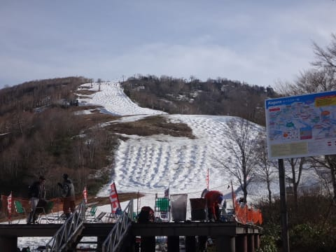

# 5月8日，日曜のかぐらスキー場詳細…かぐらがあって良かった！空いてて良かったよ！

📅 投稿日時: 2016-05-10 02:59:30

10連休という，盆休みや正月休みより長いGWが終わって．

休み明け初日から，いきなり手加減の無いフルスロットル

での仕事で半死状態になっているSkier_Sです．

…だめだ…10日間も休むと，社会復帰できない…

ってことで．

GWの最終日，昨日に行ってきたかぐらの詳細レポートです…

えー．

すっきり快晴で始まったこの日の朝．

ロープウェー営業開始時間に，みつまた駐車場が

半分も埋まっておらず…

うむ．

GW最終日は空くに違いない！

…という，私の読みは当たりそうだなぁ…

と思いながら．

みつまたロープウェー→みつまた高速リフト→ピスラボ滑走→ゴンドラ

という，果てしない道を通って移動し…

（みつまた高速リフトからゴンドラ乗り場への

　ピスラボコース）

やってきましたよ～！

かぐらメインバーン．

かぐら山頂まで出ると…

いや～

晴天ですな！

あー．

リフトを降りてから，最初の落ち込みに行くまでの

緩斜面部分．

コース幅半分に雪寄せしたみたいですね～．

5月6日には落ち込み手前部分に大きな穴が開いてたけど．

この雪出しで，その穴をなくして，さらに緩斜面

部分の雪の厚みを稼いだようで…

で，メインバーンに出てみると…

朝イチゲレンデは，しっかり幅も広く，

大回り可能！

雪が柔らかかったので，あっという間に荒れ始めるけど…

でも，かぐらに来る目的の半分は，この朝イチの

整地での大回りにあるのだ！

雪不足の今シーズン，GW最終日までこんなに幅が広い

フラットが滑れるとは…

ありがたや！！

それも．

今日は私の読みが素晴らしく当たり．

9時半過ぎまで，リフト待ちほぼ0！

ガラガラっ！

…と，思っていたら．

10時過ぎには，やはりゲレンデの人口密度が

上がってきちゃったんですが…（涙）

でも．

リフト待ちは最高でこの程度．

2分待ちくらいかな？

これだけ待ったのは1回だけで，

あとは午前中でも，せいぜいこの程度の待ち人数…

搬器3-4台待つ程度で，ほぼ飛び乗り！

しかし，ゲレンデの人口密度は，

激込みってほどではないものの，

結構高めなので…

これらの方々のコブ掘削作業により．

11時ごろには，こんな感じでコブが育ち始め…

昼ごろには．

メインバーンは，ほぼ全面コブコブ状態化しちゃいました…

…まぁ，いつものことですね．

コース上から見て一番左端は，山頂からほぼコース全長に渡って，

朝イチにスクールのスタッフが大人数で滑って

きれいなラインを掘ったので…

このラインはしっかりきれいなラインに

なってましたね～．

この日は，昼間になってもずっと晴天だったんだけど…

気温は意外と低く，Tシャツだけで滑るのはやめた方が

いいくらいの寒さでした（笑）

おかげで，雪も壊滅的ストップスノーになることは

なかったんですけど…

でも．

午後になってくると…

え？

あれ？？

そして，コース幅全体にわたり…（涙）．

残念ながら，午後1時過ぎには，

リフトをくぐった下あたり，長さ20m程度に渡って，

ほぼすべてのコブラインで，底が抜けちゃってる

状態に…（泣）

まぁ，この時期のかぐら．

傷ついたら悲しい板はもってこない方がいいです．

でも，そのせいか，午後に帰る人が多く…

午後のリフトは，完全に飛び乗り状態！

ゲレンデは，幅いっぱいに

コブの底が抜けたエリアが出現したものの…

それ以外は，全面きれいなコブバーンで．

コブ好きにはたまらん感じですね～！

この時期のコブは，適度に柔らかく，体に優しいので，

いやー．楽しいっ！！

さすがにリフトストップ直前は，結構

底が抜けた部分が発生したけど…

でも，雪不足の今シーズン．

これだけのコブを滑れれば，上出来だよね！

ってことで．

この日も，ラストリフトまでたっぷりコブを満喫して

帰ったのでした…

で．

この日の帰りは．

ゴンドラで下山→みつまた第2ロマンス（登り）乗車のあと，

ピスラボを滑らず，みつまた高速（下り）乗車で

下山してみましたが．

リフトで下っても，それほど歩く距離も長くなく，

ピスラボ滑るより楽だった気が…

＃ちなみに，みつまた高速リフトのくだりは

＃板を履かずに手でもって乗車です

…これって．

もしかすると．

朝，かぐらゲレンデに向かうとき．

かぐら第2ロマンスをくだり乗車できるようにすれば，

ゴンドラまでピスラボ滑るのが嫌な人は，

長距離を歩かずに済むので良いのでは…？？？

と，思ってしまったSkier_Sなのでした…

とりあえず．

かぐらは今週末までは滑れそうです．

＃午後になると，コブ溝はかなり土だらけに

＃なりそうだけど

今週末も，かぐらへ滑りに行こう！
