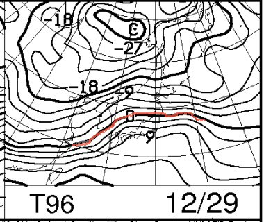
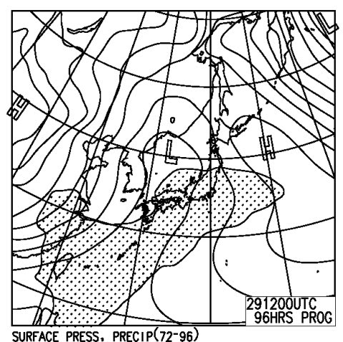
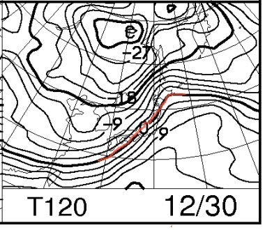
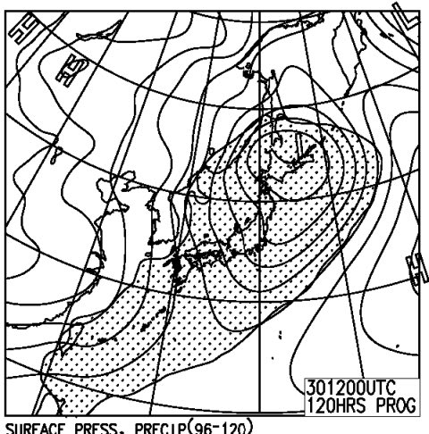
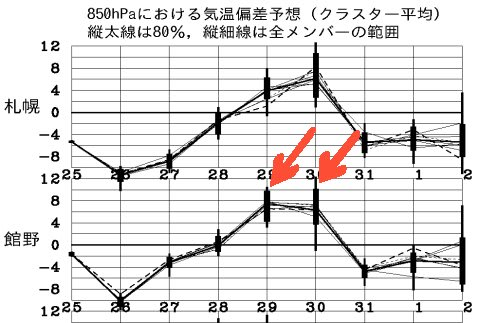
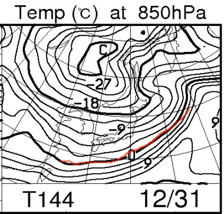
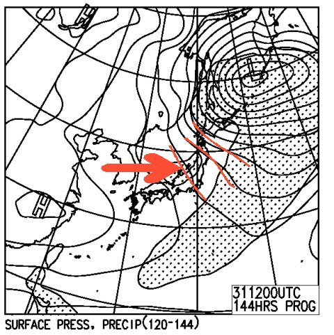

# この年末年始のスキー場の天気は…？？

📅 投稿日時: 2012-12-27 01:05:33

🏷️ カテゴリ: [スキー天気予想](c6554f5c3c106093b511a8daae23757e8.md)

うーーーーむ．

おとといから予告してますが．

29日は，やっぱり壊滅的な雨が終日降るのだ…

15日も気温が上がり，22日も雨だったけど．

…それを上回る壊滅度合いなのだっ！

何がだめかというと．

29日だけじゃなく，30日まで終日雨になりそう…

29日の850hpa気温図．

こんな感じで．

志賀高原近辺もプラス6度を超えそう．

そしてこの日は…

こんな感じで，雨の降る網掛け領域が，日本中を覆ってます．

…信州や新潟のスキー場，残らず雨ですな．

30日は…夜9時の850hpa気温図が

こんな感じ．

0度線がやっと信州を越えるかどうか…

ってところなので．

夜9時までは確実にプラス気温．

そして…

こんな感じで，また日本全域を降水域が覆っているので．

…やっぱり，雨．

うーーむ．

うーーーむ．

どうしたことだっ！！！！

29日，30日の2日連続，雨．

2日間，だめな感じです…

でも．

こんな感じで，29，30日の気温が高いピークを過ぎれば．

それ以降は平年より気温が下がり，

次の日，31日は…

こんな感じで，0度線が日本よりずーーっと南まで下がり．

志賀高原は，－9度以下です．むちゃくちゃ冷えます．極端です．

って感じで．30日の夜から雪になりそうです．

31日からは冷えそうです…

31，1，2日はすごい冷えそうなのだ．

でも．

でも．

だめなのだ．

今のままだと．

31，1，2日とも．

新潟の海沿いは降るパターンだけど．

こんな感じで，31日の地上天気図の等圧線が右下がりなので，

→の方向に西風が入るパターン．

…これは，志賀高原などの，信州内陸部は降らないパターンなのだ…

1日，2日ともにおんなじようなパターンなので．

31日から2日まで，今のところ信州内陸部の積雪は期待できないのだ（涙)．

あーあーあー．

でも，あれです．

海沿いの，新潟方面のスキー場はよさそうです．

31日，1日はともにパウダーデーになるんじゃないですかね．

ということで．

このままいくと．

志賀高原は．

29日，30日は終日雨．

そして，31，1，2日は曇り＆小雪，時折日も差すかも…

ということで．

29.30日は湿ったドボ雪，

31，1，2日はアイスバーンの上に冷えた雪が薄く積もる…

ってくらい．

このままだと，この正月休み．

バーン状況はずーーっと悪いままなのだ．

悪いのだっ！

どうしたことだ～っ！！！！！！！

この天気予想が外れるよう，祈りましょう．

つーか，ここしばらく天気予想外してるし．

予想外の好コンディションになると，信じようっ！

＃自分の天気予想が外れるということで，うれしくもあり悲しくもある
