# 6月19日　月山の状況

📅 投稿日時: 2011-06-21 01:23:02

しょ，詳細レポートを書こうと思ってるんですが．

ちょっと時間が無いので，今日は写真だけ…

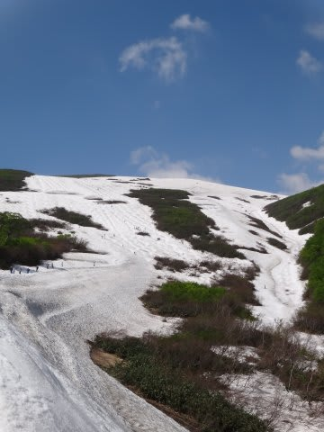

定点観測ポイントですね．

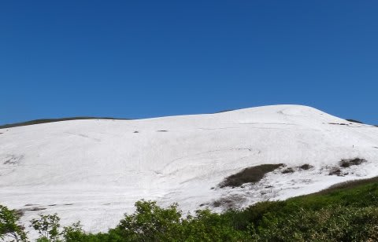

山頂方面からトラバースライン．

トラバースラインの，画面右下あたり．

ちょっと草木が出始めてます．

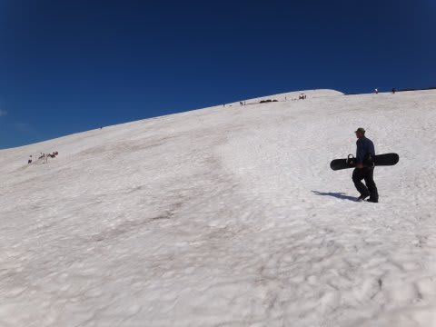

リフト降り場から歩いてゲレンデに到着．

そこからTバー乗り場方面をながめる．

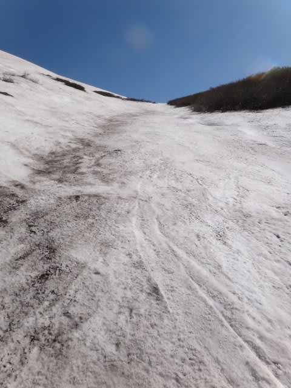

沢コースを見上げる．

右側，コブラインが1本できてます．

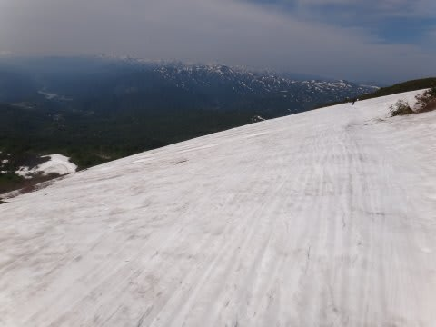

トラバースラインから大斜面上部に出たところ．

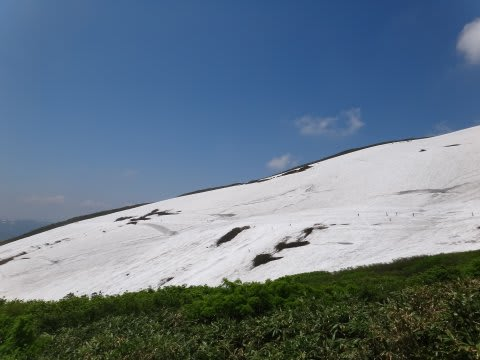

トラバースライン方向

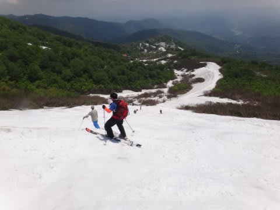

大斜面下半分を上から

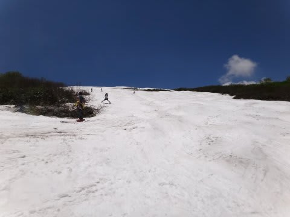

大斜面下半分を下から

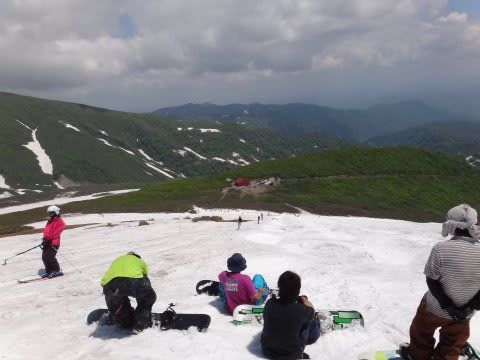

下のTバー降り場からリフト降り場方面

コブラインが2本見えます

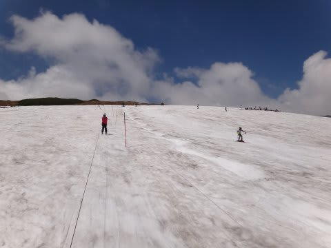

上のTバー．

コブラインが1本．

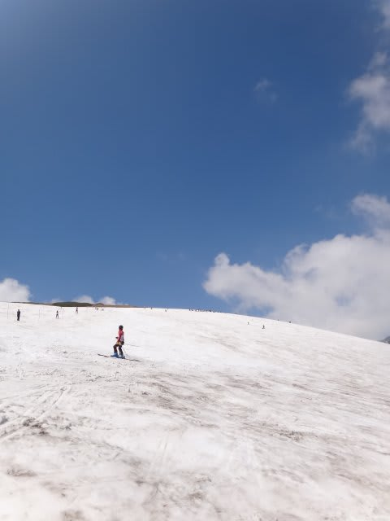

Tバーの周辺は快適な大回りコース
