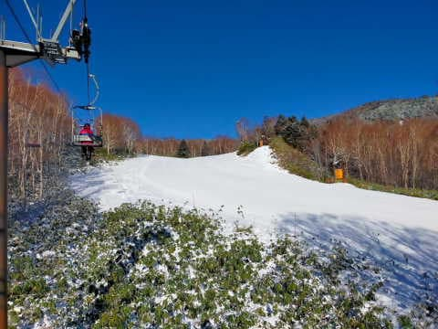
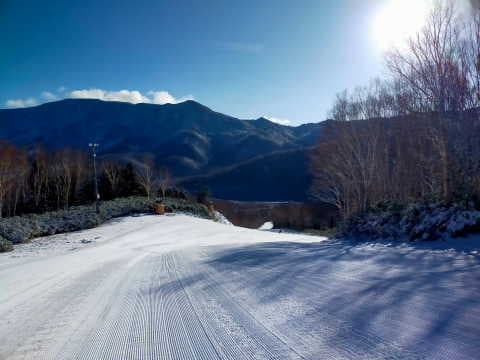
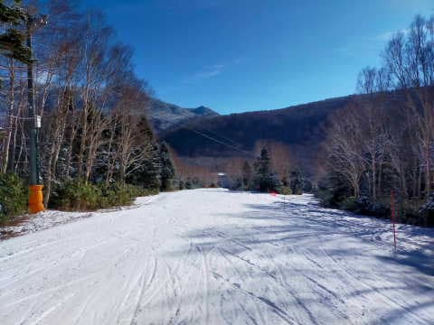
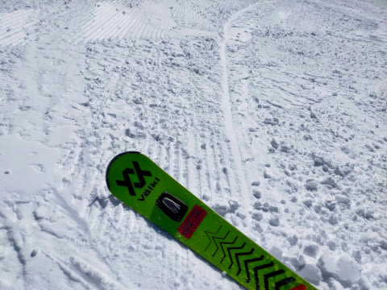
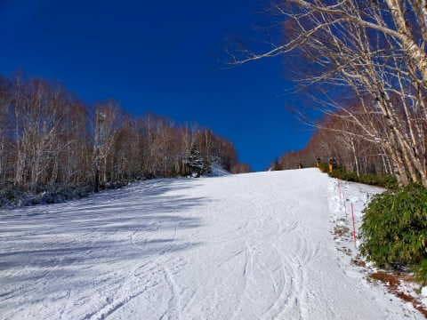
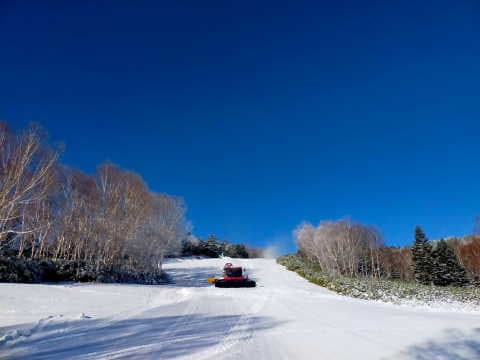
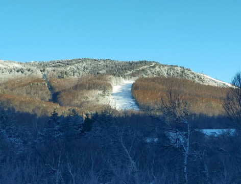
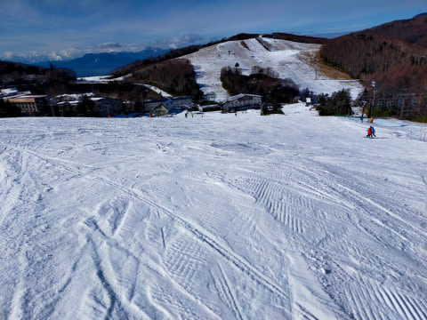
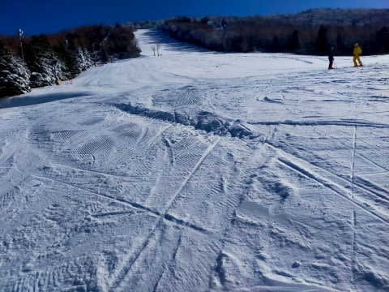

# 明日はついに今シーズン初の志賀高原へ！12月9日は焼額・一の瀬ファミリーがオープンしたよ

📅 投稿日時: 2022-12-10 00:07:23

ついに．

ついに明日…

今シーズンの初志賀高原へ行ってきます！！

…って，今日の夜9時過ぎに

「月曜までね」って仕事が新たに1件

突っ込まれて，

月曜までの宿題が3件もあるんだけど…

でも，行く！

焼額がオープンしたら，行かねばならぬのだ！！←いや，義務じゃないけど…

宿題は日曜の夜と月曜の朝に

やっつければなんとかなる！！

（とても3-4時間で終わる仕事じゃないけど…（涙））

ってなことで．

テンションが上がってるSkier_Sですが．

今日，一の瀬ファミリーと焼額がオープンしました～！！

…今日オープンのスキー場の写真がさっそく

送られてくるとは，志賀高原の特派員の

素晴らしいことよ…

今日は，晴れ～曇りの予想を裏切って，

一日すっきり晴天！

朝イチ焼額は見事なシマシマが

お出迎えしてくれたようです！

うがーーーー！！！

滑りたい！！！！

いや…天然雪はほとんど積もらなかったのに，

予想以上に幅が広く，少なくとも

イエティよりずっと良さそうですね…←比較対象を間違えている

ただ，やはり人工降雪ほぼ100％．

バーンはちょいと固めの仕上がりで，

コロコロも出てきたみたいですが…

でも，雪の厚みも十分．

今日はそれほど気温も上がらなかったので，

終日雪は緩まず，硬めのバーンコンディション

だったようです．

で．

焼額は，第4ロマンス沿いのサウスコースの

人工降雪はこれで十分と判断したのか，

今日は第2ゴンドラのパノラマコースと…

第2高速沿いの唐松コースで人工降雪を

打っていたようです…！

…来週には，第2高速と第2ゴンドラが滑れると

いいなぁ…

来週はほぼ間違いなく，第2高速は滑れるはず…

（希望的観測）

で，焼額もペアリフト1本で営業開始ですが．

一の瀬ファミリーもペアリフトがオープンしました！

コース幅はそこそこ広そうな感じですが．

こっちも人工降雪なので，雪が硬そう…

そして．

ファミリーと焼額がオープンしたからか．

熊の湯はコースがさらに広がったにも

関わらず，ガラガラだったようです…

で．

明日から，

横手山第1リフト

高天ヶ原トリプル

のオープンが決定しました！！

明日土曜から，志賀高原では

熊の湯第2中間駅まで

横手第1，第4

高天ヶ原トリプル

一の瀬ペア

焼額第4ロマンス

の6本のリフトが動きます…

そして．

土曜の天気は曇りベースかと思っていたら，

午後遅くまで晴れそう！

土曜：朝から晴れ！朝は-5℃くらいまで冷える．

　朝からバーンは締まって硬め．

　昼間は0℃越えまで上がるけど，バーンは

　硬めをキープ．

　午後はところどころ磨かれてツルツルに…

　夕方から曇り出す

日曜：早朝から雪がぱらつく．

　志賀高原への登り坂はところどころ

　凍結の上に雪が載っている

　デンジャラス道路になるので注意．

　朝は-3℃くらい？昼に向かって

　冷えていき，昼間は-5℃を下回る．

　結構寒い．

　朝は人工雪の硬いバーンの上に

　柔らか新雪が載ったいい感じのバーン！

　そして，雪が一日降り続ける．

　ドサドサ積もるほどではないが，

　昼間で5～10cm前後積もりそう．

　この日は寒いよ！

って感じでしょうか…

あと3時間半で出発です．

また，週末は3時間睡眠で出発の

日々が始まる…（涙）←こんなBlog書いてないで寝ようよ

週末，志賀高原でお会いしましょう！！

## 💬 コメント一覧

### 💬 コメント by (レインボー改めブラボー75)
**タイトル**: Unknown
**投稿日**: 2022-12-10 23:08:30

土曜日の熊の湯情報

朝の蓮池-3℃。まずまずの寒さ。熊の湯はペア二機が動いてくれたので、待ちは最大五分といい感じでしたが、そのためゲレンデの密度は高く、少しストレスはありましたが、まずまず楽しめました。上はやっぱりだめで今日は見送りとなりました。

そのあとヤケビ四ロマを見に行ってビックリ。空いてる！

明日はヤケビに行ってみよう。

### 💬 コメント by (Skier_S)
**タイトル**: ＞ブラボー75さま
**投稿日**: 2022-12-12 00:41:54

コメント回答遅れました…

土曜は4ロマ空いてましたが，日曜は混みましたね（涙）

でも，午後はがらあきでした…

