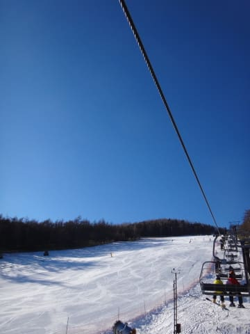

# 11月22日，アサマ2000の2015シーズンオープン日に行ってみた

📅 投稿日時: 2014-11-22 23:26:46

🏷️ カテゴリ: [2015スキー滑走日記](c09ea645cfc085f86dfcd80f49599dd89.md)

えー．

予告通り，この3連休の初日ですが．

本日オープン日となる，アサマ2000に行ってきました～．

とりあえず，スキー場へ向かったわけですが…

朝，峠を越えたところの道路状況．

スキー場に向かう道が，か～なり本格的な

雪道になってますな～．

…雪が残っている距離は，わずか数100m程度なんですが．

夏タイヤで突っ切るのは無理なレベルです．

去年も書いたような気がしますが，

・車が崖から落っこちても「やっぱりな」と平静でいられる方

・何か物理現象を超越した力で車をコントロール可能な方

・松岡修造並みの熱い情熱で雪を溶かしながら車を走らせられる方

などと言った，特殊能力を持ち合わせていない限り，

スタッドレスを履いてくることをお勧めします．

ってことで．

やってきましたアサマ2000！！

来週までは，15:00リフト終了と，かなり早くに終わっちゃうんですが．

その代り，リフト券代は3000円とお安くなっています．

で，リフト券を買ったら，ゲレンデへGoだっ！！

うはー！

ピカピカ，

わはははは！

そして，晴天ですっ！！！！

どはははは！

さらに，朝のうちは，リフト待ちもほぼ0です！！！

で．

雪質は，かなり締まり気味の圧雪．

結構固めですが，氷のゴロゴロが出ているとか，

がりがりにはなっていないので，かなり滑りいい！

うははははっははっ！！！

そうだ．

これだ．

これだよ！

もう，Yetiだとできない中斜面大回り．

長らく忘れていた，かなりのスピードで斜面を

落ちていく感覚！

…最初はちょっと怖かったけど．

そうなんだよ．

これがスキーだよ！

…と，感動していたら．

…まぁ，ゲレンデの人口密度は，Yetiほどではないけど．

そこそこですな…

でも．朝9時過ぎまでは，リフト待ちはこんな感じでほとんどなし！

9時半ごろに，リフト待ちが出てきましたかね…

でも，丸沼もかぐらもオープンした本日．

人が分散したのか，リフト待ちピークは午前10時ごろで

せいぜいこの程度．3分強待ちが最大でした．

で．

ゲレンデは，10時ごろまでは問題なく大回り可能！

気温は，ジャケットの前を開けたいほどに上がってきたけど，

固い人工雪なのでゲレンデは思ったほど緩まず，固いまま．

…でも，固いままということは．

そうです．

アサマ2000と言えば，あれですね．

午前11時ごろには．

…こんな感じで，カチコチ小回り道が，顔を出し始めてきます…

この小回り道．

当然成長していき．

12時過ぎにはこんな感じになってきたかと思ったら…

2時ごろにはすっかり成長して．

…手ごわい．

手ごわいよ！

さらに．2時を過ぎると．

ゲレンデの日もかげっていき…

どこがアイスバーンで，どこが柔らかいか

全く分からないよっ！

…手ごわい．

手ごわすぎるっ！

ただ．

ゲレンデコンディションが厳しかったからか．

午後はリフト待ち時間が短かったのが救いですね～．

って感じで．

午後3時の営業終了時には，完全に日陰になってしまった

ゲレンデですが．

人工雪がしっかりしているおかげで，

営業終了まで，コース内で石が出てくるようなところもなく．

…せいぜい，こんな感じのブッシュが2-3か所に出ている

程度で．

新しい板でも行けそうな感じでした．

って感じで．

夕方はアサマ2000名物，カチコチ小回り道に

やられてしまった感がありましたが．

でも．

そうだ，大回りって，こんな感じだったんだよ！

スキーのスピードって，こんな感じだったんだよ！

…と，感動できた一日で．

超満足だったのでした…

PS.道路は帰りの夕方でもこんな感じだったので．

明日も，まだ道路は凍っていると思います…

何か，人智を超える力を持っている方でない，

普通の一般人は．

素直にスタッドレスを履いていきましょう…

## 💬 コメント一覧

### 💬 コメント by (Goku)
**タイトル**: Unknown
**投稿日**: 2014-11-23 07:37:26

お～！中々のコンディションですね。

Sさんと入れ違いでK県にいる私は地震で我が家がどうなっているのか心配・・・

### 💬 コメント by (Unknown)
**タイトル**: Unknown
**投稿日**: 2014-11-23 20:37:29

いつもレポート楽しみに&参考させてもらってます！

### 💬 コメント by (Skier_S)
**タイトル**: Gokuさま＆匿名さま
**投稿日**: 2014-11-23 20:43:43

＞Gokuさま

今年はスタートが遅いかな？と

思ってたけど，直前の追い込みの

積雪で，なかなかのコンディションでしたよ…

長野は，志賀はほとんど被害がなかったようですが…

K奈川県でもそこそこ揺れて驚きました…

＞Unknownさま

応援ありがとうございます～！

今後もいろいろ参考にしてやってください～っ！！

