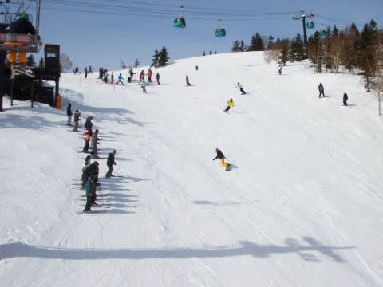
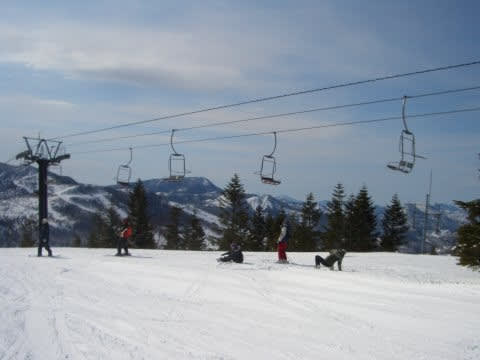

# 焼額山スキー場マニアッククイズ！…何問解けるかな？志賀高原に昔から来ている人じゃないと分からないネタ

📅 投稿日時: 2020-09-08 02:26:26

ということで．

ダイビング日記が3日以上

続いてしまうと，このBlogの

読者数が減るという経験則から，

なるべくダイビング日記が3連続に

ならないように，頑張っていろんな

ネタを挟んでいたのですが…

どこにも出かけてない昨今．

そろそろネタも尽きてきていて．

私が旅行ネタ以外を書こうと思うと，

どうも宇宙ネタとか，

車の細かな技術ネタとか．

マニアックなネタになってしまいがち…

だもんで．

今日はちゃんとスキーヤーブログらしく，

スキーの話題で行くのだ！

そう．このBlog，

スキーヤーBlogだったのだ！！←本人も忘れかけている

…と．

久々のスキーネタなのに，

このBlogを書いている人は

やはりかなり偏っているらしく．

スキーネタでも，異常なほどマニアックな

記事になってしまって，

焼額スキー場に長いこと通っている人

じゃないとこれっぽちも面白くない

という偏った記事になり，書いた本人も

頭を抱えているようですが…

とりあえず，このBlog読者には，

焼額マニアが多いはずだから，

そのまま投稿！

ということで．

まずはこの写真から．

この写真．最近，焼額に頻繁に行って

いる人なら違和感を感じるはず…

ということで，問題．

第1問．ここは焼額のどこから撮った写真？

　今と何が違う？

さぁ，考えてみよう！

…最近の常連さんなら，すごい

違和感を感じるはず．

常連さんじゃなければ，

これっぽっちも分からないと

思いますが…

ヒントは，これですかね．

この写真にも，今は写らないものが

写ってます…

ということで，答えです．

マニアな方は分かったと思いますが．

最初の写真は，

A1．今は無き第3ロマンスリフトの上から撮った写真で，

　GSコース非圧雪側を見ているけど，

　この時はGSコースの非圧雪側がピカピカに

　圧雪されていた！

…という，マニアック問題でした～！←読者を振り切ってしまってないか？

2枚目の写真も，今は撤去された

第3ロマンスリフトが写ってますが．

この写真では，非圧雪側はちゃんと

凸凹になってますね．

今，ほぼ同じアングルで写真を撮ると．

第3ロマンスリフトの降り場の跡が

残るだけになってます…

さて．

次も焼額フリークに送る問題．

第2問．この写真には，今は無き何リフトが写っている？

新雪が積もった日で，搬器の

上に雪が乗ってますが．

…もう，マニアな20000mクラブの古参の

皆さんは，すぐ分かりますよね…

下から見上げるとこんな感じでした．

…そう．

A2．今は無き，オリンピックコースの

　下から上まで上がることができた，

　第1ロマンスB線

でした～！！←だから，着いて行ける人はもうほとんどいないって…

ここも，今はもう，リフトが残って

いた気配もありませんね…

まだ行きます．

第3問．この写真は，焼額のどこ？写ってるのは何リフト？

…マニアックすぎる．

ホントにマニアックすぎる…

ちなみに，リフト降り場はここに

数年前まで残ってました…

そうです．

A3．第1ゴンドラからGSコースを降りてしばらく，

　第2ゴンドラからのコースが合流するあたり．

　今は無き，オリンピックコースてっぺんから

　1ゴン山頂まで上がれる，第5ロマンスリフト

でした～！

まだ続く．

第4問．この写真に写ってるのは何リフト？焼額のどこからどこまで行けた？

…うーん．

写真がちょっとわかりにくい…

拡大してみましょうか…

えい！

矢印のところに，搬器があるのが

わかりますでしょうか…

行きますよ～！

答えは，これだ！

A4．今は無き第1ロマンスA線．3高乗り場下から，

　オリンピックコースの下まで行けた

が，正解でした～！

何人分かったかな？←いや，もう正答した人はひとケタ人だと思う…

さーて．

次の問題です！←まだ続くの！？？

第5問．この矢印部分に写っているのは何リフトの降り場？

　写真を撮っているのは焼額のどのコースから？

…これも分かりにくいので，

矢印部分を拡大っ！！

こんな感じで．

パークがここにあったんですねぇ…

昔は…（昔を語る老人の目）

では，答えを行ってみよう！

A5．第2ロマンスリフト．GSコースの途中，

　突き当りを右に折れて落ちていくあたりから

　撮影

でした～！！！←マニアックすぎて，もう読んでる読者いないとおもう…

さて．

では，次の問題です！←まだあるんかい！！

第6問．この写真の右隅に写っているのは，焼額の何リフト降り場？

これは簡単すぎますね～！サービス問題ですね！←いや，簡単じゃないから！

ちなみに，このリフトからの景色がこの写真．

今はもう見れない景色ですね～…

答えは…

Q6．2012年に廃止になった，焼額第1高速リフト降り場

でした～！

降り場の写真は，パノラマコースの，

白樺コースとの分かれ目ですね．

…ということで．

焼額山，今は，

第1ゴンドラ

第2ゴンドラ

第2高速

第3高速

第4ロマンス

の5本のゴンドラ・リフトが営業していますが．

ピークには，このほかに

第1ロマンスA

第1ロマンスB

第2ロマンス

第3ロマンス

第5ロマンス

第1高速

と，さらに6本のリフトがあり，

今の倍以上の，トータル11本のリフト・

ゴンドラがあったんだなぁ…

ということを懐かしんで，

廃止になったリフトの写真をかき集めて

みたのでした…

ちなみに．これらの写真は2006年の写真です．

…これから，もう焼額はリフト増えないのかな…

第1高速の復活を祈ってたのに，2シーズン前

（あれ？3シーズン前かな？）に撤去された

ときはショックでした…

また，新規設備投資でコースとか

リフトが増えてくれると嬉しいなぁ…

ちなみに．もっと古い写真をひっくり返すと，

1ゴンがタマゴゴンドラだった写真が

出てきました…

この写真，2001年．

2002年12月に1ゴンが架けかわっているので．

新しく感じる1ゴンも，

次のシーズンには19シーズン目になるんですね…

## 💬 コメント一覧

### 💬 コメント by (naoちゃんねる)
**タイトル**: Unknown
**投稿日**: 2020-09-08 04:59:08

私が焼額山に通うようになった時には、今の５本体制でした…

だからすべての写真に違和感ありまくりでした〜

昔の状況が知れて面白かったです☆

### 💬 コメント by (はなげ親分)
**タイトル**: Unknown
**投稿日**: 2020-09-08 12:25:12

なつかしいですね～

只今、先日山積みの本から見つけた1998年skierの別冊の空撮ガイドを取り出して、こんなだったよなぁーと一人でにんまりしています

ところで内緒ですけど、第5ロマンスだけ乗車したことがないことを白状します！

### 💬 コメント by (まあ)
**タイトル**: Unknown
**投稿日**: 2020-09-08 14:03:40

いちばんマニアックなのは、第3ロマンスじゃない？その写真はないの～？

### 💬 コメント by (下手の横好き)
**タイトル**: Unknown
**投稿日**: 2020-09-08 16:50:18

５問正解でした！

第５ロマンスは乗ったことが無かったです。

仲間内で尾根線コースと呼び、第1高速を使ってクルクル廻るのが好きでした。

### 💬 コメント by (通りすがりの)
**タイトル**: Unknown
**投稿日**: 2020-09-08 19:56:16

はじめまして。

マニアックな記事を書かれてらっしゃったので、つい通り過ぎることができませんでした笑

私もヤケビ大好きでマニア度はちょっとしたものだと思っています。

第3ロマンスは2000年代前半に一旦廃止になり、2010年前後に復活した時は歓喜しましたが、また廃止で今度は完全撤去というのは寂しいものがありました。

さて出題の問題は全問正解かつ全ての廃止リフトに乗った経験ありです、、、が！

たった1つだけ乗れなかったリフトがあります。

その名も　第2ロマンスB線　です。

と言っても実物は見たことがないので本当に存在するのかは確かでないのですが、第2ロマンスの支柱番号札に第2ロマンスA線と書かれていたのは間違いありません。

また、第1ロマンスA線B線と同様直線的に、第2ロマンス降り場付近から、森林の具合から第1ロマンスB線の降り場付近までリフトがかかっていたと思わせる痕跡があります。

昔、焼額山スキー場が開業して間もないころのパンフレットには載っていた気もします。

ご存知の強者はいらっしゃいませんか！？

### 💬 コメント by (みほ)
**タイトル**: Unknown
**投稿日**: 2020-09-08 22:57:00

めちゃくちゃなつかしい写真の数々ありがとうございました。もちろん全部わかりました。２ロマ、３ロマ、いろいろ新雪のコースをすべることができて楽しかったなあ・・・。コロナの今、こういうリフトが残っておれば、ゴンドラで密になることもなく風通しよくすべることができたのに、と残念です。

### 💬 コメント by (しんちゃん)
**タイトル**: 勉強になりました
**投稿日**: 2020-09-08 23:56:19

昔はこんなにリフトがあったんですね。

私をスキーに･･･を見ていても、今は亡きリフトが映ってますものね。

勉強になりました。

昔（90年代後半ぐらい）の空撮ガイドがあれば、ぜひ記事にしてほしいです（笑）

### 💬 コメント by (Skier_S)
**タイトル**: 意外と盛り上がりましたね
**投稿日**: 2020-09-09 01:29:04

＞naoちゃんねるさま

昔はいっぱいリフトがあったんです…(遠い目)

イチゴンもタマゴゴンドラだったし，ペアリフトが

6本もあったんですよ！

そのほか，ミドル連絡コースが無かったり，

オリンピックコースからミドルコースに下りる

コースがあったり…

＞はなげ親分さま

第5ロマンス，私も運転しているのは数回しか見たことありません！

普段は全く動いておらず，超混雑した日に時々動いているのを

見かけるくらい…

私も1-2回しかのったことがありませんが，

GSコースの上だけ滑りたいって人はやっぱりそんなに

いなかったんでしょうね…

＞まあさま

最初の2枚，3ロマです～！

でも，まあさまも3ロマ好きですか！

私も奥志賀から帰るのに便利だった3ロマ，好きだったんですが．

乗車時間が長すぎて，

「このリフト，GSコースと3尾根コースが分かれるところまででいいのに…」

と思ったことも何度か．

＞下手の横好きさま

5問正解はすごいですね！

1高，私も好きだったんですが，1高が動いてた時は

白樺コースすごい混んだんですよね…

コース幅が2高沿いの唐松コースほど広くないので…

それが欠点でした．

＞通りすがりのさま

マニアックな記事につられてしまいましたか(笑)

そうなんですよ．3ロマ，一度廃止になって，サイド復活した時は

私も喜びました…！

2ロマB線は，私の記憶ではありません．

ある年，いきなり2ロマは短くなってびっくりしました．

1ロマはある年に途中で2分割され，2ロマは短くなり，

3ロマは最初から長さが変わらずです．

焼額ができた当時は，1ゴンと1ロマ，2ロマ，3ロマの4本体制で，

1ロマ，2ロマ，3ロマは降り場がほぼ同じところにありました．

その時は，1ロマ，2ロマ，3ロマともに1kmを超える長いリフトで，乗車時間8分以上．

足かけがあったので良かったですが，足をぶらぶらさせておくと

足がしびれる，恐怖のリフトでした…

＞みほさま

全問正解，素晴らしい！

私も3ロマと1ロマB線くらいは残しても良かったのでは…とか思いましたが，

3ロマの復活営業でも乗ってる人すごい少なかったので，

「やっぱりこれはダメか…」

と思いました．

やっぱりゴンドラがあるとみんなそっちに行っちゃいますから…

＞しんちゃんさま

スキーが華やかなりし昔はすごかったですよ．

そのかわり，混雑も今の比じゃなかったですが(笑)

そのころは，志賀高原も有料道路で，上林チェーンチェックのところに

料金所があって…

と，年齢不詳の昔話をしてしまいます

（上林から先が有料だったのは，さすがに私が子供の頃ですが)

### 💬 コメント by (Hide)
**タイトル**: Unknown
**投稿日**: 2020-09-09 07:40:24

おひさしぶりです。

A5：ありましたね～

今も道路からパークゲレンデの跡地は見えますよね・・・。

A6：これぜひ復活させて欲しいんですけどね。

ヤケビ開設の2年目だったですかねぇ～初めて行ったのは。

私をスキーに連れてっての翌年だったですかね？

まだ上信越道開通前で、中野市街から夜間瀬川沿いに上って行ったものです。

湯田中の温泉が出ている急坂や上林からもまだ有料でしたし・・・

あっ、蓮池の交差点付近でしたっけ？GSもありました（笑）

中野の有料トンネルも開通してなかったような？？

歳がバレる（笑）

### 💬 コメント by (はやと)
**タイトル**: Unknown
**投稿日**: 2020-09-09 13:36:52

５問正解でした。

白樺コース大好きなので、１高はぜひ復活して欲しいですね。

蓮池交差点のすぐ先、１号トンネルとの間にも料金所が有りましたよね。その当時、仲間からリフトが終了したので蓮池まで迎えに来てと宿に連絡が来ましたが、（往復？）通行料を惜しんで「バスで帰って来て」と言った事が有ります。

### 💬 コメント by (Goku)
**タイトル**: Unknown
**投稿日**: 2020-09-09 21:35:51

やはりスキーネタになると盛り上がりますね(^^♪

ヤケビ、できたばかりの頃は全体的に狭い林間コースってイメージしか残っていません。

オリンピックコースも当時はスラロームバーンって名前で、丸池Aコース並みのコブ斜面でしたね。

オリンピック以前は上林で３００円払って、一の瀬に行くには蓮池で往復５００円の有料道路でした。

でも焼額山ができたおかげで、それまで車でしか行けなかった奥志賀にも滑っていくことができるようになって本当に便利になりました。

ヤケビで一番復活して欲しいのは、やはり１高と３ロマですね。

１高は白樺コースをローテーションできるし、３ロマは奥志賀から帰ってくるのに便利(^^♪

蓮池のパルスゴンドラいらないから、１高復活して～(笑)

### 💬 コメント by (Skier_S)
**タイトル**: 思った以上に盛り上がりましたね…
**投稿日**: 2020-09-10 00:45:31

＞Hideさま

2ロマが廃止された後は，スノーモービルランドとして

細々と使われてますよね…

昔は2ロマ下にレストランがあって，そこでお昼を食べたこともあります．

1高も復活してほしいですよね～！

オリンピック道路ができる前は，道も狭かったし有料だし，

料金所にすごい長い列が並んで下山に数時間かかった

思い出もあります…

丸池のガソリンスタンドの廃止は4-5年前でしたっけ？

つい最近まであったイメージが…

＞はやとさま

5問正解，おめでとうございます．

古い人認定です！(なんのこっちゃ）

1高は復活してほしいですよね…

一の瀬山の神の，1高の向かいのリフトも復活してほしいです．

そうすれば，一の瀬のアクセスが格段に良くなるんですが…

＞Gokuさま

思った以上に盛り上がりましたね…このネタ．

出来たばっかりのヤケビは，すごい狭いコースでしたよね．

焼額を滑った後に奥志賀のダウンヒルコースを滑ると，すごく広いコースに

感じた思い出があります．

蓮池からの有料，往復500円もしたんですね！！

子供の頃で，自分は払ってないので金額まで知らなかったのですが，

いまだと有料道路に800円も払うと考えると，行くのをためらう金額ですよね…

私も1高と3ロマ，復活してほしいです！

