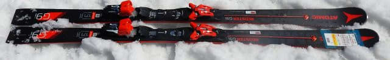
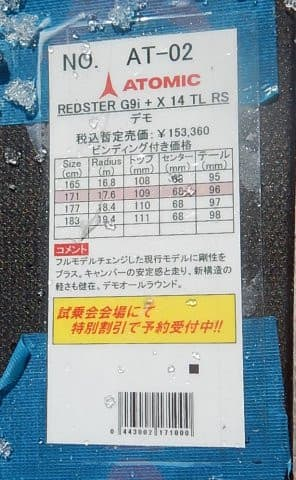
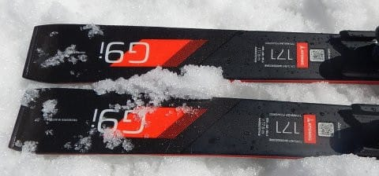
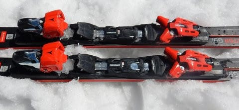
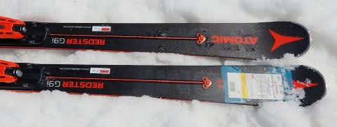

# 2019シーズンのスキー板，試乗レポート第12回…ATOMIC編その3

📅 投稿日時: 2018-05-31 02:19:06

🏷️ カテゴリ: [スキー板試乗](c0bd8048615710cee890e403a36cc9a2b.md)

えー．

10月頭に，Yetiでシーズンインしてから8か月．

ついに，この日曜でかぐらも終わってしまい（涙）

残るは月山のみとなってしまいました…

なんとスキーシーズンとは短い

ものよ！！！←いや，8か月も続いていれば長いから

でも．

月山がある限り，まだ私のスキーシーズンは

続くのだっ！！

だもんで．このBlogもまだまだ冬モードですよ～！

今日は，スキー試乗レポートです．

今回は，アトミック編．

では，どうぞ～！

---

○ATOMIC REDSTER G9i 171cm

基礎大回り

基本的には，GS競技用セカンドモデルのG9の

コア材を軽量カルバコアにして，サイドウォールも

ちょっと変えて基礎用に仕立てたこの板．

ビンディングはS9iやG9と同じく，

TLビンディングがつきます．

そして，サーボテックもついてますね…

今シーズンまでは，サーボテックのアームは

黒色だったのが．

来シーズンは赤色になるので，

ここが'18モデルと'19モデルの

大きな見分けポイントですね．

サーボテックの色とサイドウォールの色以外は，

今シーズンモデルと見た目は一緒です…

今回の試乗コンディションは，柔らかく，

板が潜り気味の春雪でしたが．

柔らかい板で板が食い込むところでは，

強いグリップで気持ちよくたわんで深い弧が描けます．

軽い力で良くたわんで曲がってきます．

だもんで，スピードを出していくと，大回りより

むしろミドルっぽいターンになっていくほどで，

かなり深く傾いてターンして行ける板です．

グリップはそこそこあるけど．

GS用のわりに，板は異常に軽く感じるし，

簡単にたわんでいくので，結構優しく感じる板．

でも．

逆に言うと．

簡単に曲がりすぎるので，

スピードを出していくと，大回りというより

ミドルっぽく感じるターン弧になっていくので．

ヤケビ早朝だとちとターン弧が小さすぎるか…

さらに，板の柔らかさのためか．

小回りレーンのガチガチ斜面だと，

ちょいとエッジグリップが弱くて

ズレていく感覚も．

うーむ．

固い斜面をガンガン大回りするなら，

もう少しフレックス・トーションは強くてもいいかな？

でも，柔らかめの春雪だとちょうどよい感じで．

ズレた中でもズラシのコントロール性は良くて．

さらに板が軽いのもあって．

板を大きく動かして小回りも可能．

雪が悪い春雪では，かなりずらしやすい感じ．

だもんで，大回りベースのオールラウンドとして

行けそうかな…．
