# 1か月予報が出たけど…GWまでずっとひたすら志賀高原スキー場も高温が続きそう（涙）．そして特派員によると本日焼額山のGSコースは雪寄せ済み

📅 投稿日時: 2024-04-19 01:18:44

えー．

本日18日木曜日も，特派員から

写真を送っていただきましたが．

本日の志賀高原は，予想通りの終日曇り

空だったようですね～…

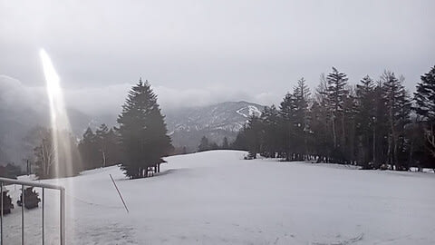

日差しで雪がやられないのはいいけど，

やっぱり気温が上がり…

最高気温は+10℃まで上がったらしく，

ここもほぼ予想通りの気温…

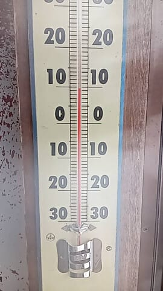

んで．

焼額のGSコースですが，

分かる人には「右ドッグレッグ部分」で

通じる，奥志賀連絡コースの分岐点の

ちょっと上の急斜面部分．

上から見て左側1/3ほどの雪が削られ，

コース右側に雪寄せされたようです…

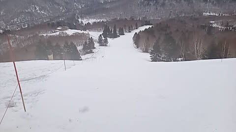

去年は4月8日の週末にはすでに雪寄せ

されていたことを考えると．

暖冬と言われた今シーズンですが，

去年よりかなり雪が多かったんだなぁ…

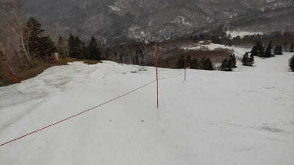

下から見るとこんな感じですね．

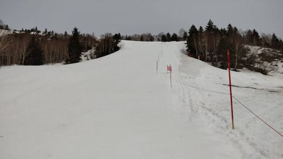

さらに，ゴンドラ迂回コースも，

下の方は雪が寄せられてますね…

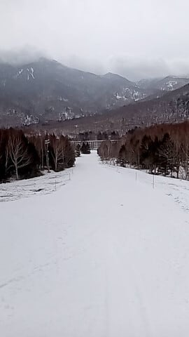

まぁ，GW最後まであと2週間ちょい．

これで何とか雪がもってくれると

いいんですが…

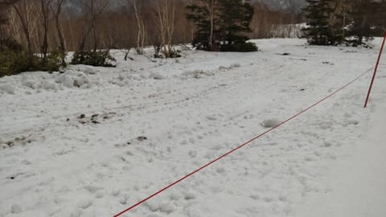

とりあえず．

昨日の予想では，明日の金曜は

朝は冷えて雪が硬く，午前曇り，

午後は晴れという予想でしたが．

最新の天気図を見ると，ちょっと

予報が変わってます！

金曜の朝は，山頂では氷点下まで冷え込み，

…そして，午前中は雪がぱらつくかも？

午後も曇り空が続きますが…

運が悪ければ液体がぱらつくか…

という感じで，

朝の雪は硬くて滑りにくいかもしれませんが，

比較的気温が低めの一日になりそうです．

ちなみに．

深夜1時現在，すでに硯川のライブカメラでは，

レンズにみぞれっぽいのがついていて…

降り始めているようです．

麓は雨っぽいですが，山頂は雪だと

思います…！

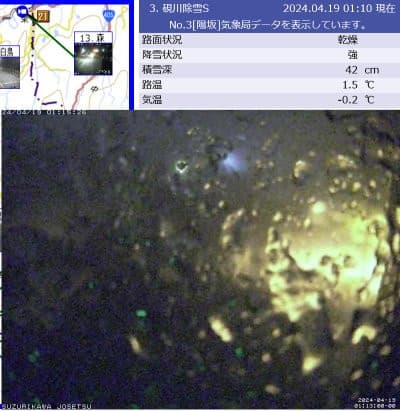

（[北信建設事務所　道路気象状況カメラ](http://hokushin.pref-nagano-roadcamera.jp/)より）

まぁこの時期，雪が降っても滑りが

悪くなることも多いし，1-2cm降っても

そんな足しになるわけではないですが…

でも，このまま雨にならず，

雪のまま降ってくれることを

願うばかり…！！

ってなことで．

本日は木曜日．

そうです．気象庁の1か月予報の発表日です！！

だもんで．

いつも通り，[FCCX92](https://www.sunny-spot.net/chart/FCXX92.pdf)を見ますが…

いつもの気温傾向を見ると．

見ると…

見たけど…

ふぎゃーーー！！

ダメだ．

相変わらずダメだ！！！

4/20-26のGWまでの第1週で気温が

平年より高い確率80％，

4/27-5/3のGW期間の第2週で気温が

平年より高い確率70パーセントぉっ！！！

ダメです…これはダメだ（泣）

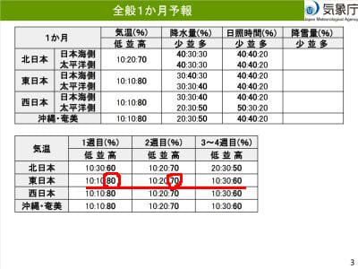

850hpa予想を見ても．

4/20-26のGW前の期間は，

志賀高原付近は水色の平年比+3℃の

エリアに入ってるし．

志賀近辺を通っている太い線は+9℃線．

これだと，昼間は+10℃を越える高温が

続く感じですね…（激泣）

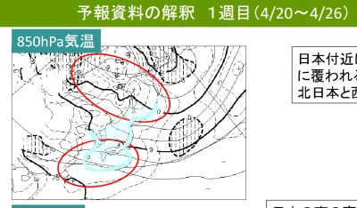

そして，

4/27-5/3のGW期間も，志賀高原は

水色の平年比+3℃の線に覆われてます（泣）

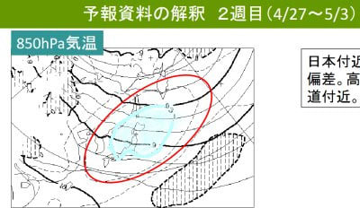

平年比+3℃が丸々1週間続くだけで

異常高温レベルだというのに…

平年比+3℃が2週間も続くのか…っ！！？

さらに過去を振り返ると，

これまでの1週間，4/11-4/17も，

1週間平均気温が+3℃を越えていたよう

なので．

3週連続で，1週間平均気温が

平年比+3℃超えってことですね…！！

これはヤバすぎる．異常気象です…（涙）

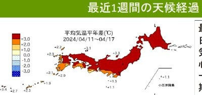

そもそも．

3月24日以降，5月11日までの1か月半以上，

平年より高い気温がひたすら続くグラフなんて

初めて見ましたよ…（激泣）

それも，3月26日から5月1日ごろまで

ほぼずっと平年比+3℃以上が続くという…

こんな異常高温が続くグラフは見たこと

ないです…

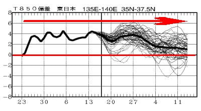

なんということか…

3月の奇跡の積雪で，今のところなんとか

雪がもっていてくれますが．

このままだと，焼額のゴンドラや高天ヶ原は

もってGW前半まででしょうか（涙）

平年並みの気温なら，ぎりぎりGW

いっぱいもってくれそうな勢いだったん

ですが…（泣）

うーん．

温暖化の地球を冷やすために，

[巨大火山噴火](https://www.jstage.jst.go.jp/article/jar/27/3/27_278/_pdf)か[隕石が落ちる](https://www.sci.tohoku.ac.jp/news/20160715-7973.html)とかで，

太陽光が防がれて気温が落ちてくれない

かな？←それ，地球滅亡しかねないから！！スキーどころじゃなくなるから…！
