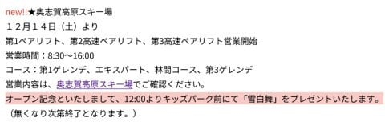
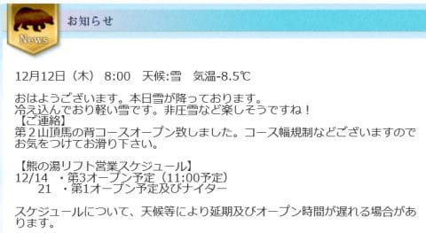
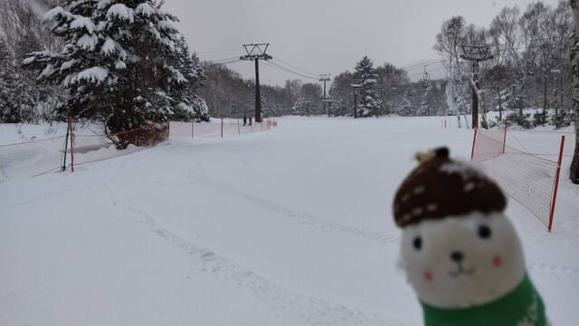
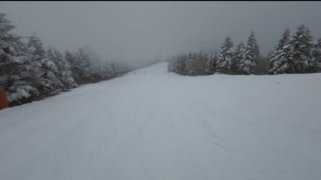
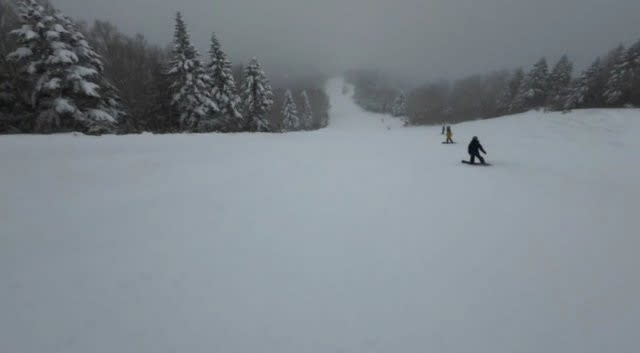
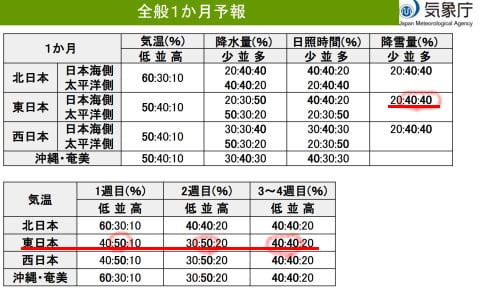

# 今日も朝更新…奥志賀スキー場も14日オープン！そして12日(木)の焼額山スキー場はゴンドラ運転するも雪は硬め．

📅 投稿日時: 2024-12-13 09:19:26

🏷️ カテゴリ: [日記](cc4b5682fb7b8b144980957a978653fb0.md)

なぜか昨日も気づいたら床で寝ていて．

朝までそのまま床で寝てました…

どうせなら布団で寝たかった．

とりあえず，昨晩は寝てしまったので

今日は朝に手短に更新…！

まず．

奥志賀高原ですが．

今週末の14日にオープンが決まりました！

第1，第2，第3リフトが動くようです．

うーん．第4は動いてくれないんだ…

([志賀高原索道協会ホームページ](https://shigakogen-ski.or.jp/winter/news/2024/12/open.html)より)

そして，熊の湯は昨日から馬の背が

滑れるようになり，週末の14日(土)から

第3クワッドリフトが動くようです！

（[熊の湯スキー場ホームページ](https://www.kumanoyu.co.jp/lift/)より)

そして，

昨日もおこみん特派員から写真を送って

いただきましたが…

昨日はゴンドラが動き出した焼額を

滑っていたようですね！

第2ゴンドラが動き出し，パノラマコースに

しっかり人工雪が着けてあるので

ブッシュなどなく，コース幅いっぱいに

ゴンドラ1本分滑れたみたいですが…

ただ，木曜の朝は積雪が予想より少なく，

積雪はせいぜい5cm程度．

下地の人工雪が隠れるほどではなく，

バーンはかなり固めで，コロコロがたくさんで，

楽しいというよりちょっと手ごわいバーン

だったようです…

まぁ，GWまで雪がもつようにこの時期は

硬めの下地をしっかり作る時期なので，

バーンをちょい硬めに仕上げているのだと

思いますが…

昨日の昼間もそんなに積もらなかったよう

なので，今日もバーンは硬めかも…

でも，週末にはそこそこ積もりそうだから，

土曜のバーンはいい感じのトップシーズンの

雪になっていると思います！！

…ちなみに．

第2ゴンドラが動き出した焼額．

いつ第1ゴンドラが動き出すのか気になりますが…

ヤケビのホームページの，「SNSに投稿すれば

ステッカーがもらえる」という案内に，

第1ゴンドラリフト券売り場は12/21からの営業

とあるので，

これからドカドカ雪が積もっても，1ゴンの

営業は12月21日以降のようです…

まぁ，このままいけば12月21日には

第1ゴンドラオープンするんじゃないかな！

で．

昨日は木曜だったので，気象庁の1か月予報が

発表されましたが．

こいつを見ても，引き続き1月中旬までは

平年並みかそれより冷えそうな予想で，

積雪量も平年より多そう！！

これを見ると平年並みの確率が一番高い

ですが，高温になる確率より低温になる

確率が高いので，どちらかというと冷え気味

と読んだ方が正解です…

ということで．

これから1月中旬までは，いい感じの天気が

続きそうで，一安心！！

今週末もかなり冷えた週末になりますよ～！！

## 💬 コメント一覧

### 💬 コメント by (レインボー77)
**タイトル**: Unknown
**投稿日**: 2024-12-13 16:49:53

金曜日の志賀高原情報

流石は天下のヤケビ。今日は最高の条件に整えてくれました。パノラマの壁も快適至極。ヤケビにありがとう、です。

### 💬 コメント by (Skier_S)
**タイトル**: ＞レインボー77さま
**投稿日**: 2024-12-14 00:49:45

今日はゲレンデ状況改善したようですね…

明日は新雪10~15cm，圧雪コースも5cmくらいの新雪が乗ってる感じで，

さらに良くなりそうです！（午後は荒れそうですが）

大阪府の研修会の団体さん200人でちょっと混みそうですが，この週末もさらに

コンディションよくなりますよ~！！

