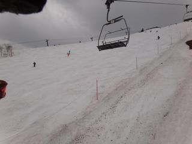
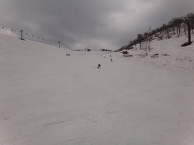
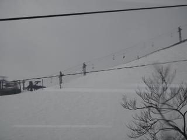
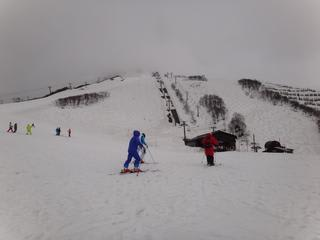
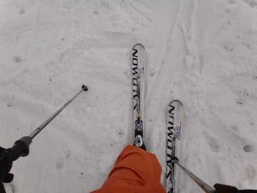
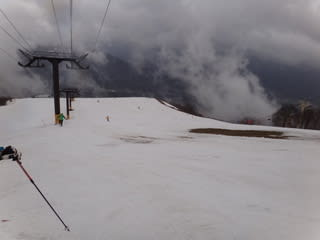
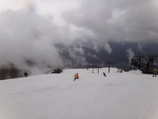

# 4月30，5月1日八方尾根スキー場

📅 投稿日時: 2011-05-01 23:58:38

🏷️ カテゴリ: [2011スキー滑走日記](ca488c98cfb9169941c3e73770dcefb56.md)

うむ．

外しました．

天気予報．

30日土曜は…

朝から土砂降り．

雨だよ．

しかし，雨にも懲りずゲレンデに上がると，

10時半ごろには雨は上がりました．

しかし，雲は切れず，時々ガスが出ます．

そんな中滑っていたら…

12時半ごろに．

超強烈な土砂降りに．

そして．

雷がっ！

すぐそばでごろごろいってます．

危ない～

当然，直ちに全リフト・ゴンドラはストップ．

黒菱レストハウスは雨宿りの人であふれかえります．

リフトは止まり，ゲレンデには誰もいなくなりました…

しばらく待ったら止むかなぁ，と思っていたけど．

1時になっても

2時になっても．

雷は止まりません．

2時半ごろ，

「スカイラインの下にマイクロバスが来てます」

とのことですが，乗車希望者を調整したところ，

あっという間にバスの定員を超えちゃいます．

3時ごろ．

「黒菱クワッドとゴンドラのみ，下山専用に動かします」

とのことで，土砂降りの中ゴンドラに乗り，寂しく

下山したのでした…

結局この日は，10時から12時過ぎまでの2時間しか滑れず．

リフト券も半日分払い戻しがあったのがせめてもの救い…

あけて翌日．

5月1日．

窓を開けると…

今日も雨．

昨日に負けないくらいの土砂降り．

うーーーん．完全に天気予想を外した…

雨に負けずゲレンデに出ましたが．

結局この日は，朝からリフトストップまで，

ずっと雨．ひたすら雨．止むことなく雨．

時折ガス．

た，楽しくない…

滑れるゲレンデは，リーゼングラート，兎平，黒菱，スカイライン，

パノラマです．

雪はそこそこ．

兎のこぶ溝も土が出てくることはないっです．

ただし，パノラマはところどころ土が出てきましたね～．

志賀は今年は雪が多いなぁ，と思いましたが，八方は

例年並みかな．

うーん．

やっぱり，志賀の方がコンディションいいかも…
