# 2019/4/7(日)の志賀高原スキー場，速報モード！…曇り時々晴れの穏やか天気なれど，気温が上がり，板が張り付くストップスノーに（涙）

📅 投稿日時: 2019-04-08 02:01:42

🏷️ カテゴリ: [2019スキー滑走日記](c3e4496fc0fb7f9c17ff21214a35b1ace.md)

えー．

日曜のいつものパターンですが．

今日も帰宅したら，日付が変わっていて．

いろいろ片づけやら道具の手入れやら

していたら，もうこんな時間…（涙）

土曜は朝2時に家を出たというのに．

懲りずに，夜は23時半ごろまで

たらふく飲んでしまい．

Blogを更新したのは日付が変わったあと…

活動時間23時間（泣）．

（かなり酔っぱらって眠い中，半分意識を失いながら

記事を書いていたので．まともな記事になっていたのか，

ちょいと心配）

なのに，本日も懲りずに．

睡眠5時間で朝5時半に起き，

焼額の早朝営業に行って．

帰宅してBlog記事を書いたら，深夜2時…

今日も活動時間20時間を超えてます（泣）．

かなり眠いです←当たり前でしょ

布団に入って寝たのが，2晩合わせても

計6時間半しかないような気がする，

この土日だったわけですが．

…そこまでして滑る価値がある

土日だったか？？？

というと．

微妙でした（涙）

とりあえず．

本日の志賀高原スキー場．

どんなだったかを，日曜恒例の

速報モードでお送りすると．

まず．

曇の予想だったのが，

晴天で始まった早朝営業．

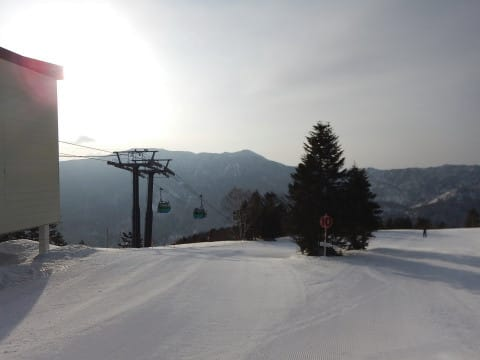

早朝オープン直後のゲレンデは…

そうです！

うはははは！

シマシマバーンがお出迎え！

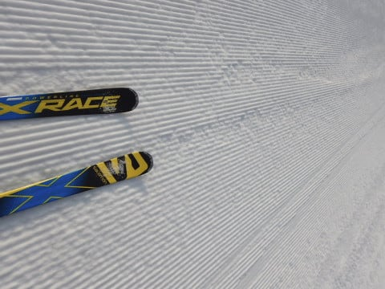

だけど…

あれれれれれ？？

中途半端に固まった，

微妙な雪質で．

下地は柔らかめなのに．

表面はちょっと固まり気味で．

板が流されていく，

快感度の低いコンディション…（泣）．

でも．

板は滑るし．

まだ，良かった．

早朝は良かった…

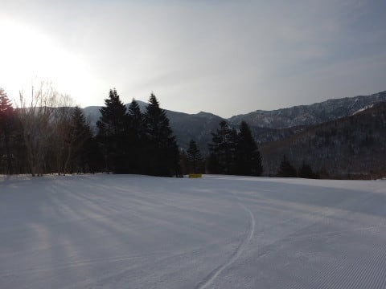

通常営業開始のころになると．

空には雲が増え，完全曇り空に

なっちゃったけど…

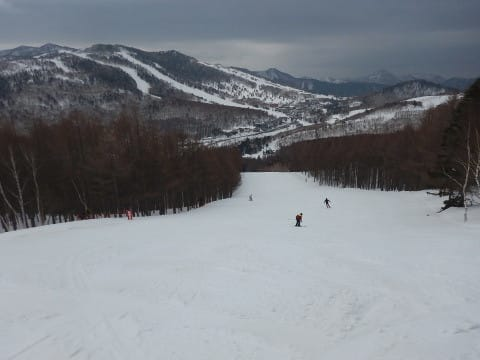

気温がぐんぐん上がり．

朝10時ごろには．

なんだか，かなりダメな感じの

雪質に…（泣）

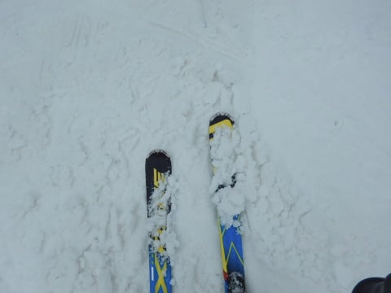

ただ．

この時間は．

曇り空で，日が射さなかったので．

まだ，板が滑ってくれたんですよ．

でも．

10時半ごろになると．

日が射してきましたよ…！

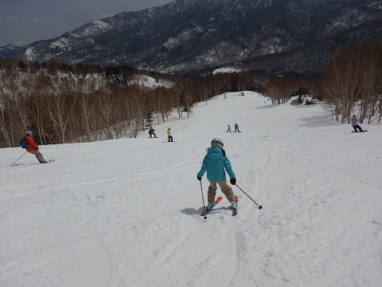

（特別出演：本日一緒に滑ってくれたYちゃん）

いや．

いいんですよ．

普段なら，晴れてくれた方が嬉しいんですが．

今日は，日が射すと，ヤバい．

雪がとんでもないことになりそう…

という，心配通り．

そうです．

日差しで雪が融けて．

板が張り付く，完全な

ストップスノーになってきました（激泣）．

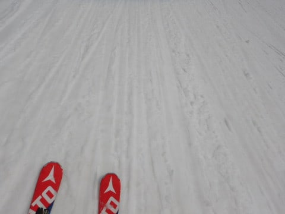

もう，ダメです．

志賀高原ほぼ全域，

妖怪板つかみ

の大量発生です

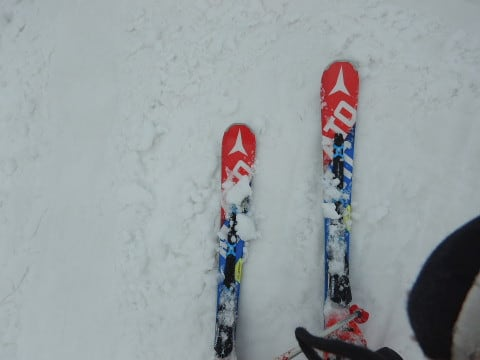

もう，昼には．

滑走性の悪さと．

荒れていくゲレンデに

滑る意欲を失う

ほどの状況です（涙）

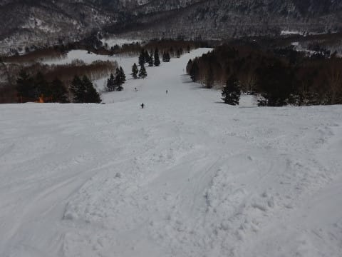

…ただ．

ゲレンデコンディション悪化に伴い．

ゲレンデから，人がいなくなっていき…

午後には，ゲレンデ全面，どこに行っても．

誰もいない，貸し切りゲレンデ状態！

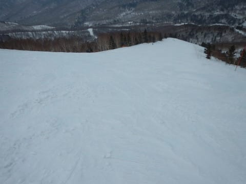

午後3時ごろには，気温が下がり始めて．

板が滑るようになってきたので．

誰もいない，自分一人専用の

貸し切りゲレンデを．

思うぞんぶん，リフトストップまで

楽しんできたのでした…

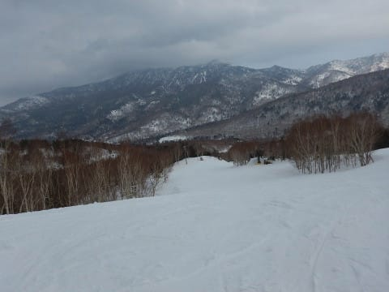

しかし．

今日の妖怪板つかみは手ごわかった…

昼前から午後3時ごろまで．

どこに行っても滑らない雪で．

あぁ…

春がやってきたなぁ…

と，思わずにいられない一日でした…（涙）

また明日，詳細レポートやります～！

## 💬 コメント一覧

### 💬 コメント by (かず)
**タイトル**: Unknown
**投稿日**: 2019-04-08 10:39:48

かなりひどくなってしまったみたいですね…さらに今週末も高温…評判いい妖怪撃退アイテム購入したので早く試したいです

### 💬 コメント by (なるなる)
**タイトル**: Unknown
**投稿日**: 2019-04-08 13:29:06

土日、高天ヶ原と一の瀬を滑っていたのですが、いや～春でしたね。

認めたくないけど、春雪でした。なんか雪が茶色いし…

昨日は、焼額や奥志賀までツアーしてご挨拶出来ればと思っていたのですが、あまりに

滑らない雪だったので、遠出する気になりませんでした。

でも、夕方は恐ろしい程に人が居なって、滑る雪になってくれたので、楽しかったかよ!!と自分に言い聞かせていますw

今週末も同じ感じでしょうか??　天気予想楽しみにしています。

### 💬 コメント by (べー)
**タイトル**: Unknown
**投稿日**: 2019-04-09 00:06:47

土曜日曜と滑りましたが日曜の昼過ぎから３時頃まで板が滑らず、特に奥志賀第１には泣けました。エキスパを滑ったの後悔しましたよ。ダウンヒルはそこそこ良かったのに…。

結局遅い昼食をとる前は奥志賀と焼額山で回して、滑りの悪さから昼食をとった高天ヶ原から戻る気力も無くなり、３時前からは高天ヶ原でグルグルして終了しました。

妖怪板つかみはマジ勘弁です(涙)

### 💬 コメント by (Skier_S)
**タイトル**: 今日の志賀はいい感じ
**投稿日**: 2019-04-09 05:45:31

＞かずさま

この土日はダメでした…

木曜まで最高だったのに，なぜ週末に限って…（泣）

妖怪撃退アイテム，試したらどんなだったか教えてください．

＞なるなるさま

あら．

一の瀬方面滑ってらしたんですね．

夕方まで滑ってらしたなら，一瞬一の瀬に

現れた私を見ていたのかも…

でも，見事な春雪でしたね（涙）．

今週末は，もう少しまともな感じかもしれませんが…まだわかりません．

水曜の予想をお待ちください．

＞べーさま

もう，滑らない雪でしたね～…

奥志賀もダメだったんですか！

でも，高天ヶ原は良かったんでしょうか…

午後3時頃からは焼額も板が滑るようになり，

なんとか滑れましたが…

いや．

ホントにストップスノーは簡便です（涙）

