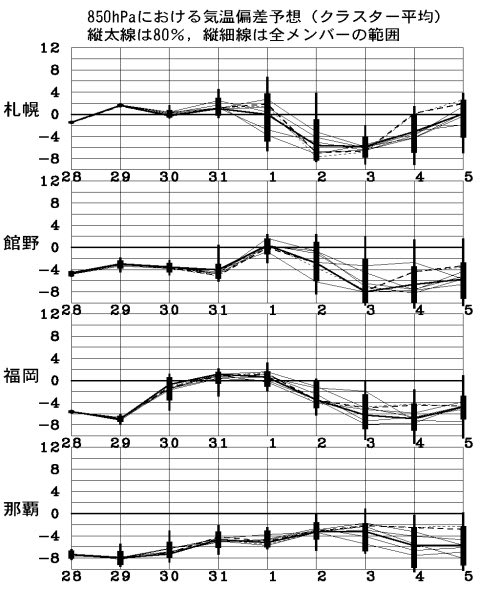
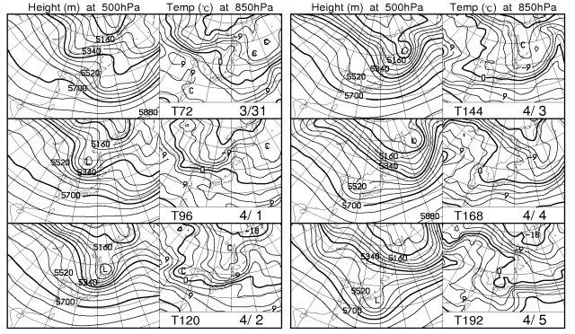
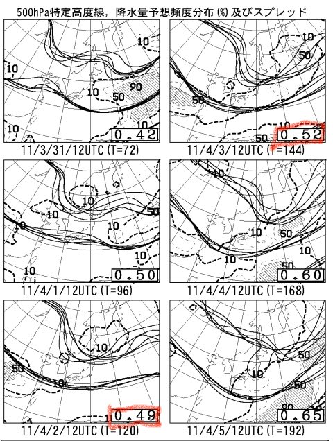

# この週末も…

📅 投稿日時: 2011-03-30 01:58:39

🏷️ カテゴリ: [スキー天気予想](c6554f5c3c106093b511a8daae23757e8.md)

明日まで，結構冷えそうな天気予報ですが．

あさって以降，ちょっとあったまるかなぁ，と思っていたところ．

なんと．

木，金と一瞬暖まるけど．

…また，土日は冷えそうです．

1日は平年並みの気温ですが，2日，3日は平年より寒いです…

この図でも，2日，3日は0度線が信州より南．

つまり，1500mでは気温がマイナスです．

この時期にしては，冷え込んでます．

2日，3日のスプレッドは0.42～0.5程度なので，予想の確度は

結構高いと思います．

この図の点線で囲われた部分が降水量予想なんですが．

（10，50，90ってのがそれぞれ降水確率）

1日（金）．2日（土）とも，信州方面の降水量は予想されておらず．

積雪ははあんまり期待できないので，

金曜昼間に暖まって溶けた雪が固まった，ちょっと固い雪に

なるかな…

この週末のようなパウダーは難しいか．

でも，雪がどぼどぼに溶けるようなことはなく，

コンディションは4月にしては良くなると思います…
