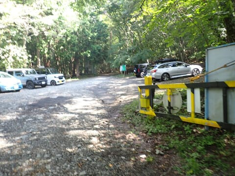

# 2023年9月，今度は大菩薩嶺へ行ってみた，その5…石丸峠から駐車場まで，ひたすら下山！

📅 投稿日時: 2024-08-13 01:59:31

えー．

3連休前に夏休み予告をしていましたが．

この3連休がらみで夏休みを取って．

また南の島へ潜りに行ってきました～！！

いやーーーーー．

天気もよくて，海況も恵まれてて．

仕事からも解放されて，

（夜は会社携帯で仕事してたけど…（涙））

癒された夏休みでした…

また明日から仕事か…（涙）

お盆休みで会議もほとんど無いのが

救いですが．

南の島で完全に頭がボケてしまって，

頭が仕事モードに全く切り換わらない

気が…

今日は帰ってきたばかりでまだバタバタ

してるので，落ち着いたらまたレポートを

書きます！

ってなことで．

今日は途中まで進んでいた，大菩薩嶺の

レポートです！

ーー

という感じで．

大菩薩嶺→大菩薩峠→石丸峠という，メイン

イベントといも言えるべき，景色の予備場所は

通過してしまったので．

石丸峠からもうこれといったポイントはなく．

あとはひたすら駐車場に戻るばかりの

ルートですが…

まだ最初のうちは見晴らしもいいですね！

ただ．

だんだん笹が生えた，見晴らしの悪い

ルートになり…

こういう道を下ること15分．

一旦林道を横切って…

さらにひたすらこんなルートを下ること，

さらに10分．

石丸峠から25分で，道路を横断します．

ここは，木屋平とかいうバス停がある，

バスも通る道みたいです…

でも，自分はバス停を通り過ぎ，

道路を渡った向こう側に続く

登山道をひたすら下山…！

バス停から3分ほどで，川に着きあたり…

金網で石を囲った，こんな踏み台に

乗って川を渡ったら．

あとはいかにも，ザ・登山道！

という道が続いていきます…

ひたすらこんな山道を下り続けると．

駐車場もある，神日川峠に出ます！

ここまで，大菩薩峠から1時間17分

ですか…

天狗棚山によってなければ，ちょうど1時間

くらいでしたね．

ここからはしばらく，ロッジの横の

道を歩くことになりますが…

2-3分で，いったん道路から登山道が

分かれるものの…

7-8分ほどこんな道を歩いたら．

また，さっきと同じ道路に突き当たりました．

ここはまた10mほどですぐに登山道へ

戻り．

あとはこんな道をひたすら下ります…

でも．

ここら辺は歩く人も少ないから．

誰もいないし，下り坂なので

快適にハイペースで飛ばす！！

ってなことで．

大菩薩峠から1時間50分ほどの

いいペースで，

千石茶屋に到着！

ここは，結構お手ごろなお値段の

お店のようですね…

この千石茶屋から駐車場までは，

駐車場につながる道を歩いていく

だけです！

駐車場までは8分と案内標識に

書かれていましたが…

こんな舗装路を疾走すること，5分．

大菩薩峠から1時間56分．

スタートから4時間50分で，駐車場へ

戻ってきました～！！

…ってなことで，9時50分過ぎには

駐車場へたどり着き．

無事昼までに家に帰り着いて，

午後は泣きながら仕事をしたのでした…

ってなことで．

ちょっとした山歩きのつもりが．

ちょっと寄り道したりしたので，

距離自体は陣馬山往復とほぼ同じ

16.5kmながら，

標高差は1400m越えとなり．

まぁまぁの運動量でしたね…

でも．

スタートから下山まで4時間50分だけど．

実際の山行時間は4時間23分と．

お手軽に行ってくるにはいい山でした…！

雷岩から大菩薩峠までの景色は結構

いいので．

上日川峠→雷岩→大菩薩峠→上日川峠って

ルートなら，コースタイムもかなり短いにも

関わらずいい景色も楽しめるので．

人気が出るのも良くわかる，

楽しめる山でした～！

