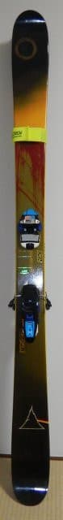
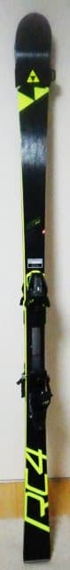
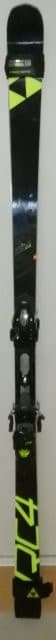
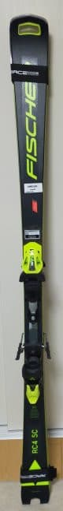
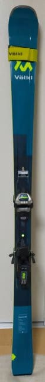

# 2023/2024シーズンを一緒に過ごすスキーマテリアルたち…スキー板は7セット！？？

📅 投稿日時: 2023-12-27 02:50:27

🏷️ カテゴリ: [スキー雑談](c1f9d2cb7478308da16419928ea3945e9.md)

本日の志賀高原ですが．

山の神のリフトが動き，ようやく一ノ瀬

方面と焼額がつながったようです…！！！

が．

今日も一日晴天で雪が降らず．

ゲレンデコンディションは全く改善して

いないようです…（涙）

うーん．明日27日(水)の朝までには5cm

くらい積もってくれそうだけど…

でも，積もってもわずか5cm（涙）

とりあえず，今後の天気図をざっと読んでみると．

27日は朝までに5cm程度．

28日は全く降らず．

29日にはちょっと降りそうだけど，これも

せいぜい5cm，積もって10cm．

30日も全く降らず，それどころか気温が上がり…

そして．

31日は雨になりそう（涙）

…この状況で雨になったら，ゲレンデは

かなりヤバいんですが…（激泣）

なんでまた雨になるかな…（泣）

でも．

31日の夜から雨は雪に変わり，

元日の1日の昼間にかけてそこそこ

降って，積もりそう…！！

そして，2日からまた晴れそう．

うーん．正月休みも積雪の積み増しは

あんまり期待できなさそう（泣）

とりあえず，大みそかから元日の雪に

期待…！！

（また明日，年末年始の詳細天気予想やります）

…ってなことで，本題へ．

2024シーズンも始まり，すでに滑走日数

14日ほど滑ってますが，

今シーズンを一緒に過ごす相棒たちを

ここで紹介しておきましょう…

まずはスキー板．

古い板から順番に紹介すると…

1．新雪用ファット板 

’16 LINE Sir Francis Bacon

新雪ぱふぱふ時に履く，

センター幅108mmの太板．

2シーズンの型落ちで，2018シーズンに

購入した板．

今シーズンで7シーズン目になります…

新雪パフパフになるチャンスはそれほど

多くないので，シーズンに数日ずつしか

出番はなく，ヘタっている感じは

全くなくて．

センター108mmというファットのくせに

エッジグリップがしっかりしていて，

「太板でそこまで傾く人は見たことない…」

というくらい深いカービングができるので

気に入っている板．

あと5-6年は履けそうかな？

2．石ころふみ用

'21 FISCHER RC4 SC Pro 

先代石ころふみ板のATOMIC SXの四郎君が

剥離した上にベロンベロンにヘタって，

もう危なさすら感じていたので，

昨シーズンインのイエティで引退させ，

昨シーズン終盤から，3シーズン履いた

この板を石ころふみにしました．

が．

どうやら40日履くと剥離して強烈にヘタって

いくATOMICと違って，FISCHERの板は

寿命が長いようで…

最近はショート板を履くことが減ったという

こともあるけど，このSCは3シーズン履いてる

にもかかわらず，まだそんなにヘタってません．

ただ，これまで，デロンデロンにヘタった

板を石ころふみにしていたけど，

そうすると，雪が悪くて石ころふみ板を

履いている間，板が全くグリップせず

これっぽっちも楽しくない…

という経験を何度もしていたので．

今回は，板にまだ張りが残っているうちに

石ころふみ板におろすという贅沢を

してみました…

石ころふみと言っておきながら，

なるべく踏まないように気を付けて．

かなりこまめにエッジも立てているし．

「新品じゃないので，石を踏んでも

　ショックをもっとも受けず，

　精神衛生上いい」

という程度の扱いの板で．

まだ全然トップシーズンでも履けます…

3．普段履きロング板

'21 FISCHER RC4 RC Pro

これは，ほとんど使われてなかった板を

’22シーズンに中古でお安く購入したもので．

今，最も高頻度に履いているメインマシン

ですが…

私が2シーズンメイン機として履いて，

すでに3シーズン目に突入しているのに，

まだ全くヘタる気配が見えないという…

これまでの他のメイン板は短ければ3-4か月，

長くても2シーズン目には死んでいった

ことから考えると．

私のメインマシンとしては異例の

3シーズン目突入です．

おそらく，今シーズンいっぱいヘタらずに

もってくれるんじゃないかな？

しっかりした張りとグリップがあるのに，

185㎝とは思えないほどものすごく

よく曲がってくれるし．

安定感も高いし，寿命も長いとあれば．

これまでのメイン機の中でもかなり

優れた板ですね～…

FISCHER板，寿命が結構長いかも？

4．大回り板バックアップ用

'19 FISCHER RC4 RC 魔改造バージョン

これは，[昨シーズンのシーズンイン前の
物欲選手権](e107181925fb3cf130e75fb7a164207e7.md)に敗れてFISCHERのブーツと

同時に買った板．

昨シーズン，メインマシンの3.のRCが

2シーズン目に突入するので，

「これまでの経験から，私がメインで

　履き続けている板は，遅くとも

　2シーズン目にはヘタるはず」

という考えがあり．

ウクライナ製の’21以降のモデルではなく，

名機の誉れ高いオーストリア製の’20以前の

モデルがたまたま出てきて，さらに

型が古いのでかなり格安だったということ

もあり，ついつい買ってしまったこの板．

優しめのRacetrack付きモデルしか残ってなかった

けど，これをエキップさんが強めのM/Oプレート

に交換したという…

この板が販売された'20にはまだM/Oプレートが

なく，標準ではRacetrackかRaceplate付きモデル

しかなかったので．わかる人なら

…この板にM/Oプレート付けられるんだ…！

と驚く，一般市販モデルにはない

魔改造仕様の板になります．

でも，’21 RCが2シーズン履いても全く

ヘタる気配がないことを考えると，

慌てて買わなくてもよかったのかも…

この板は，昨シーズンも2-3日しか履いてないけど．

とりあえず，まだメインのRCが元気なので．

今シーズンもほぼ出番なしに終わりそうな，

バックアップ板です．

5．朝イチハイスピード大回り用

'19 FISCHER RC4 WC GS Master

’21シーズンの終わりに購入した，

189㎝のR=27の欧州向け選手用の板．

日本仕様よりかなり分厚く，強い板です…

あさイチの焼額をトップスピードで

大回りするだけのために買った板ですが，

選手用なだけあって，これまでで最も

気持ちよく安心してスピードが出せる板．

すでに3シーズン目ですが，今シーズンも

あさイチ大回り用として活躍してもらいます…

6．小回り用板

'23 FISCHER RC4 SC Pro

[昨シーズン終わりの物欲選手権](e05737a8e31c770fa09305653a9f0b66c.md)で

負けてGetした，小回りマシン．

古い2．のSCを石ころふみにしたので，

トップシーズン用の小回り板がこいつに

なります．

…ただ，最近では小回り板を履くことが

ほとんどなくなったので，それほど出番は

なさそうなので，石ころふみ板にしたSCを

トップシーズン小回り板と兼用にしても

耐えられるかな…と思っていたけど．

2024モデルからお値段が爆上がり

するし，試乗落ちで安かったということも

あり，

値上げ前の安い23モデルが残ってて，

さらに試乗落ちでもっと安く買えるなら，

今のうちに買っておこう

と，ついつい物欲に負けたのでした…

とりあえず，出番は少なそうだけども，

小回り・コブなどを滑るときにお出まし

願う板です．

7．春先，ちょっとした新雪，荒れ雪用セミファット

VOLKL DEACON 84

これも，[昨シーズン終わりの物欲選手権](e05737a8e31c770fa09305653a9f0b66c.md)に

敗れて買ってしまった板で，

春雪，ちょっとした新雪，荒れた雪などで

履くための板．

春先の荒れた雪で試乗して，

一発で気に入った，[春の重くて荒れた雪を
まるで整地のように滑れる](e750883a75f016ac81d540cd4969db5c5.md)，魔法の板で，

この板があるかないかで春雪の楽しさが

全く違うという，素晴らしい板．

重くてつらい春雪を楽しく滑れるだけじゃなく，

新雪でもよし，圧雪でもよし，荒れた雪でもよし

なので，今シーズンはかなり出番が多そう…

ってな感じで．

今シーズンは，スキー板はこの7セットで

過ごします！

…が．

7セットって，やっぱり多いな…

そしてそのうち5セットがFISCHERに

なるとは，3シーズンほど前までは

思ってなかったなぁ…

## 💬 コメント一覧

### 💬 コメント by (1kamakura)
**タイトル**: Unknown
**投稿日**: 2023-12-27 06:38:48

江戸の秋

おー！プロですね。

七本お持ちですか！

1日のうち数本履き替えるのでしょうか？

いいね👍

### 💬 コメント by (愛読者)
**タイトル**: Unknown
**投稿日**: 2023-12-27 08:15:08

バイタリティのあるᏚさんだから大丈夫だけれども、板を持つとその数だけ、ベースワックスをかけなければいけなくなり、私は、お金の次に物欲との葛藤材料となります。ベースに入れるバラフィンワックスでも結構なお金もかかりますしね。

### 💬 コメント by (スシネコ)
**タイトル**: Unknown
**投稿日**: 2023-12-27 08:41:15

Sさんの名機（と購入物語）を眺めるのは楽しいです。ほんの少し前まで「板は4,5本が普通」だなんて知りませんでしたが、いろいろと履いてみると違いが分かって楽しいものですね。

私の今年の物欲選手権、既に「黄色い虎の小回り板」にロックオンして離れません･･･（ ´ー｀）

### 💬 コメント by (真美子)
**タイトル**: Unknown
**投稿日**: 2023-12-27 16:39:36

車で行くと、板も何本も持っていけていいですね。

私は明日28日から1年ぶりで唯一の焼額なのに、雪がほぼ無い状態。

可哀想すぎませんか。

人工股関節になり、必死にリハビリをしてきたのに、悲しすぎます。

### 💬 コメント by (まーくん)
**タイトル**: Unknown
**投稿日**: 2023-12-27 20:36:45

おや、たまにブログ内の写真で黄色い穴空きトップのSL板を見かけた気がするのですが…

### 💬 コメント by (Skier_S)
**タイトル**: 29日から焼額ゴンドラ運転！
**投稿日**: 2023-12-28 03:00:36

＞江戸の秋さま

ゲレンデに4セット持っていくことがあり，先週末は4種類を履き替えて滑ってました…

さすがゲレンデまでスキーを4セット持っていく人は，私以外に見たことないです（笑）

＞愛読者さま

確かに，シーズン前後の板の手入れは大変です…

でも，シーズン中は板がたくさんあっても，結局使った板だけしか滑走ワックスを

塗りなおさないので，そこまで手間もお金もかからないです…

＞スシネコさま

まさかスシネコさん自らも，板を3セットとか4セットとか履き替えるようになるとは…

最初のころは思ってなかったですよね（笑）．

黄色い虎さん，ぜひ物欲に負けてください（笑）．

＞真美子さま

今シーズンはダメです…

28日はまだ4ロマ，2高しか動きません（泣）

せっかく人工関節まで入れたのに，ちょっと残念な感じですね…

29日からゴンドラ動きますよ！（パノラマコースのみですが）

私も29日から滑っている予定ですので，またお会いしましょう…！

ウェアが変わっているので，板を目印に探してもらえれば…

＞まーくんさま

黄色い板はまだ買ってません！！

某スキーショップが私の物欲を刺激するために貸し出してくれてるだけです…

うん．まだ買ってない．

まだ…

