# 2月19，20日の週末の志賀高原の天気は…土曜は晴れのち曇り，日曜はまた終日雪降りで積もりそう

📅 投稿日時: 2022-02-17 01:34:06

🏷️ カテゴリ: [スキー天気予想](c6554f5c3c106093b511a8daae23757e8.md)

本日の志賀高原．

いつもの志賀高原特派員の誰からも

写真が送られて来ないという，

珍しい一日だったのですが…

でも，いつもの特派員と違う方が

志賀高原の写真を送ってきてくれてたので，

勝手に載せちゃいます！

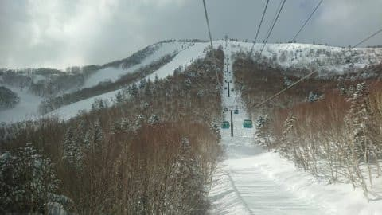

朝イチの積雪は10～20cmほど．

午前中は晴れ間があったものの，

基本的に曇り，午後は時々雪降りの

一日だったようで…

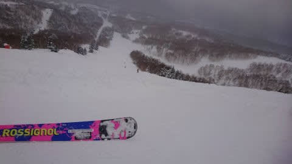

まぁ，朝の晴れ間は外したものの．

概ね予想通りの天気だったようです！

ってなことで．

これから週末までの志賀高原の天気．

また雪が積もりそうですが．

果たして今週末の志賀高原の天気はいかに？？

水曜恒例の天気予想です！

えー．

まず，17日(木)の850hpa図を見てみると．

志賀高原には水色の-12℃線が近づいてます！

これは，激冷え．

朝は-15℃を下回りかねないレベルですね…！

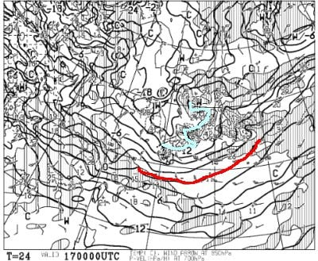

さらに，500hpa図を見ると…

うはーー！

大雪の目安の赤い-30℃線が太平洋側

まで下がって，

ドカ雪の目安の水色の-36℃線が志賀より

南まで下がってます…！

これは降りそう…！

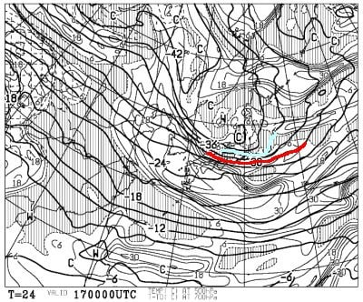

そして，地上天気図を見ると…

見事に日本海側に降水域がかかっていますが…

志賀高原の真北，北海道の西のあたりに

低気圧がある関係上，志賀はちょうど

西風．

500hpaで-36℃の寒気が入っているので，

私の経験上は，西風でも志賀に積もる

のですが…

まぁ，朝は脛パフ，行って膝パフ．

これで北風なら腰パフくらい積もる

パターンなんだけどな…

でも，昼間も積もり続けそう．

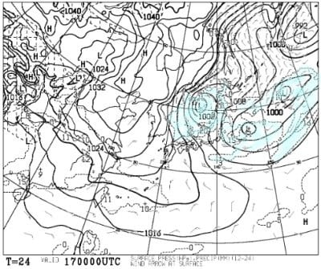

そして，翌18日(金)の850hpa図は．

志賀に近づく水色の線は，-9℃線．

17日よりは気温が上がりそうだけど，

あさイチは-12℃くらいかな．

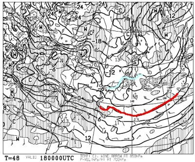

地上天気図を見ると…

等圧線は縦縞だけど，志賀のあたりは

わずかに北東ー南西に向かって傾いてます．

これ，見事な北風になるパターンなので．

18日の朝は積もりそう！！

膝～太ももパフは行ってくれるかな？

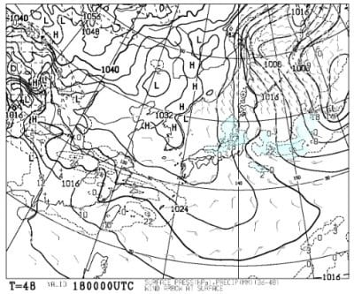

続いて，19日(土)の850hpa図ですが．

この日の志賀に近い水色の線は-6℃線と，

金曜よりさらに気温が上がってます…

あさイチは-10℃くらいかな？

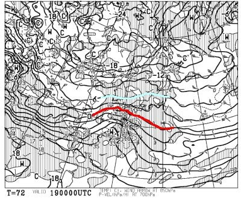

地上天気図を見ると…

高気圧が太平洋側に抜けて，

西から低気圧が迫ってるので．

朝は晴れるものの，じきに曇って，

昼前くらいから，曇り空の一日かな…

この低気圧が土曜の深夜から日曜早朝に

かけて志賀近辺を通過するころから，

また雪が降り始めそう…

降り始めはかなり重い雪ですね…

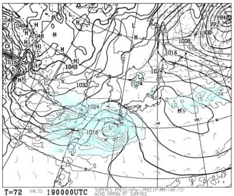

そして，20日(日)の850hpa図は．

水色の-9℃線が志賀に近づいてますが…

これは夜9時の気温図．

朝はおそらくそれほど気温が低くなく，

午後に向かってグングン気温が冷えていく

パターン．

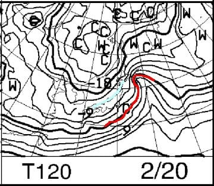

そして，地上天気図を見ると…

うわ．

これはすごい冬型…！！

かなり密度が高い縦縞等圧線なので．

この日は一日雪が激しい勢いで

降り続けそう…！！

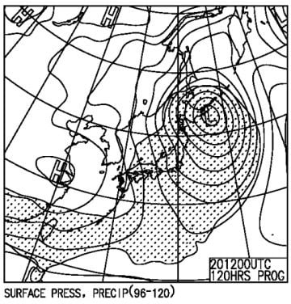

ってな感じで．

まとめると．

17日(木)：朝は-15℃以下まで冷えそう．

　朝までの積雪は10～20cm程度．

　終日雪が降ったり止んだり，時折

　強く降って，昼間も雪が積もる．

　昼間の気温も-10℃以下をキープ

　しそうで，根性の無いスキーヤーは

　ふるい落とされる．

18日(金)：朝は-12℃くらい？

　朝の積雪は30～40cm，膝から太もも

　パフのパウダー！！

　朝は雪が降ってるけど，昼ごろには

　止んで，午後に向かって天気が回復，

　夕方は日が射すかも．

19日(土)：朝は-10℃程度．

　朝の積雪は無し．

　朝は晴れて，やわらか圧雪の

　シマシマバーン！

　…でも，じきに雲が増えて，

　昼ごろには曇り空になり，

　そのまま最後まで曇りの一日．

　午後は曇るけど，雪は降らず

　気温もそこまで寒くないので，

　まぁまぁのスキー日和．

20日(日)：未明からみぞれっぽい

　湿った雪が降り始め，朝までに

　重めの積雪が5～10cmほど．

　あさイチバーンはモサモサで

　ちょっと快感度が低いかも．

　この日は終日雪降り．

　朝は気温が高めだけど，

　ひたすら気温が冷えて行き，

　降る雪がだんだん冷えたいい

　雪になっていく．

　昼間もコース上に積もっていき，

　午後は圧雪バーンもプチパウダーに

　なりそう．

…ってな感じでしょうか…

ちなみに，20日の日曜から降り始めた雪は，

21日朝までは結構な勢いで降りそうなので．

21日の月曜は，またパウダーねらい目かな？

そして，その後23日の水曜のころまでは，

それほどドサドサ積もるほどではないけど，

雪が降る日が続きそうです…

うーん．

今シーズンは，ホントに良く雪が降るなぁ…

ここ数シーズンの冷え冷え踊りで溜まった

何かが，今になって一気に放出

されているのかも…！？？←何かってなんだ？？

そしてなぜ放出されるのが今なんだ？？

## 💬 コメント一覧

### 💬 コメント by (かず)
**タイトル**: Unknown
**投稿日**: 2022-02-17 11:36:50

金曜と悩みましたが日曜からにしました！ 悩みどころ宿なら  車中泊用の車買うのもありです笑笑

### 💬 コメント by (レインボー74)
**タイトル**: Unknown
**投稿日**: 2022-02-17 14:51:13

木曜日の志賀高原情報

朝の上林-6℃　蓮池-11℃。寒いし雪降りの一日。

ダイヤモンドで新雪10cmの圧雪バーンを何本か堪能してから、貸切状態の非圧雪へ。多少の底付きはあるものの、やっぱり楽しい。

降りしきる雪のなか、やけびに行く。

GSサイドは新雪20以上あるものの硬い底付きがが残念。

オリンピックは新雪30以上だけど、ストップがかかるので楽しくない。朝一は20cmだったそうな。

11時頃の白樺はどんどん雪が積もってきて軽快にとばせる。この日の一番かな。

ダイヤで何本か滑ったあと、高天の銀嶺昼食で終了。

銀嶺はメガ唐揚げが有名だけど、私はざるそばかラーメン。今日もおいしかった！

### 💬 コメント by (Skier_S)
**タイトル**: 明日はパウダー！
**投稿日**: 2022-02-18 02:36:50

＞かずさま

やっぱり1泊2日で行きます．

宿は素泊まりで，食堂などに集まらないようにして．

食事は持ち込みで対処します…

＞レインボー74さま

今日も新雪楽しめたようですね．

明日も新雪ですよ！

明日は激太ファット履いて行ってください！

