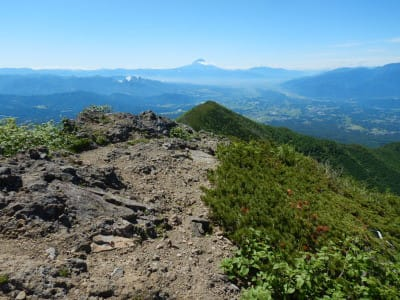
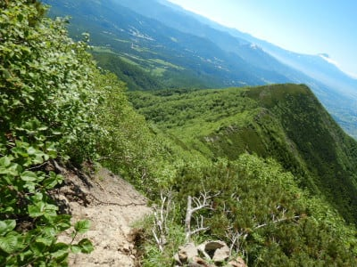
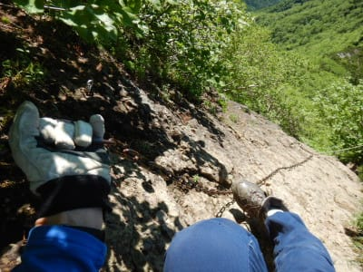
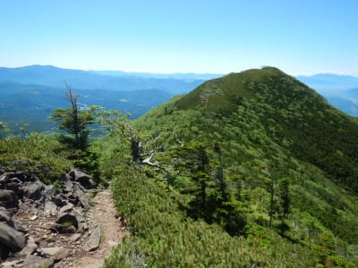
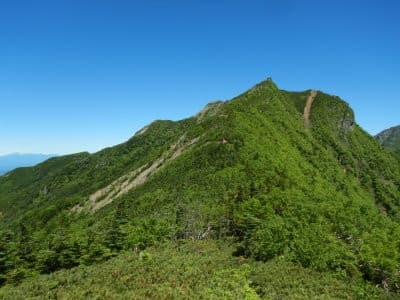
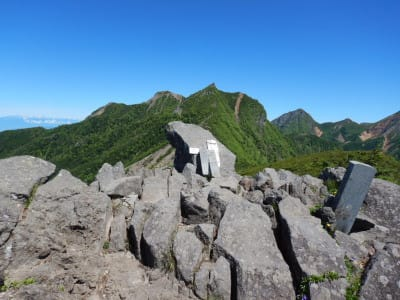
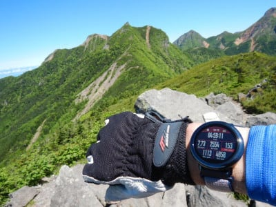
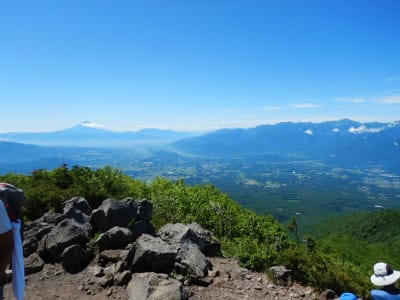
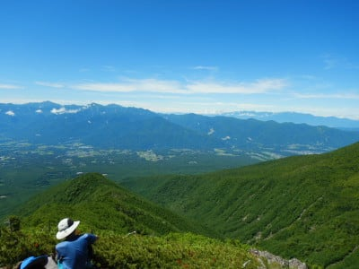

# 2021年7月，編笠山リベンジ＆権現岳へ！その9…そしてSUBARU新型アウトバック発表！

📅 投稿日時: 2021-09-03 02:32:53

🏷️ カテゴリ: [登山・旅行](c1d637a11a25b457ac978d197adbdafc5.md)

えー．

もう，国内販売は無いのでは？

と思っていた，SUBARUのアウトバック．

本日，新型のアナウンスが出て．

SUBARUのWebページに，かなり詳細な

情報が出てましたね～…

（[SUBARUホームページ](https://www.subaru.jp/legacy/outback/)より）

新型アウトバック，一昨年からアメリカでは

発売されていましたが．

国内仕様は，顔がちょっとアメリカ版とは

変わってますね…

2.5L NAと2.4Lターボのアメリカ版と違って．

日本版は，全車1.8Lターボ！

LEVORGと同じ，CA18エンジンになりました．

そして，全車アイサイトX付き！

うむ．

でも．

安いほうのグレードで410万円．

LEVORG STI EXと同じ値段か…

ちょっと高い(涙)

我が家では手が届かない車ですね…

ってなことで本題へ．

引き続き，編笠山＆権現岳山登りレポートです！

ーーー

というわけで．

権現岳山頂を極めたので．

あとはひたすら下山！

…昨年の編笠⇒西岳ルートでは，膝痛のため

西岳からの下り標準コースタイム

3時間20分のところ5時間20分かかった

という，悔しい思い出を，果たした今回は，

上書きすることができるのか？？

ここから駐車場までのコースタイムは，

3時間25分．

とりあえず，今のところは全く膝が痛くなる

気配はないけど．

いつもなら，膝が痛くなる下り坂．

今回は，全く痛まずに残りコースタイム

3時間25分のコースを下りきれるのか？

果たして，どのくらいの時間で下山

できるのか！？

いざ，チャレンジ！

まずは，この向こう側に見えている，

とんがった三ツ頭へ向かうのですが…

いきなり鎖場か…

でも，下山ルートの鎖場はこの一か所のみ．

そんなに急でもないので，サクサク

降ります．

あとは，気もちいい緩やかな稜線沿いを

歩いていきます．

振り返ると，さっき登った権現岳

山頂のとんがりが見えますね…

もうこんなに降りてきたのか！

快調，快調！

ってなことで．

権現岳からコースタイム40分の

三ツ頭へ，25分で到着！

…すごい早いわけじゃないけど．

まぁまぁのペースですね…

この三ツ頭，尖ったピークだけあって．

ここも景色がいいです！

いや…ホントに今日は絶好の山登り

日和ですよ！！

景色は良かったけど，まだ下山を始めた

ばかりなので．三ツ頭は3分ほど

立ち止まっただけで，ひたすら下山を

続けます…
