# 2007年8月　三宅島ドルフィンスイム＆ダイビング旅行記　その3

📅 投稿日時: 2013-09-11 02:43:16

えー．

なんだか．

昔書いた文章だから．

今とスタイルが違うなぁ…

完全にダイバー向けに書いてますね．

…とりあえず．

三宅島レポート，続くのだ．

-----

ってことで．

大久保浜へエントリーしましたが…

をを！水温が暖かい！

透明度は15m．まぁまぁでしょうか．

でも，景色はやっぱり伊豆っぽいなぁ…

と，思ったところ．

エントリー直後，まだ深度5mに達しないうちにムロアジ群れが！

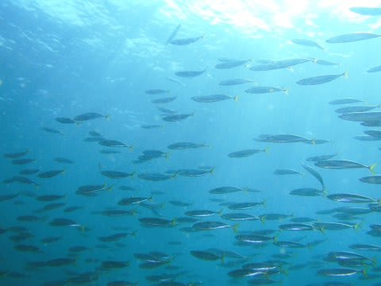

さらに，ほんの少し進んだだけで．

ひらひらと踊っているようなヒレグロコショウダイ幼魚と…

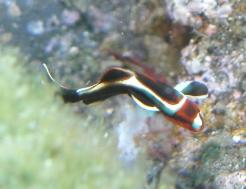

アジアコショウダイ幼魚が並んで出現．

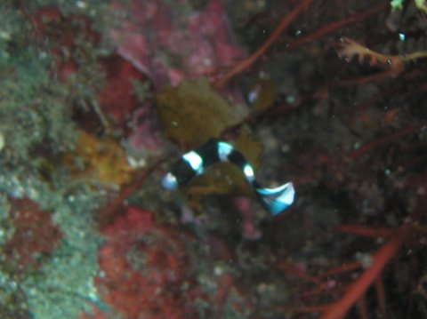

ツユベラ幼魚もいっぱいいます．

こちらにはマダラタルミ幼魚が！

って感じで．

いきなり山盛りの小物が登場ですね～．

そこからさらにほんのちょっとだけ行くと…

をを！

今度はフリソデエビのペアが！

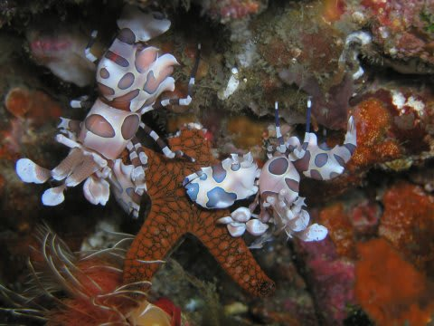

2匹で一つのヒトデにしがみつき，お食事中の様子．

さらに深度5mほどの岩場を真っ直ぐ進んでいくと，

V字状の崖に沿ってボトムが-25mほどの砂地に落ち込んでいます．

この壁際を下りて行くと…．

なんと．2cmは余裕で越えていようかという巨大イソコンペイトウガニ．

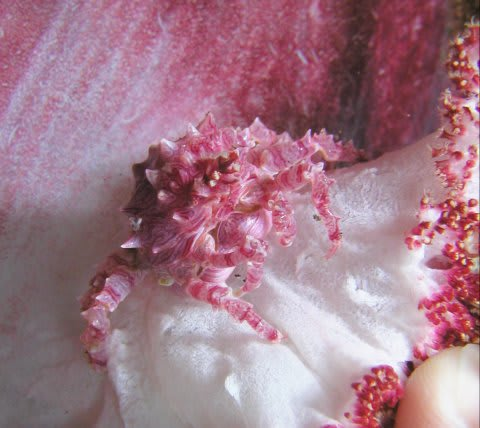

ナンじゃこりゃ．ありえないでかさ．

ボトムまで降りると，目の前を30cmクラスのツムブリの群れが

突っ切って行きます．

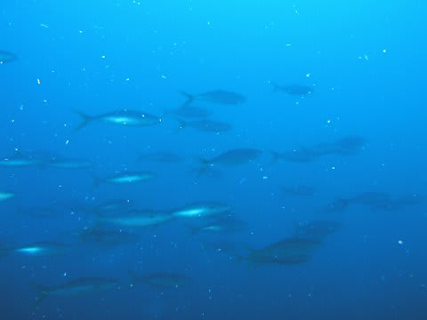

さらに，20cmほどしかないミニカンパチも，私の周りを

ぐるぐると回ってくれます．

こんなフレンドリーなカンパチ，初めてだ…．

ガイドさんはマクロ系に強く，スケロクウミタケハゼやら…

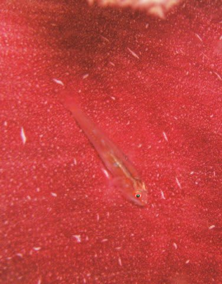

ウミウシなんかもいっぱい見せてくれます．

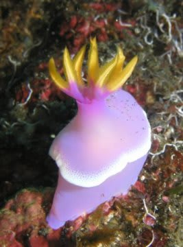

浅場に戻ってくると，今度はニシキフウライウオが．

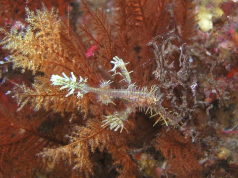

さらにはクロメガネスズメダイyg，セダカスズメyg，

そしてウミテングなどなど…

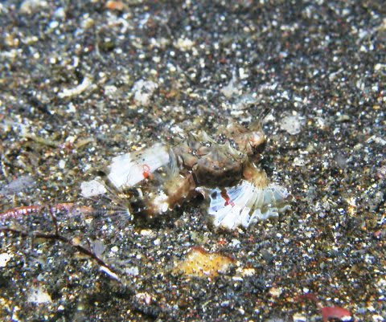

…すごい，1ダイブでこれだけ見れてしまうとはっ！

てんこ盛りのダイブだ．

それも，ほかのダイバーに会うことなく，

こんな海を貸切で潜れてしまうとは…．

いやー．

三宅島．

…実に，マニアックな海ですね～．

伊豆に通いつめて，マクロ系生物を必死に探しているような

人にはたまらない海ですね～．

ということで，1本目のダイビングを無事に終え，ダイブショップに戻ってお弁当のあと．

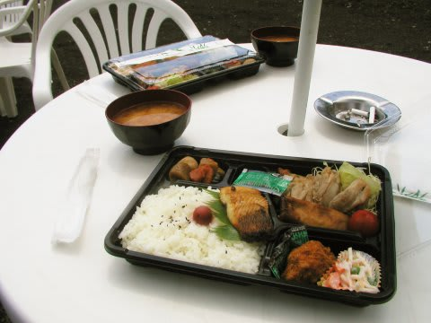

午後はいよいよドルフィンスイムです．
