# まだ続く！1月2日の志賀高原は…晴天．積雪増えず（涙）．

📅 投稿日時: 2016-01-02 22:06:32

🏷️ カテゴリ: [2016スキー滑走日記](c70c67ed5248e9432b899dcd5747048bb.md)

一体Skier_Sは，いつまで志賀高原に滞在するんだ…？？

という疑問が，読者から出てくるであろう今日この頃．

皆さまいかがお過ごしでしょうか．

えー．

雪不足に悩まされている志賀高原ですが．

…本日も．

晴れなくてもいいのに

すっきり晴れ

でした（涙）

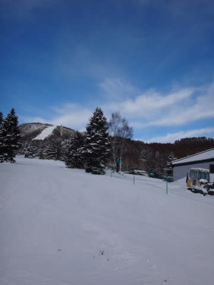

昨晩からの積雪は，1mmたりとも増えていません．

…ええ．1mmたりとも…（泣）

…普通なら，晴れてくれるとうれしいけど．

今シーズンほど，この晴れが憎らしいことは

ないですね…（がっくし）

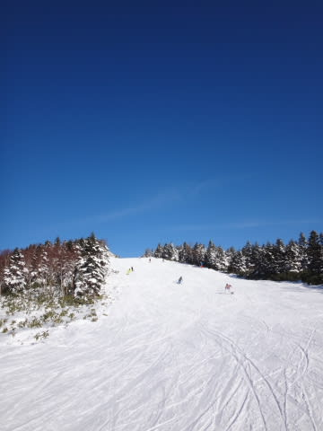

朝のうち，気温はマイナス6度程度と，

そこそこ冷えて．

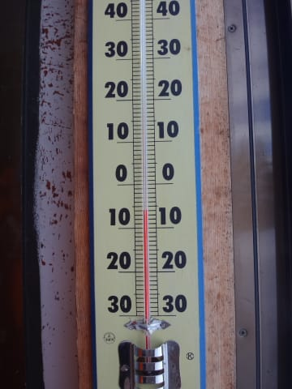

雪も朝イチはかなりいい感じのシマシマバーンで．

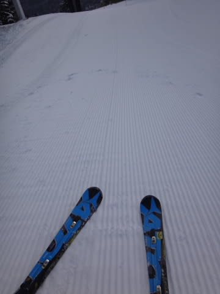

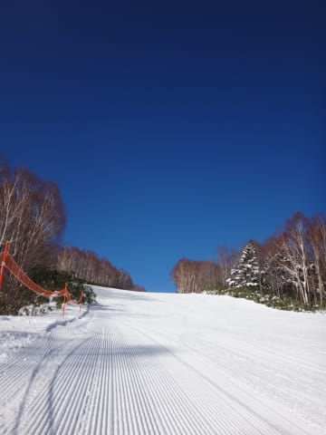

雪質も，冷え冷えの志賀高原クオリティで，

かなりいいんだけど…

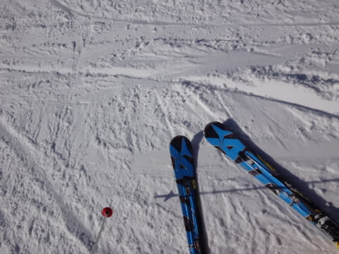

…でも．

やっぱり．

今日も，朝早くから…

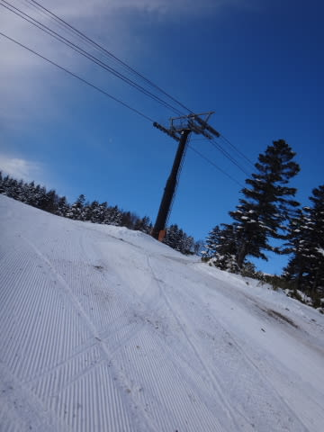

ああ．

出てきています．

スキー場には出てきていけない何かが，

朝早くから，ゲレンデにコンニチハしてきてます…（激涙）

…ああ．

晴れなくていい．

晴れなくていいから，そろそろ，

どっさり積雪を…っ！！（強い懇願）

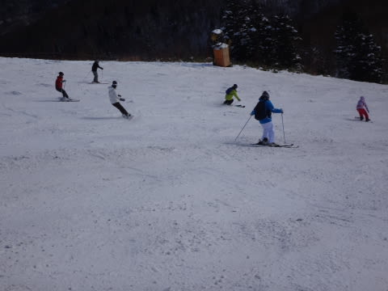

そして，こーゆー土が隠れてほしいところ…

もう，ほんとにそろそろ焼額の第1ゴンドラ側，

人工降雪をつけてないジャイアントスラロームコースは

やばいです．

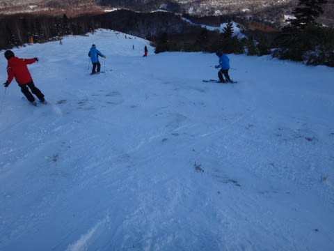

いつコース閉鎖されても不思議じゃないレベル…

そして．

本日は．

人工雪をつけてある，第2ゴンドラ側の

パノラマコースも，かなり土が出てきました…

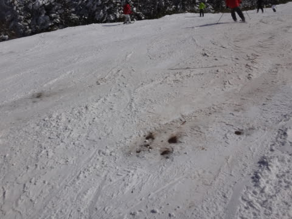

まぁ．

でも．

こちらはまだ避ければ滑れるレベルです．

人工降雪をつけてない1ゴン側は，もう

石を踏まずに滑ることは絶対無理．

コースクローズになってもおかしくないレベルなので

また，なんとかコース状況を改善すべく．

人力で必死に雪出しをしています．

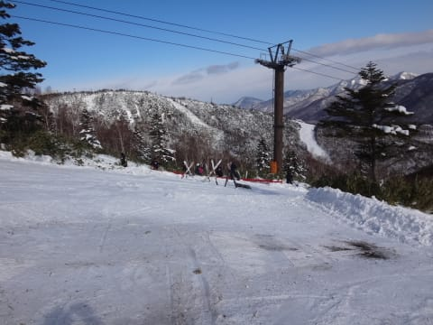

…せっかく隣に人工降雪機があるのに，

なぜ，人力で…？？

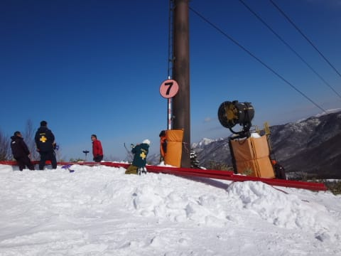

まぁ．

第2高速と第4ロマンス側に人工降雪を打つようになってから．

この1ゴン側の人工降雪機，ここ10年ほど動かしてるの

見たことないし．

今年も動かす気はないんだろうなぁ…

と，思っていたところ．

あれ？

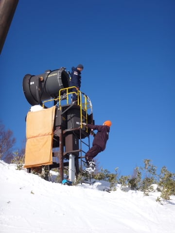

人工降雪機の整備をしている…っ！

長らく使っていなかったので，すぐは使えないようだけど…

あまりにもゲレンデ状況が悲惨なため．

どうやら．

ここ10年ほど人工雪をつけることがなかった

第1ゴンドラ側のGSコースも，

「状況によっては，人工降雪を検討中」

とのこと．

うーむ．

なんてたって，ゲレンデがこんな状況なので．

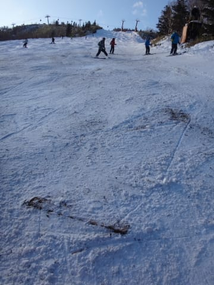

早く人工雪を打ってほしいなぁ…

さらに．

本日は，積雪が全くなかっただけではなく．

昼間の気温も…

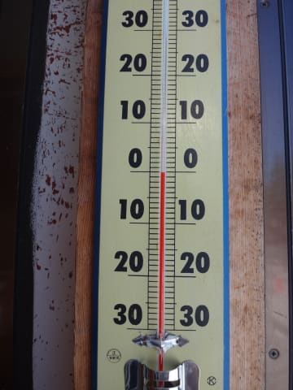

はぁ？

なんですとっ！！！？？

1月の志賀の山頂，日陰の温度計で0度ですかっ！！？？？

気温が…

気温が高すぎるんですがっ！

って感じで．

かなりあったかかった本日．

晴天の強烈な日差しも相まって，

午後には，志賀の1月ではありえない重めの雪となり…

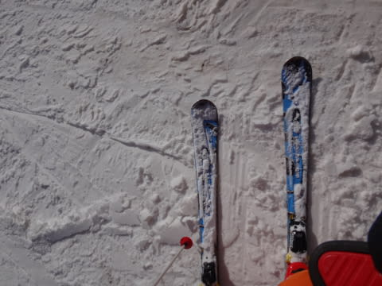

そして．

荒れ荒れバーンになりました（涙）

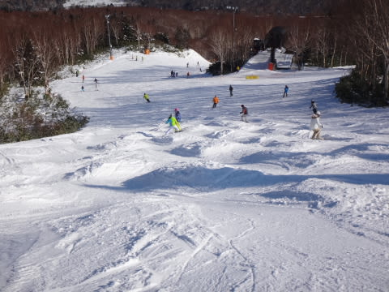

今日も．

せめてもの救いは．

相変わらず1ゴンは，終日待ちが

全くなかったことくらいでしょうか…

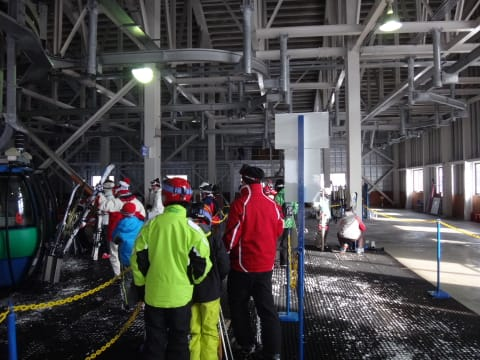

＃人工降雪をつけてある2ゴン側は，

＃午前は一時10分待ち近くあったらしい

うがーーーーっ！

だめだ．

ダメだよ．

12月30日より，ゲレンデ状況は悪化してます（涙）

晴れなくていいから，そろそろ

雪が降ってくれないと…

とりあえず．

明日も，雪は降りそうにありません（悲）．

…それどころか．

明日は今日より気温が上がり．

平年比＋6度くらいに上がりそう…

…

…

なんてことだ…（悲嘆）．

これはもう．

雪が降るように．

神に祈りましょう…

…

…でも，それだけでは足りないので．

皆さんがめったにやらない，

普段では絶対にありえないような，

大変大変珍しいことをやってみる…ってのは

いかがでしょうか．

例えば．

あれですね．

私が来週の週末に志賀高原に行かない，とか．

…あー．

そんなことしたら．

すごい激烈な吹雪になるかも…！！？？

＃絶対にやらないけど

## 💬 コメント一覧

### 💬 コメント by (デーコン)
**タイトル**: Unknown
**投稿日**: 2016-01-03 19:15:57

こんばんわ。

初めまして。

志賀高原の様子を楽しみに見てます。

来週行くのですっごく気になります。

### 💬 コメント by (Skier_S)
**タイトル**: デーコンさま
**投稿日**: 2016-01-04 02:12:53

初コメントありがとうございます～．

ようこそ，わが駄文置き場へ．

来週，3連休に志賀高原ですか．

今も，横手山・熊の湯方面はかなりマシなのですが…

それ以外はかなりやばい状況です．

3連休の天気＆雪がどうなるか，

また水曜夜に恒例の天気予想をやりますので…

今後もよろしくお願いします～

