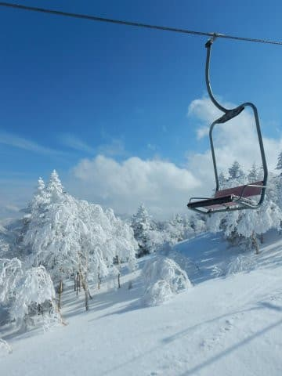
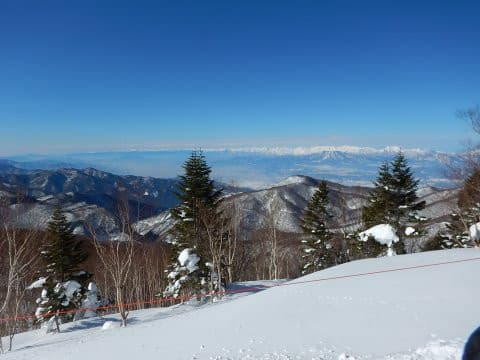
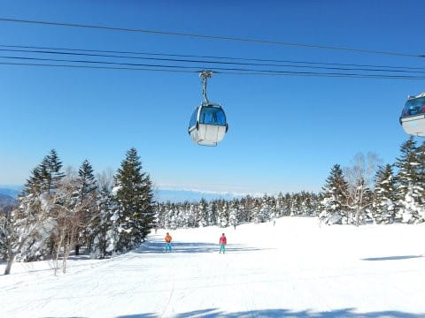
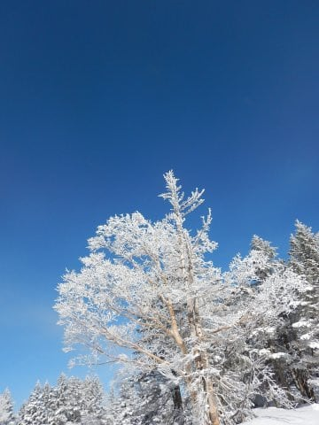

# 20000mクラブの名言集，2019シーズン版…2019年も，いくつもの迷言が生まれました…

📅 投稿日時: 2019-07-02 01:29:07

🏷️ カテゴリ: [スキー雑談](c1f9d2cb7478308da16419928ea3945e9.md)

ということで．

この土曜日の月山をもって，

ついに私の2019シーズンも終わって

しまったわけですが．

今シーズンも，志賀高原では毎週，

20000mの方々とお会いしていたわけで．

そして．

世間一般の標準からかなりずれている突き抜けている，

20000mクラブの方々．

まぁ，普段から，生きているだけでネタの

宝庫素晴らしい伝説を数多く生み出す方々なので．

やはり，[昨シーズン](ebad5fbe487532f1c34f089b11b85b828.md)同様，今シーズンも．

数多くの迷言&伝説を残してくれました…

名言その１．

一の瀬ファミリーを生息域とする，

超大御所の某氏．

週末のリフトが動いている時間であれば，

ひたすら一の瀬ファミリーを滑り続け．

一の瀬ファミリースキー場の正面バーンに

立っていると，

ほぼ確実に7分に一度は目の前を通過

していく…という，伝説の方ですが．

この方が，今シーズンの昼間．

大変極めてすごく珍しいことに，

焼額第1ゴンドラに乗り，オリンピックコースを

滑っていました…！！

私「ど，どうしたんですか！？なぜ焼額に？？

　一の瀬ファミリー，何かあったんですか！？？」

という質問に答えて曰く．

　「昼休みに，焼額オリンピックコース滑ってる」

…

…え？

は？

休み？？

良く意味が分からないのですが…？？

「一の瀬ファミリー正面バーン，雪がひどくて疲れるから，

　焼額に休みに来た」

は？？

…どうやら．この某大御所にとっては．

焼額のオリンピックコースは

体に優しい，疲れない斜面

らしく．

条件が厳しい一の瀬正面バーンを滑り続けることを考えると．

焼額のオリンピックコースで滑るのは，休憩のようなもん

らしいです．

だもんで．

体を休めに，オリンピックコースを滑っていたという…

あのー．

普通の人は，滑っている状態は「休み」と言わないのですが…！？？

それも，オリンピックコースって，かなりの急斜面で．

普通の人には，かなり厳しいコースなんですが…っ！？？

ずれてる…

基準が激しくずれてる…

名言その2．

私と同じく，焼額をベースとする某氏．

ある日，自宅で足をぶつけて．

足の指の骨にヒビが入ってしまったらしく．

かなり痛そうに歩きながら．

スキー場にやってきてました．

私「…骨，折ってるんじゃないんですか！？？滑れるんですか？？」

という質問に答えて曰く．

　「スキーブーツは，ギプスですから」

…え？？？

…そうなんですか．

ブーツ履いたら固定されて，

痛くないんですか…

骨折ってても，滑るんですか…

やはり，違う．

20000mゴールドな人の，スキーに賭ける

執念は，一味違う．

名言その3．

4月のゲレンデコンディションが最高の日．

トップシーズンでもそうそうないくらいの

超絶Goodコンディションで，とても4月と

思えない最高の日に，

ゲレンデで大転倒してしまった某氏．

膝を痛めたのか，かなーり痛そうにしていたんですが．

それを目撃してしまった私は，

私「大丈夫ですか？まだ滑れますか…？」

と聞いたところ…

　「コンディションが悪かったら帰るところだけど，こんなにコンディションがいいから帰れない」

と答え．

良い子は絶対マネしちゃダメよ状態で，

その後しっかりリフトストップまで滑り続けて

いました…

そして．

某氏は．

その翌日，靱帯一部断裂が判明し．

数日間動けず，仕事にも行けなかったという…

数日間仕事を休むような怪我をしたにもかかわらず．

転んだあと昼休みを挟んで，しっかりリフトストップまで

滑った，この根性…

やっぱり，20000mな人は違う．

「ブーツはギプスです」と言ってのける人は，違う…

名言その4．

これは，20000mゴールドな方じゃなく，

シルバーな方の迷言なんですけど．

焼額朝礼メンバーの某氏．

志賀全山のシーズン券を持っているのですが．

焼額の早朝＆ナイターを滑るために，

焼額のシーズン券も買ってしまい．

同じスキー場で使えるシーズン券2枚持ち

という，

信じられないほど終わってしまった人情熱にあふれた人

なわけですが．

もう，シーズン券でナイターも早朝も滑り放題

なので．

「滑らにゃ損」とばかりに，

毎週確実にナイターを滑り．

早朝営業をやっている日には，

毎週しっかり早朝から滑っていた

わけですが…

さすがにそれが長く続いて，疲れが出たのか．

3月下旬のシーズン終盤のころ．

　「ナイターも早朝もタダってのは，体に悪い」

…

…

…いや，いやいやいや．

前も同じようなツッコミをした気がするんですが．

それって，「リフトが動いているから帰れない」という

迷言と同じで．

早朝とナイターがやっていても，滑らないで休めば

いいだけですから！！！

早朝とナイターが営業しているから，滑らなきゃいけない

のではありませんから～！！

…という感じで．

今年もいろいろ伝説が生まれたわけで．

やはり，20000mな人たちの中に混じると．

自分は極めて平凡な，常識的な人間だなぁ

という，いつもの思いを強くする，

Skier_Sだったのでした…

## 💬 コメント一覧

### 💬 コメント by (迷言スキーヤー・2)
**タイトル**: Unknown
**投稿日**: 2019-07-02 19:39:36

いや～タンスの角にぶつけたときは、ホントに悶絶しましたよ～

日常生活では歩くたびに痛かったのに、あ～ら不思議！

スキーブーツを履いたとたん、痛みは消え、何事も無かったように滑れました。

何度も言います『スキーブーツはギブスです』断言！

（しかし夕方の荒れたバーンとコブは無理です・・・）

### 💬 コメント by (迷言スキーヤー・3)
**タイトル**: Unknown
**投稿日**: 2019-07-02 19:49:59

やった瞬間は捻挫くらいかな～って軽く考えてたんですが、まさか靭帯部分断裂だったとは・・・

あの時すぐ止めてアイシングとかすれば、もっと軽く済んだんでしょうが、後の祭りですね。

さすがに、スキーパンツはギブスにもサポーターにもならなかったです(笑)

せめてもの救いは、シーズンも残り僅かだったってことでしょうか。

皆さん、怪我したら速攻で病院に行きましょう！

### 💬 コメント by (迷言スキーヤー・４)
**タイトル**: Unknown
**投稿日**: 2019-07-03 00:17:58

ナイターの開催中は土曜日のみなので楽しくてしょうがなかったです。

早朝が開始されて楽しさ数倍！って調子に乗ってましたが、連日の早朝～リフトストップは何故かだんだん口数が減ってきます（笑）

まったくの想定外でした！

ヤケビの超早割りのページも未だ早朝可と変更されていませんので、来シーズンは死にそうな目にあわなくてよさそうです。

ただS様同様に、早朝が開催されなくなるのではという一抹の不安が・・・

### 💬 コメント by (Skier_S)
**タイトル**: 迷言を残した方々が…
**投稿日**: 2019-07-03 03:00:48

＞迷言スキーヤー２＆３さま

今度から，足の小指の骨が折れた時は，

普段からスキーブーツを履いて生活されてはいかがでしょうか．

痛みに悩まされずに済みますよ！

…そして．

骨折した状態で滑り，靱帯を痛めるとは…

いろいろ伝説の年として今後語り継がれそうですね．

来シーズンは，怪我の無いようにお過ごしください～！！

＞迷言スキーヤー・4さま

そうですね…ナイターは土曜だけだけど，

早朝は土日ともですから…

早朝が始まると，疲れが加速しますよね（笑）．

来シーズンは，私もシーズン券2枚買いせずに済みそうですが，

早朝営業は引き続きやってほしいところです…

### 💬 コメント by (ゆうこ)
**タイトル**: Unknown
**投稿日**: 2019-07-10 21:57:58

私も、昔スノボで肩を骨折したときに、

「スノボのせいで骨折したけど、スキーは大丈夫」

とか言ってやっぱり毎週滑っていたのを思い出しました。

みんな、同じような感じで、ホッとしました！

### 💬 コメント by (Skier_S)
**タイトル**: >ゆうこさま
**投稿日**: 2019-07-11 04:44:21

いや…

それ，みんなおんなじ感じじゃないですから（笑）．

かなりイっちゃってる人と同じってことですから…

肩を骨折して滑ったってのは，すごすぎます…

