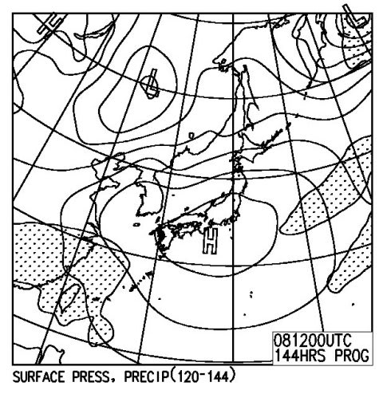

# 暴風雨の後は…今週末は期待できそうっ！

📅 投稿日時: 2012-04-04 00:27:54

あー．

今日は，日本の広い範囲にわたって暴風雨でしたね…

で．

暴風雨をもたらした低気圧は．

これからも発達を続けるわけですけど．

なんで今回の低気圧がこんなに発達したかというと．

…上空に異常な寒気が入ってるんですね．

だもんで，この低気圧が発達すると…

こんな感じで見事な西高東低の冬型の気圧配置になるわけですな…

ちなみに，これは金曜6日の朝9時の天気図です．

で．さらに高層天気図のFXFE577，金曜朝9時の500hpa気温図を見てみると…

こんな感じで．

赤線で記したように，この時期にはありえない-30度の寒気が

新潟近辺まで下りてきてますっ！

さらに，北東北には-36度の寒気という．

猛吹雪の目安となる寒気が来てます…！

さらに，今後1週間の気温傾向を見ると．

こんな感じで．

これから数日間は，平年より10度近く気温が低い日が続きます…

矢印で示したこの週末も，かっちり冷えそう．

FXXN519の850hpa気温図では…

こんな感じで，赤く記した0度線が日本の南まで

下がっているので．

いい感じで冷えて，週末までは雪が降り積もりそうです．

トップシーズン並みの冷え込みですね～．

さらに．FXXNの500hpa高度の傾向を見ると．

赤線で示すように，明日から矢印で示した週末まで，

網掛けがかかっている5400mのラインが北緯35度くらいまで下がっています．

この図の左側を見ると，3月下旬に，5400mラインがここまで下がったことはないですね…．

つまり．3月下旬に来たどの寒気よりも強い寒気が，これからやって来るということですな．

…ということで，明日以降，週末までは，

かなり冷え込んで，そこそこいい感じで雪が降り積もり．

この週末は，とても4月と思えないコンディションで滑れそう…

さらに．FEFE19で，8日（日曜日)の予想天気図を見ると．

こんな感じで．

日本はすっぽり高気圧に覆われてます．

ということで．

日曜は冷えていい雪が積もった上に，晴天に恵まれるという…

このままの天気図が続けば．

このままの状態が続けば．

この週末．

コンディションは最高なのだっ！

## 💬 コメント一覧

### 💬 コメント by (雪上の翁)
**タイトル**: やった～
**投稿日**: 2012-04-04 20:11:51

土曜日の滑り納めは、

ガリガリかグサグサを覚悟していたので、

いきなりモチベがMａXになりました！

### 💬 コメント by (Skier_S)
**タイトル**: このままならば
**投稿日**: 2012-04-04 23:22:18

いい週末になりますよ～．

とても4月とは思えない感じです…

下地にちょっと硬いところがあるかも

知れませんが，

その上にはいい雪が積もっていることでしょう…

この4月上旬，寒めの日々が続きそうなので，

春スキーシーズンは長そうです．

今週末で終わりとは，もったいない！

