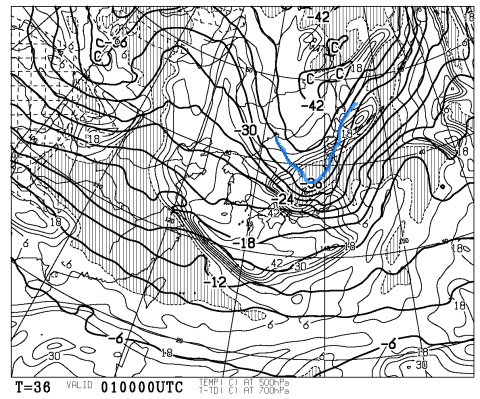

# この週末の志賀高原は…焼額ゴンドラ運転決定っ！

📅 投稿日時: 2012-11-30 01:15:42

えー．

ということで．

昨日．

「焼額，ゴンドラ動いてくれるといいなぁ～」

って書きましたが．

本日木曜日，この週末の[第2ゴンドラ運転が決定](http://ski.princehotels.co.jp/shiga/newarrival_mod2.php?index=2088)したようです～（パチパチパチ～）

いやー．

12月第1週からのゴンドラ営業って，私の記録を10年ほどたどってみても．

2007年しかないですね…

普段は第2週，遅いときは第3週．

第3週に動いたものの，雪がぜんぜん無くてブッシュだらけ…ってこともあったっけ．

今年は順調なようで，うれしいですね～っ！！！！

って感じで．

この週末の志賀高原で動くリフトは．

高天ヶ原（下半分，トリプルリフトのみ)

一の瀬ファミリー(下半分，ペアリフトのみ)

熊の湯(第2ペア山頂まで，第4ペア)

横手山（運転リフト未定)

焼額(第2ゴンドラ）

ですか．

一の瀬は下半分だけみたいですね(涙)

土曜に積もったら，日曜クワッド動かないかな～，って期待．

あと，焼額の第2高速も動いてくれるとうれしいんですけどね～．

…そうそう，この土日の焼額．

なんと，[早朝運転までやるようです．](http://ski.princehotels.co.jp/shiga/newarrival_mod2.php?index=2030)

6時半～8時までの1時間半，第4ロマンスを運転．

ただし，リフト代が別途￥1500円必要ですが…

でも．

今週土日，スキー開き祭価格ということで，

1日券：2,800円

2日券：3,600円

という格安価格なので．

長野の先陣を切ってゴンドラを動かす焼額，結構ねらい目かも？？　

この土曜日は．

こーんな感じで，青い線で描いた－36度という，大雪の目安の寒気が日本直近まで降りてくるので．

冷えるのだ．

金曜の夜から，日曜の朝まで降り続けるのだ．

それも．

冷えたパウダーが積もるのだ．

期待できるのだ．

＃ホントはこの時期，湿った雪のほうがしっかりとした下地として積もるのでいいんだけど…

そして．

うまくいけば．

日曜は昼には晴れるのだ．

この週末は，コンディションが良いのだ．

ということで．

この土日．

私は志賀に出没することが決定したのだった…
