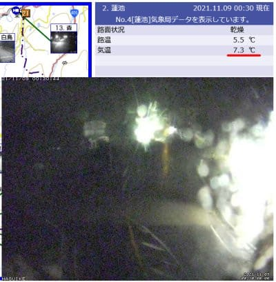
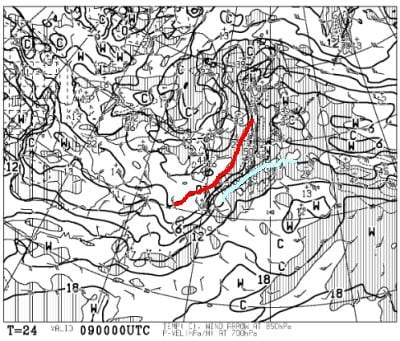
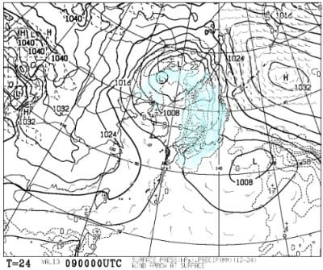
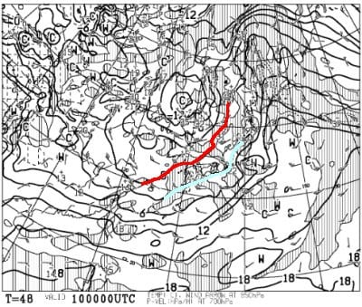
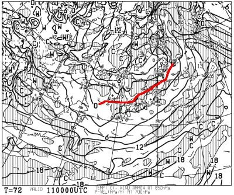
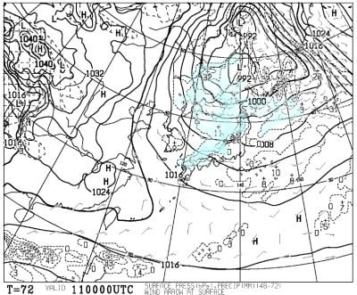
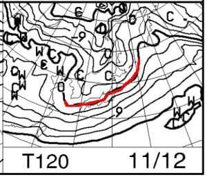
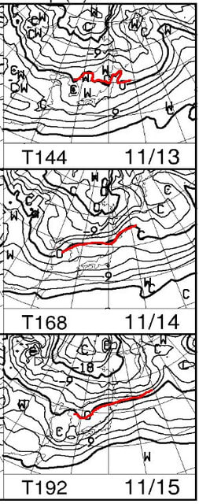

# 11月13日までに志賀高原の横手山・熊の湯は滑れるようになるのか？天気図を読み解いてみる

📅 投稿日時: 2021-11-09 01:24:29

🏷️ カテゴリ: [スキー天気予想](c6554f5c3c106093b511a8daae23757e8.md)

かなり以前から予告していましたが．

8，9日とものすごく気温が上がり，

壊滅的な雨が降りそう…

と，予告しましたが．

今，志賀高原ではやはり予想通り，

雨が降っているようです…(涙)

（[北信建設事務所道路気象状況カメラ](http://hokushin.pref-nagano-roadcamera.jp/)より）

それも，夜中の志賀高原で気温が

7.3℃って…！！？？

この時期としては，やはり異常なほど

温度が上がってます(泣)

そして．

9日の850hpa気温図を見ると．

赤い0℃線は志賀にはかかっておらず…

それどころか，志賀高原にかかって

いるのは水色の+9℃線(涙）

これは…激烈に気温が上がりますね(泣）

さらに，9日の地上天気図を見ると，

こんな感じで．二つの低気圧に挟まれて，

見事に日本全域に水色の降水域がかかって

いるので…

ダメです．

明日9日一日，まるまる雨が降り続け．

さらに気温もかなり高いので．

高温＆雨のダブルパンチで，やはり横手の

人工雪は跡形もなく地上から抹殺

されてしまいそうです…(激涙）

あぁ…

これまでの人工降雪が無駄になる残念さ…

そして．

翌10日も，850hpa気温図を見ると．

志賀には水色の+3℃線がかかっている

くらいなので．

横手ならギリギリ0℃まで冷えるかな…？

ってところで．

あまり降雪は期待できず．

熊の湯も横手も，人工降雪機は

動かせなさそう…

ただ，11日になると．

何とか赤い0℃線は志賀高原に近づいて

来て，ちょっと冷えてくるので．

熊の湯は厳しいかもしれないけど．

標高が高い横手山は，ぎりぎり人工降雪機を

動かせるかも？

11日の地上天気図では降水域が志賀高原に

かかってないので．

うーん．

志賀高原，雨にもならない代わりに，

雪も降らなさそう…

そして．

12日の850hpa気温を見ると…

うむ！

この日はギリギリながら，志賀に0℃線が

かかっているので．

この日，志賀高原は雪がぱらつくかも？？

…でも．ドサドサ積もりそうな雰囲気では

ないなぁ…

さらに，その後の850hpa気温を見ると…

…ダメだ(涙）

13~15日までは，赤い0℃線は志賀高原より

ずっと北．

志賀高原は，この期間も…

天然雪も積もらなければ，人工雪も打てなさそう

な感じなんですが！？？

ってなことで．

まとめると．

9日：高温の雨でゲレンデ壊滅(涙)

10，11日：気温は冷え始めるが，人工降雪も天然雪も

　期待できない一日．もしかしたら，ギリギリ横手が

　ちょっとだけ人工降雪機を動かせるかも．

12日：ようやく冷える．西風なので志賀は

　天然雪無し．でも，志賀高原なら人工降雪機が

　動かせそう！(標高が低いところは無理)

13日~15日：雨も降らないけど気温も冷えない日々が続く

という感じの天気になりそうですが…

…

…どう考えても13日に熊の湯オープンは

無理ですね．

ええそうですね．

ということで．

やはり13日に志賀高原の横手山も熊の湯も

オープンせず．

首都圏から滑れるのは，Yetiと狭山，

軽井沢岳という状況が，今週末を超えるまで

続きそうです…

しかし．

11月になってからなかなか冷える日が無く．

10月中旬が無駄に寒くて雪が積もった

ことを振り返ると．

…やはり，10月半ばに雪が降ったのは

完全に無駄だったという結果に終わり．

10月半ばの天気の神様に

「違う．冷えるのは今じゃない」

と，もう一度伝えに行きたい気分です…(涙)

今のところ．15日以降，一体いつ

冷え込むのかは未定です(泣）

あぁ…13日の週末もYeti確定だな…(零れ落ちる涙)

## 💬 コメント一覧

### 💬 コメント by (コウジ)
**タイトル**: Unknown
**投稿日**: 2021-11-09 20:27:20

志賀高原の情報とても役立ちます

### 💬 コメント by (Skier_S)
**タイトル**: ＞コウジさま
**投稿日**: 2021-11-10 01:25:23

コメントありがとうございます～！

これからもご愛読よろしくお願いします！

