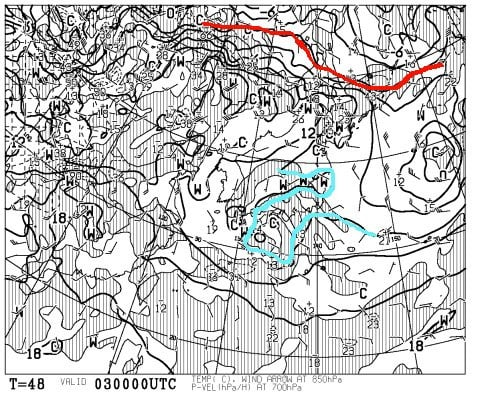
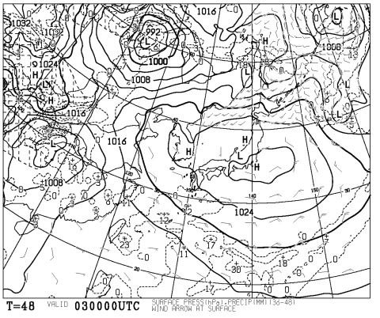
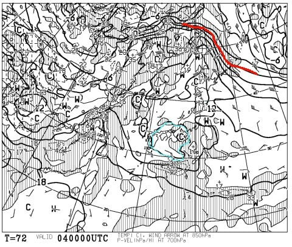
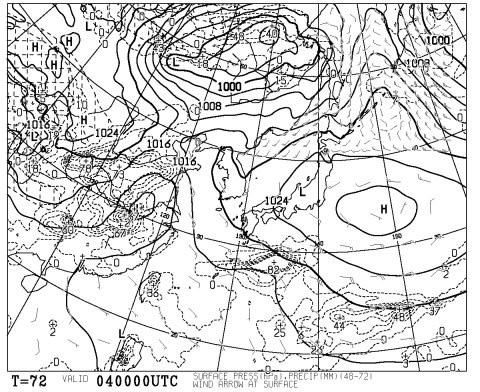
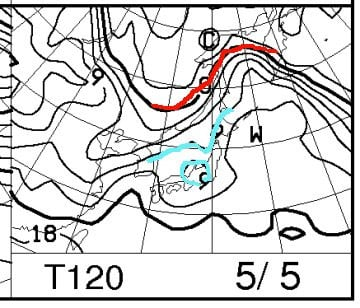
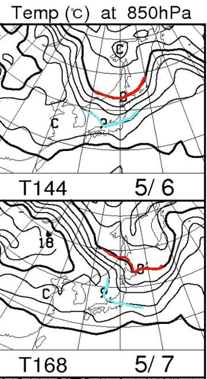
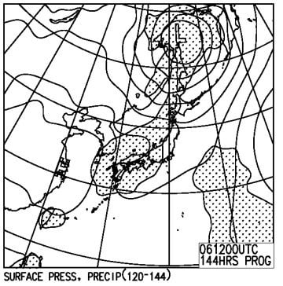
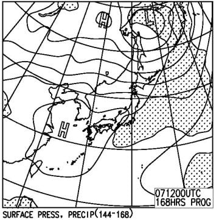

# 本日2つ目の更新！GW後半5連休の志賀高原の天気は？…おおむね晴れ．気温高め．6日午後～夜は雨かな？

📅 投稿日時: 2017-05-01 22:32:31

ということで．

そろそろ，

「GW後半，5連休の志賀高原の天気はどうなんだろう…？？」

…と，気にしている人も，非常にたくさん

いらっしゃると思うので．←いや…もうほとんどいないと思うけど…

スキー場レポートの記事を書いたというのに．

さらに天気予想の記事をアップするのだ！

＃何がモチベーションで，スキーが終わった後に

＃ここまで時間をかけて記事を書いているのか…

まず．

5連休初日，3日の850hpa図ですが…

…はぁ．

赤い0度線は，図からはみ出しそうなほど

北に行ってますね…

…春ですね…（涙）

志賀高原は，水色の+12度線が近づく

レベルなので．

はっきり言って，この日は朝から

暑く感じるほどの一日です（泣）．

地上天気図を見てみると…

うーむ．

まぁ，高気圧に覆われるので．

基本的に晴れそうですね…

気温が上がって晴れるので，

雪質はかなりざぶざぶか…（涙）

そして2日目．4日の850hpa図ですが…

うーむ．

この日も，志賀高原には水色で描いた9度線の

外側．むしろ12℃線が近づいてるので．

この日も，志賀高原でも最高気温は15度を

超えそうな一日．

地上天気図は…

この日も，高気圧に覆われて晴れそうで．

晴れて気温が高いので，一気に雪が緩みそう…

暑く感じる一日でしょう…

で．

3日目の5日ですが．

この日も，水色の9℃線がぎりぎりかかる程度

なので．

昼間の気温は確実に+10℃を突破するかな…

地上天気図は．

うーん．．

高気圧のへりにかかってますが．

まだこの日も晴れが続くでしょう…

4日目＆5日目の6，7日ですが．

まぁこの2日とも，水色の9度線が

志賀高原にかかってる感じなので．

まぁ，5日と同じ感じで，昼間は+10℃を

超えるレベル…

地上天気図は．

6日の天気図を見ると…

微妙なところ，この図ではぎりぎり

降水域の網掛けが志賀高原にかかってないので．

うーむ．

志賀高原はぎりぎり降らないか，降っても夜になるころ

からか…

昼間は降らないで済むかも？？

7日の地上天気図は．

>

…これも微妙だけど．

7日は朝は雲が残るけど，昼に向かって晴れて

行くかな？

とりあえず．

まとめると．

初日，3日：晴れ．朝から高温．

　放射冷却で早朝一発は固いかもしれないけど，

　あっという間にゲレンデは緩む．

　通常営業開始時の8時ごろはもうゆるゆる．

　日差しが暑く感じ，気温も+15度くらいまで

　上がるので，夏スキーを思わせる陽気…

　午後は雪がざぶざぶ＆すべりの悪い荒れ荒れバーン

　になっていくでしょう…

2日目，4日：3日とほぼ同じ．

3日目，5日：おそらく，この日もすっきり晴れ．

　前2日より気温がちょっと下がるので，

　多少雪が硬めの時間が長いかも…

　一の瀬は，運が良ければ通常営業開始時まで

　割と締まったコンディションキープかも？？

　昼間は+10℃くらいまで上がり．

　日差しがあると暑く感じる．

　午後はやっぱり荒れ荒れバーン．

4日目，6日：微妙…前線通過時間がいつになるかで

　かなり予想は変化するので，今のところ参考までに．

　朝は晴れて，放射冷却が入って，ちょっと

　バーンは固くなってくれそうだけど…

　昼頃から雲が多くなり，曇り空に．

　最高気温は+10℃程度．

　夕方から夜にかけて，そこそこ強めの雨が

　降るかも…

5日目，7日：この日も参考程度に．

　明け方まで雨が残るかもしれないけど…

　朝のうちに晴れ始め，午後には太陽が

　顔を出すか．

　放射冷却が期待できないので，この日は朝から

　しっとり春雪．

という感じでしょうか…

6，7日の予想は，まだ精度が低いので．

また追って詳細予想します…

業務連絡 to まうちゅうさま：7日は南岸低気圧…と言ってましたが．

　今の予想では，日本海側の低気圧になりました

　前線通過タイミングで雨になりそうです…

　ただ，通過時間がまだ不明ですが（涙）

## 💬 コメント一覧

### 💬 コメント by (まうちゅう)
**タイトル**: Unknown
**投稿日**: 2017-05-02 21:37:24

今日５月２日はダウンヒル＆エキスパで滑っているのを見かけましたが、

タイミングが合わずにご挨拶できませんでした。

当初の週間天気予報では５月７日が雨予報でしたが１日繰り上がり、

まだ確度が低いようなので日々、天気予報をチェックするしかないですね。

### 💬 コメント by (Skier_S)
**タイトル**: まうちゅうさま
**投稿日**: 2017-05-03 11:32:55

わたしもゲレンデでお見かけしたのですが，

全くタイミングが合いませんでしたね…．

でも，私のウエアがいつもと違ってたのですが，

やっぱりすぐ分かっちゃうのですね（＾＾；

今のところ，雨のタイミングは6日の

夕方～夜っぽいのですが…

また直前に詳細予想します～！

