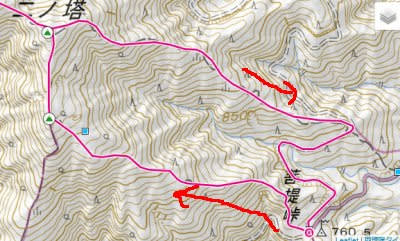

# 菩提峠から塔の岳へ登ってみた，その1…2週連続丹沢山系へ！

📅 投稿日時: 2022-08-18 04:13:00

えー．

先週の水曜，そして月火水の3日間．

書類上は夏休みとなっていたのですが．

休み中もなぜか会議に出てたり，

Slackも飛んでくるので．

休みだという気がしなかった今日この頃，

皆様いかがお過ごしでしょうか…

…結局今年の夏休みは，

中1日の出勤を挟んで，山の日と土日

含めた計7日間だったんですが．

一回都内に出たのと，一回近所に出かけた

以外，ずっと家で仕事してたという…(涙)

7日間で家から2回しか出てないよ！（激泣）

ってなことで．

家でじっとしていた7日間．

かなり精神的に不健康になった

感があります(泣）

あぁ…一日くらいは山に行きたかった…

ということで．

今日はGarmin Fenix7Xの紹介記事はひと休みして．

山に行きたかった恨みも込めて，

7月に丹沢山系の塔の岳へ行ったレポートです…！

ーー

えー．

スキーシーズンも終わり．

身体を動かさないとストレスで

死にそうだったのと．

前回の丹沢山が，意外とトレーニングに

良さそうな整備された道だったのと．

Garmin Fenix7Xの設定をちょっと

調整したので，それを試したかったのと．

あと，もう一つの目的もあり．

7月の週末の日曜に，

2週連続で丹沢山系へ登ってきたのですが…

今回の目的ってのは…

こいつです！

ちょっと調べてみると．

意外とランや登山にVAAMが良さそう

という情報に行きあたったので，

（このあたりの情報は，後日また

記事にします…）

ちょっと試してみようと思ったのでした…

で．

今回のコースは，

ヤビツ峠そばの「菩提峠駐車場」から

塔の岳への往復，11.6km．

距離は短めだし，標高差も1218mしか

ないのに，ちょっとした鎖場なんかも

あるらしく．

ヤマレコの標準コースタイムは

8時間22分と，意外と時間がかかるルートです…

とりあえず．

この日も仕事が忙しかったので．

「10時には下山して，昼までには

　帰宅して午後は仕事するぞ！」

という，いつものご無体パターン…

睡眠時間2時間ほどで家を出て．

ヤビツ峠を通って，4時50分には

菩提峠駐車場へ到着！

駐車場は未舗装ながら意外と広く，

台数は結構止まれそうな駐車場でした…

…でも，ヤビツ峠付近の道．

ちゃんとした舗装道路だけど，

行き違いできないほど狭い道幅が

続き，交通量もそこそこあるので…

私にとっては，丹沢登山の時の

戸沢の駐車場への道より怖かったかも…

で．

まだ日が登り切ってない朝5時に

駐車場を出発！

今回，二の塔までの行きはこの下側のルート

（二の塔の下にある山頂マーク，地図には名前が

書いてないけど「大音沢ノ頭」というところ経由）

を通る計画．

で．帰りに通る上側のルートは，

この林道のゲートから入ればいいのは

分かったんですが．

登りに通る予定ルートの入口が

ちょっと見つけにくく．林道ゲートの

左側のこんな見つけにくいところの

すごい狭い踏み跡が入口でした…

ってなことで．

テストのためのVAAMをスタート前に

200mlほどドーピングして．

朝5時ちょうどに，登山スタート！！

ちょいと狭めの踏み跡を登り始め

ますが…

スタート直後，1kmほどで標高差300mを

稼ぐ急登で，いきなり体力を使いますね…

でも，前回丹沢山を登った時の天神尾根より

マシだし．

視界も悪くないので…

快適，快適！

スタート25分ほどで標高差300mを稼ぎ，

大音沢ノ頭に到着！

ここから二の塔尾根に向かいます…

しかし，夏の盛りだからか…

踏み跡の両側から伸びてくる草を

かき分けながら歩く部分も多く．

ヤマビルが気になる…（涙）

（幸い，ヤマビルにはやられずに済みました）

でも，二の塔手前でも，もう結構

視界が開けて景色がいいよ！

そして．

まだ二の塔についてないのに．

早くも富士山が見えてます！

そして．

スタートから約30分の5:31には

二の塔到着！

二の塔には，富士山が見えるところに

ベンチが設置されてるけど…

でも，意外と視界は開けてないのね．

まだスタートから30分．

次の目的地の三の塔まではここから

440mしかないので，

ここは軽くVAAMを追加で飲んでおく

くらいで，二の塔は休まず通過！

…でも，まだ，塔の岳までは4.6kmも

あるのね…

ってなことで．

三の塔に向かいます！

(続く)
