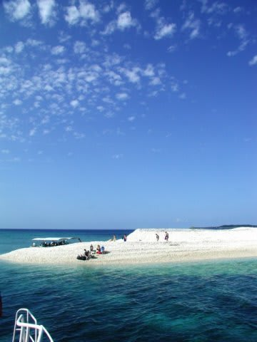
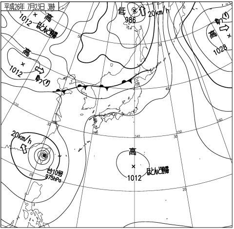
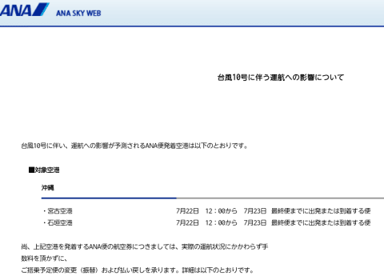
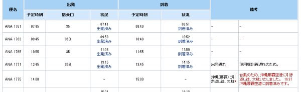

# 運試し！台風に掛けた，その結果は…？？

📅 投稿日時: 2014-07-24 02:16:11

🏷️ カテゴリ: [日記](cc4b5682fb7b8b144980957a978653fb0.md)

えー．

今年の夏休み．

いつもなら，1年ではせいぜい沖縄本島に行けるくらい

しか貯まらないマイレージが．

今年は，ちょうど家族3人で石垣島まで行ける

ほど貯まったので．

よしゃー！

これまで4年連続で行った慶良間も，

ちょっと飽きてきたかな～，って感じだし．

今年の7月は，家族そろって西表だっ！

…と，飛行機，宿，ダイビングショップを予約し．

会社に休みを申請したところ…

…ご無体職場の上司に[「氏ね」と言われた](e47ae8d72acd4351fd238afdcbb5661d8.md)のは，

記憶に新しいところ…

いや，そこは．

仕事より遊びが大切な私ですから．

これまでのように，

「必殺！それでも休みますビーム！」を繰り出して，

潜りに行く…

という選択肢も考えたのですが．

さすがに今回は，そのような必殺技を

使うと，リアルに会社から抹消されてしまい．

自分が「必殺」されかねない勢いだったので．

泣く泣く旅行をあきらめたわけですけど…

まぁ，宿はいい．

1か月以上前だったので，キャンセル料なしで

キャンセル可能．

そして，ダイビングショップも，キャンセル料なく

予約は取り消せるんですが．

…問題は，マイレージでとった飛行機，だ．

素直にキャンセルすると，一人3000マイルの

キャンセル料がかかる，と．

…これは，3人で9000マイルも無駄になってしまうじゃないかっ！！

痛いっ…痛すぎるっ！！

…というところで．

一つの作戦に出たわけですね．

…それは．

マイレージの飛行機は，一か月以上前にキャンセルしても，

出発直前にキャンセルしても，

キャンセルにかかるマイレージは一緒．

ならば，当日出発直前まで粘って．

運よく出発日に．

「台風による運航の影響が想定される」便になれば…

キャンセル料なしでキャンセルできるので．

…一か八か，台風がやってくるかどうかを，

当日まで待とうじゃないか…

という．

わけのわからない作戦を立て．

出発当日まで，粘ったわけですね．

…で．

その，出発当日っていうのが．

実は今日，23日だったのですが．

…数日前から．

よーし，よーし．

運よく台風10号が来てくれたぞ…！！！

と，自分の運の強さ（？）に密かにほくそ笑んだわけですが．

当日．

あれ？台風，それちゃったよ…

…これは，石垣便，予定通り飛んじゃうな～．

あー．キャンセル料取られちゃうな～．

まぁ，ダメもとの計画だったから，仕方がない…

と，思っていたところ．

なんと！！

ANAのWebページに…

こんな案内が！

をを！

23日の石垣発着全便，キャンセル料なしの

対象になったよ！！

超ラッキー！

ふはははははは．

見よ．

ただちにキャンセルしないという，

私の見通しの素晴らしさと，運の強さをっ！！

…ということで．

無事，私の作戦は成功し．

キャンセル料なしで，すべての飛行機がキャンセルできたのでした…

PS.台風はそれたけど…

実際，1便は石垣に降りれず那覇に舞い戻ったらしく．

…実際に影響を受けた方，ごめんなさい…

と，心で念じるSkier_Sなのだった．

## 💬 コメント一覧

### 💬 コメント by (ひろちゃん)
**タイトル**: 今日もゲリラ豪雨
**投稿日**: 2014-07-25 00:09:06

すきやーS様、相変わらず運試しの、人生ですね、変な天気も、sパワー？宝くじ最終日、購入いかが？S様もしかしたらがあるかも（笑）

### 💬 コメント by (Skier_S)
**タイトル**: ひろちゃんさま
**投稿日**: 2014-07-25 00:22:33

都内はゲリラ豪雨だったようですね…

K奈川県は無事でした（笑）．

しかし．

どうも，自分はある程度のツキの良さが

あるみたいで．

「まー，行けるだろう」と思ったら，結構

いけちゃったりします．

宝くじは買ったことはないんですが…

2枚ほどもらったことがあり，うち1枚は

3000円の当たりでした（＾＾；

うーむ．もらったやつで当選率50%ですから．

自分で買ったら，あたるのかも？？

### 💬 コメント by (KENKEN)
**タイトル**: 台風発生時は・・・・
**投稿日**: 2014-07-25 09:04:57

4-5日前の段階で出発＆目的地に近いエリアに台風が来そうな場合は変更不可のチケットでも

ANAもJALもキャンセルなり、日程の変更(変更決定は後日でも可)に応じて貰えましたよ。

その際は、受付に直接電話連絡するのがミソです。

当方明日より夏休みPart1で4年振りに座間味に行って参ります。

Sさんお奨めのセーリングさん初乗船です。

残念ながら、台風8号の影響で海の景色は変わってしまっているようですが・・・・・

Part2は8月最終週に西表訪問予定です。

もし訪問が叶って、タイミングが合えばどこかでご一緒できるといいですね。

夏モードも楽しみにしてますので執筆頑張って下さい。

### 💬 コメント by (ひろりん)
**タイトル**: Unknown
**投稿日**: 2014-07-25 14:06:51

ミラクルすぎるっっ

普通こういうことは起きません。

そんなところで、運を使っていいんでしょうかｗｗ

台風は来るとメンドクサイので来てほしくないです。

コースが北よりとかだと強烈な南が吹くので最悪。。

自分が係留してる周りで、だいたい数隻沈みます（本当！）

南に抜けるのはOKなんですけど。。。

### 💬 コメント by (Skier_S)
**タイトル**: 運がいい人間なので…
**投稿日**: 2014-07-26 01:09:58

>KENKENさま

そうなんですよ～．

私も以前，搭乗3日くらい前なのに，

特割のチケットを手数料なしでキャンセル

できた思い出があったので，今回の

作戦に思い至ったわけで…

Webページに掲載される前でも，電話で

相談すれば結構柔軟に対応してくれるんだな～，

ってのが正直な感想です．

今は，もう座間味ですかね～．

楽しんできてください！！

私も今週末は，西表をダイブワンロードさんで

潜る予定だったんですが…

8月の予定ですが，20日～で一応仮予約

していますが…

ホントに行けるかどうか，まだ未定です（涙）

>ひろりんさま

いやー．

無駄に運を使っちゃってるのではなく…

逆に言えば，私は「台風を呼ぶ男」と

呼ばれているので，

「私が乗ろうとした日なら，台風が来るに違いない！」

という，自分のネガティブパワー（？）に

根拠のない自信があったという…．

私も，これまで台風被害にあったこと多数．

ダイビングに行けなかったことや，繰り上げで

帰ったことは数え切れず…

仕事の装置が台風で跡形もなく全滅したことも…

まぁ，これが自信の根拠かも（？）

