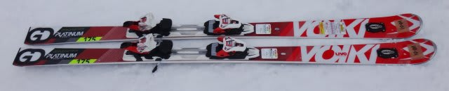
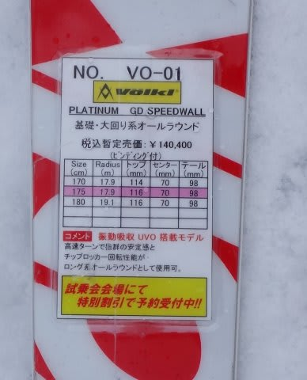
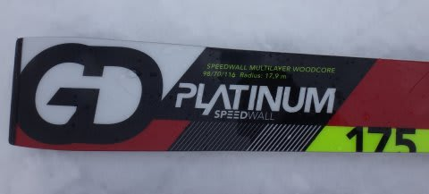
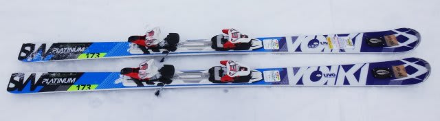
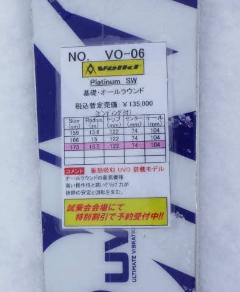
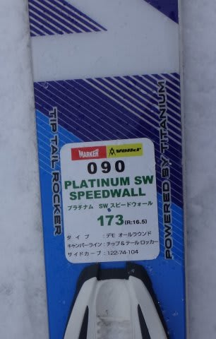
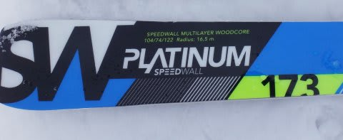

# 再開！2015シーズンモデルのスキー試乗レポート11…VOLKL編その2

📅 投稿日時: 2014-04-17 01:19:24

えー．

この週末の天気ですが．

…土曜は，朝は冷え込んで，曇り～晴れでいい感じですが．

午後に向かって気温が上がるかな～．

午後は春の雪になりそう．

日曜は…うーむ．

ヘタすると昼頃から，ぽつぽつと雨に

なるかも…

降り始めは何時になるか，まだ不明ですが．

また，明日に詳細な天気予想をする予定．

ってことで．

本日は，この4月に試乗した2015シーズンのスキー板

のインプレッション．フォルクル編です．

では，どうぞ～

---

VOLKL PLATINUM GD SPEEDWALL 175cm

基礎大回り用．

うーむ．Platinum CDもそうだったんだけど．

来年のVOLKL.

どうやら，トップのフレックスが強めで，

テールは弱めのバランスに変わったのかな？

テールが強い板との相性が良いATOMICのブーツとの

組み合わせには，ちょっとイマイチ合わない感じが…

さすが大回りの板らしく，トップを抑えて行っても，トップが

グリップして回ってくる板ではなく，比較的まっすぐスーッと

走ります．

…で，テールを抑えていくと，ATOMICブーツの強烈なテールの

押さえパワーに負けて，グリップがずれていっちゃいました．

板が軽めだし，UVOのおかげか軽いのに安定感があり．

さらに試乗板のエッジの仕上げでは板を動かしやすく，

結構操作はしやすかったけど．

…結構荒れ気味のバーンコンディションで，

この板＆アトミックブーツの組み合わせでは．

きれいに板をたわませて，それに乗ってキーンと

回ってくるポジションを見つけきれませんでした．

かなり縦目に落ちていく板なので．

荒れていて，距離が短いダイヤモンドスキー場では

正確な評価は難しい…．

うむ．フラットなロングコースで乗りたかった…

とりあえず，もう一回乗って評価しなおしたい板です．

VOLKL PLATINUM SW SPEEDWALL 173cm

基礎オールラウンド．

試乗したのは，SWとしてはチョイ長めの173cmです…

売れ筋は166cmなのかな．

R=16.5ってのもあって，割とロング目．

返りがゆったり，まったりしてるのもあって，

ロングが気持ち良い．

UVOの効果か？トップの押さえがいい感じ．

がんばり過ぎないけど，グリップさせればグリップ，

動かそうと思えば動かせます．

フレックスの柔らかさを感じるのに，粘りながら

たわんでいく感じで，スピードを出していっても

たわみすぎて窒息したりせず，そこそこのハイスピード

まで使えます．

なのに，板の軽快さで，動かそうと思えばかなり軽快に

動かせます．

うーん．

ガッツりグリップトップスピード，ってシチュエーションが

それほど多くなく，刺激のある板（疲れる板，ともいう）

を求めない人は．

エッジを利かせようとしたらしっかり利かすことが

できて，かつ過剰に返りがない，このくらい軽快で

動かしやすい板が良いかも．
