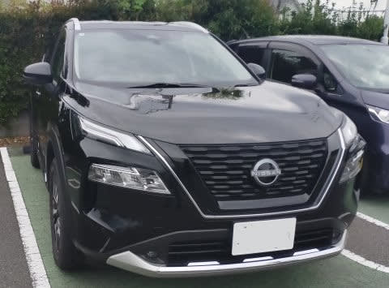
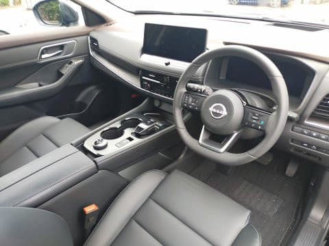
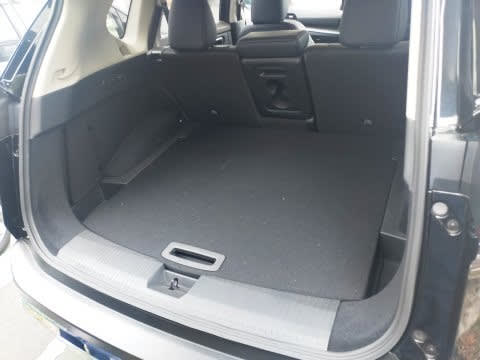
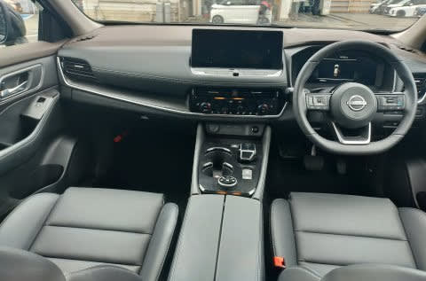
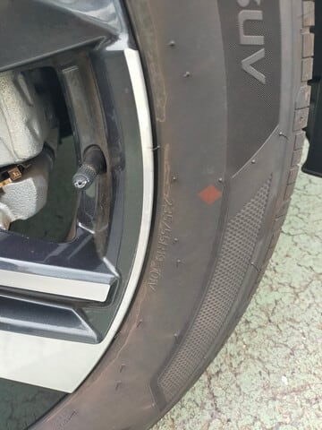

# NISSAN エクストレイルに試乗してみた

📅 投稿日時: 2024-10-13 00:34:21

🏷️ カテゴリ: [車試乗](c07dec5709d34bd74e1f6cb9c8291061b.md)

ということで．

ここしばらくあまりのんびりする時間が

なかったので，なかなか車を試乗する

機会がなかったのですが…

今週の3連休は，さすがに3日すべて仕事

しなくて済みそうだったので．

実に久しぶりに，車の試乗をしてきました～！

いやー．

これまでは，代車とか，車の点検ついでに

試乗した車とかばっかりだったので，

試乗する車がスバル車に偏ってましたが．

久しぶりに，スバル以外のディーラーでの

車の試乗でした！

で．

今回試乗してきたのは，日産のエクストレイル．

エンジンは発電のみ，4輪すべてにモーターを

もたせた純粋電動四駆という，アグレッシブな

e-4ORCEにちょっと惹かれたのと．

某焼額メンバーがおススメしていたこともあり．

一度乗ってみたいなぁ…

と思いながら，なかなか試乗の機会がなかった

ところ．

今回，ようやく試乗することができました…！

現行モデルのエクストレイルはすべて

e-POWERになっていて，FFと4WDのモデルが

あるのですが．

今回試乗したのは，4WDモデルのe-4ORCE X．

この下に廉価版モデルのSがあり，上に上級

モデルのGがあるので，中間モデルになりますか…．

この上の最上級モデルだと，ヘッドアップ

ディスプレイとかがあるようですが，

まぁそこまではいらないかな．

この下の廉価版モデルはプロパイロットが

着かないようなので…

まぁ，このXグレードが実質は一番お買い得

モデルの位置づけみたいですね．

車は全長4660mmと，現行LEVORGより10cm

ほど短いのですが，トランクや室内は意外と広く．

室内高が高いからか，リヤシートはLEVORG

より広く感じましたね～！

トランクも，LEVORGより10cm短い車長を

考えると，十分広いです…！

LEVORG同様，リアシートのアームレスト

部分だけ倒せて，そこからスキー板を通すことも

可能です．

ってなことで．

まずは乗ってみましょうか…

今回の日産の試乗コース，コーナーがなく

アップダウンがあるだけのほぼまっすぐの道

だったので，あまり細かな車の挙動が

分からないコースでしたが…

でも．

アクセルペダルを踏んだ瞬間にぐっと加速する，

このレスポンスの良さは，100％モーター駆動

ならではの加速感…！

ターボラグもなければ，スロットルが開いて

空気がエンジンに供給されて…

というスロットルラグすらない，このゼロラグ

感は，モーターならでは！

ホントにアクセルの操作に対して，ほぼ

遅れがなく車が反応してくれるというのが，

ここまで快感とは…！

そして，ゼロスタートで一番トルクが出るという

モーターならではの，スタートダッシュの良さ

もいいですね…！

普段，ターボラグが大きめのLEVORGの2Lに

乗っていると，このラグのなさは驚きの

領域ですね…

そして．

上り坂でもスピードが落ちていく感覚もなく．

ぐいぐい坂を上っていくトルク感！

1.8tを越える車重があるはずなのに，

登り坂で全く車の重さを感じない…！

で．

発電用エンジンも，可変圧縮比を用いた

最新鋭の1.5Lターボエンジン．

まぁ，エンジンパワーを直接感じられる

わけではないけど…

いつエンジンがかかっているか，

あるいは止まったのかがわからないくらい，

しっかり振動とエンジン音が抑えられて

います．

さらに，パワーを必要とする領域で，

エンジンは単なる発電用としてフル回転

すればいいはずなのに．

純粋に必要発電量でエンジン回転数を制御

しているのではなく，ある程度スピードに

連携してエンジン回転数を変化させる

制御になっているようで．

わずかに聞こえるエンジン音と加速感が

不一致で違和感を感じる…ということが

無いように味付けされてます！

エンジンと加速感は，かなり熟成されて

いますね～！！

で．

e-4ORCEは，エンジンブレーキ…というか，

回生ブレーキが4輪ともに効くので．

フロントにだけ回生ブレーキが効く

普通のハイブリッド車と違い，

下りの雪道とか，4輪すべてにブレーキが

効く安心感もありますね…

さらに，アクセルペダルだけである程度の

減速も利かせられる，e-Peadalをボタンの

On/Offで選べます！

e-Pedalを有効にすると，アクセルペダルを

離すとそこそこの回生ブレーキによる減速G

がかかるので，ブレーキを踏まなくても

アクセルだけでかなりのスピードコントロール

ができます．

…ただ，e-Pedalの最大減速Gは，最初に

e-Pedalを導入したNoteの時よりもちょっと

弱くなってるかな？？

ただ，ペダルを離していった時の制御が，

ブレーキ力コントロールではなく，減速G

コントロールになっているので，

下り坂だとより強いブレーキが利くように

なってますね…

アクセルオフのまま，平らなところから

下りに差し掛かっていくと，減速感が

下りでも同じ減速度をキープするよう

ブレーキが強くなるように感じます．

エクストレイルにはパドルシフトとか

マニュアルシフトがないので，スキー場

からの帰りに山道を下るとき，エンジン

ブレーキ（というか，回生ブレーキ）の

減速Gをコントロールするにはブレーキ

ペダルを踏むしかないのかな…？

と思っていたけど．

e-Pedalを上手く使えば，下り坂が急に

なったときはブレーキ力を自動で強めて

くれて，一定の速度で降りられるように

なっているので，これならエンジン

ブレーキ制御用のパドルシフトは

なくてもいいですね…

ってな感じで．

駆動系とその制御系は，運転している

人間の違和感なく，かつうまくコントロール

できるように，かなりプログラムがしっかり

作りこまれています…！

ペダルの重さとかも，かなり気を使って

作りこまれてるんだろうなぁ…

前述したように，試乗コースにコーナーが

なかったので，コーナーを攻めたときの

挙動はどんな感じなのか全くわかりませんが．

ステアリングは低速では強めにアシストが

効いて，もう少ししっかり感があるといいかな…

と思ったものの，スピードを出すと，比較的

しっかりした手応えになっていくので．

ステアリングフィールにそこまで違和感を

感じませんでした…

うーん．

でも，コーナーを攻めると，どんな感じで

ロールして，どんな感じで外タイヤが踏ん張る

のかをちょっと試してみたかった…

ってな感じで．

山道を攻めたりはできませんでしたが．

街乗りをする分には，かなり静かで

道路からの突き上げとかのショックも

上手くいなしてるし．

シートの座り心地も悪くなくて，

内装もそこそこの高級感を感じられるよう

作りこまれているし．

燃費も結構いいみたいだし．

よくできた車だなぁ…！！

と思いながら．

お値段を見てみると…

え？アイサイト相当のプロパイロット搭載の

4WDモデル，414万円？

そして，ディスプレイとナビはオプション扱いで

30万近くかかるの？

440万円を超えるのか…！！

そして，タイヤサイズも235/55 R19と．

55扁平の19インチか…っ！！

タイヤ，高そう…

うーん．

そう考えると，アイサイトX付きで300万円

後半のLEVORGとか，アイサイトXにハーマン

カードンのオーディオからナビまですべてついた

レイバックが400万以下なのは，かなり安く

感じる…

モーター駆動は魅力だし．

かなりリセールバリューも高い車らしいので．

そのあたりに魅力を感じる方は，検討する

価値が十分ある車だと思いますが…

1年で2-3万km走って，手放すころには過走行で

リセールバリューがなくなってしまう我が家では，

ちょっと手が届かない車だということが

よくわかりました（涙）
