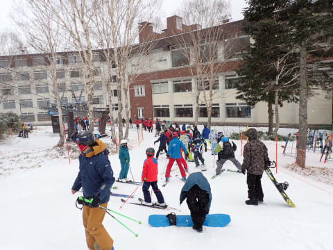

# 2023/12/17(日)の志賀高原焼額山スキー場，速報レポート！…冷えて小雪舞う一日で結構混んでアイスバーン(泣)，さらに下山が事故渋滞で3時間以上と踏んだり蹴ったり

📅 投稿日時: 2023-12-18 03:54:53

🏷️ カテゴリ: [2024スキー滑走日記](c453f687e8a0f05679e95831d0a02cd0c.md)

今日は散々な日だった…(涙)

とりあえず，帰宅したのは深夜1時半近く．

…で，帰宅後緊急の一仕事が待っていて．

そいつをやっつけているとこんな時間…(泣)

いや，金曜夜徹夜で志賀に行って，

土曜ラストまで滑った後，夜に宴会やって，

そして日曜ラストまで滑った後，

超渋滞で帰宅に9時間かかって，

その後一仕事やっつけなくてはならないって…

Blog書いてる場合じゃないんですけど（涙）

それでもBlogを書く！！

…それで，今日がすごいいい日だったなら

救われるんだけど…

実態は修行の1日でした（涙）

まあ、朝はいい天気だったものの…

朝の営業開始時からリフト待ちは

ひどく…

午前のリフト待ちピークは20分弱（泣）

当然，ゲレンデの人口密度は高いし…

そのうえ，昨日の高温から，今日は一気に

-5℃以下まで冷えたので．

ゲレンデはそこかしこで，かなりのアイス

バーン状態に…（泣）

さらには，午前中から雪も降り，

時折強く降る感じで，結構寒い中，

人口密度が高いアイスバーンを滑らなく

てはならないという，かなりの修行感…（涙）

午後になったら，多少はリフト待ちが

減ったものの．

午後2時過ぎまでは，タイミングによっては

5分近く待つことも…

あぁ…

なぜ，本日，神は私に

・長いリフト待ち

・ゲレンデ混雑

・遅いペアリフトで冷凍人間化

・ガリガリアイスバーン

という試練を与えたまうのか…

午後になっても人口密度は高めのままでした…

と，嘆きながらも．

最後の16時まで滑ったわけですが．

悲劇はそれだけじゃなかったのだ．

焼額山からの下山時．

どうやら，今日の冷え込みで道路が凍って，

テュルンテュルン道路になっていて．

そのおかげで，複数多発事故が起こった

らしく…

蓮池交差点近辺で車が詰まって，全く

動かなくなること1時間（激涙）

その後，事故車がどけられても，

テュルンテュルン道路の上り坂で再発進

できなくなった車が多数あったようで…

わずかに進んでも，また数10分止まって…を

繰り返すこと，さらに2時間（泣）

途中には，坂道を登れなくなって後ろに

ずり落ちて路肩に突き刺さったバスやら…

追突を食らったらしい車やら…

路肩にまっすぐ突進していったらしき

車やらが散在しており…

なかなかエキサイティングな下り坂で．

焼額から上林のチェーンチェックまで，

3時間半かかるという，悲惨な状況でした…（泣）

中野市街到着は夜8時半．

そのせいで，帰宅は深夜1時過ぎ…

その後，家で仕事をやっつけるという．

なんだか大変突かれた週末だったのでした…

あぁ…

これでゲレンデ状況が良ければ救われたのに．

試練ゲレンデだったし．

こんな踏んだり蹴ったりの週末になるとは…

これでは，明日から1週間の仕事をする元気が

チャージされるどころか，疲れに行った

週末だったよ…（激涙）

これから1週間は冷えてくれそうなので．

次の週末には期待…！！

## 💬 コメント一覧

### 💬 コメント by (新米パパ)
**タイトル**: Unknown
**投稿日**: 2023-12-18 07:12:13

お疲れ様でした。

下山道3時間半は辛過ぎる、そして、怖すぎる、、、

### 💬 コメント by (ヒータロゥ)
**タイトル**: Unknown
**投稿日**: 2023-12-18 11:26:11

我が家はリフト待ちと寒さで心が折れ、午前中で退散し早めに山を降りたのですが、まさか帰りがそんな大変なことになっていたとは、、、本当にお疲れさまでした。

ブーツフォーミングの記事楽しみにしてます。

### 💬 コメント by (おばちゃんスキーヤー)
**タイトル**: Unknown
**投稿日**: 2023-12-18 14:19:12

昨日　旧Twitterのトレンドに「志賀高原」が上がっていて　S様は　どーしているのか？と気になっていたのでした。

本当に志賀高原の道のりは怖いです。　

四駆のスタッドレスですが我が家は日中に退散。

心の中で橋から飛び出るのでは！と思ってます（笑）

S様の運転の極意を聞きたいです。

### 💬 コメント by (レインボー76)
**タイトル**: Unknown
**投稿日**: 2023-12-18 15:07:45

ヒータロー様、昨日は普通の人なら早めに降りると思いますよ。明らかに異常、いや、すごすぎるエス様ならではの渋滞巻き込まれですよね。

月曜日の志賀高原情報

期待の雪は降らず、ガッカリしてヤケビへ。

上林-1℃、蓮池-8℃。昨夜の事故渋滞が嘘のような楽な上り。

四ロマパークでがっかりの新雪1cm。

しっかり冷え込んで、人は平日にしては割りと多め。バーンはしまって快適。なれど、いつもに増してリフトがのろい。この寒さにノロノロ運転は、やせ老人にはちと辛い。

そんなわけで11時終了。でも、昨日よりは百倍快適でしたよ。

### 💬 コメント by (Skier_S)
**タイトル**: 今日は志賀はそんなに積もらず
**投稿日**: 2023-12-19 04:01:57

＞新米パパさま

3時間半は辛かったです…

車が1時間以上止まって待ってる間，途中何回か寝てしまってました．

寝てても，先行車が動いたらアイサイト様が「先行車，発信しました」と教えてくれるんで便利です…

＞ヒータロゥさま

早めに帰るのが正解だと思います．

いや…

かなり辛かった．上林まで3時間半は耐えられないです…

＞おばちゃんスキーヤーさま

いや．見事に渋滞に巻き込まれてました（涙）

運転に自信がなければ，絶対に早めに帰るべきだと思います…

特に昼間雪が融けて，日がかげってそれが凍るようなコンディションはヤバいです．

ちなみに，私の雪道の運転の秘訣は…

自分の車を買ったら，まずは雪が積もった人がいない広場で，車の挙動をすべて

試してみることですかね．

最小旋回半径でアクセルをラフに踏むとテールが流れるかフロントが流れるか，

スピードがあるところからブレーキをかけてステアリングを切るとどう動くのか，

横Gをかけた状態でアクセルオン・ブレーキをかけたときの動きを，車を滑らせながら

楽しみます…じゃなかった，覚えます．

その動きが覚えられれば，雪道を滑らせながら走ることができるようになりますよ～！

滑ったらアウトじゃなくて，車は滑るもの，滑ったらこう動くと分かって，

滑らせた中で車がコントロールできるようになれば，余裕をもって走れるようになるかと…

＞レインボー76さま

うーん．月曜は日曜の100倍楽しかったんですね…

なぜ，私が滑れる週末に限ってこんなにコンディションが悪かったのか…（涙）

誰だ！？？日頃の行いが悪いのは！？？（自分だとは思ってない）

