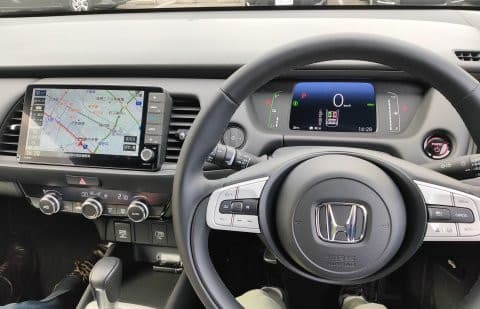
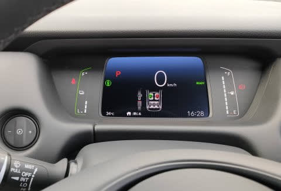

# HONDA FITのe:HEV(ハイブリッド)とガソリン仕様に試乗してみた

📅 投稿日時: 2020-07-22 01:21:31

🏷️ カテゴリ: [車試乗](c07dec5709d34bd74e1f6cb9c8291061b.md)

えー．

スキーシーズンも終わり．

自宅待機もある程度緩和されてきた

今日この頃．

…とはいえ，県境を超えた遠くへのお出かけは

控えておいたほうがいいかな…

ということで．

選んだお出かけ先は，自宅近所のホンダ

ディーラーさん．

今回．

HONDAが満を持して作った，世界戦略車，FIT．

こいつがかなり良くなったということなので…

試しに試乗しに行ってきました～！

このFIT，パワートレーンは

1.3Lガソリンと，1.5Lのハイブリッドの

2種類あって，

どちらでもFFと4WDが選べます…

私のように4WD必須の人間にとっては

嬉しいチョイス！（FIT買うことは当分ないだろうけど…）

そして，1.5Lハイブリッドシステムは，

これまでのFITの1モータ＋DCTを捨てて，

アコードやステップワゴンと同じ，

2モーター式で，通常はほぼモーター走行．

エンジンと車輪の間には切り替え式の

変速機は無く，高速走行時のみ，

エンジンと車輪が直結するという．

日産のe-Powerに，高速だけエンジン＋車輪直結

モードをもたせた…

という感じの形のものに変わりました．

ってなことで．

一体どんな感じになったのか？

まずはハイブリッド車から見てみましょうか…

グレードは，e:HEV HOME．

内装は…

うむ．

座って驚くのは，前方視界の良さ！

普通はこの形の場合，前の方のAピラーが太く，

手前側が細いサッシだけど…

この車は逆で，手前側が太く，奥のピラーが

すごい細い感じ．

だもんで，前方が，ピラーが邪魔になることなく

かなり広い角度見渡せて，すごい前方視界が

いい！

これはちょっと驚きの前方視界…

内装のデザインはシンプルだけど，

そこそこ未来感があって．

そして，ステアリングも，これ…本革じゃないですか！？

そのほかの材質も，Bセグと考えると

安っぽくない造り．

スイッチ類のタッチ＆フィールも，そんなに

安っぽくないし．

細かなスイッチ類にも，ちゃんとお金をかけて

いる感じ…

さらにメーターが完全な液晶ディスプレイって

のも，このクラスの車としては驚き！

で．

トランクも十分広いですね…

e:HEVのモデルは，トランク奥にちょっと

段差があって一段高くなってるけど，

それはあまり気にならない感じ．

ちなみに，ガソリン車は，この段差はありません…

こちらはガソリン車のトランク．

e:HEVもガソリン車も，リアシートを倒すと，

ほとんど段差のない，かなり奥行きの広い

空間になりますね．

そして，先代からのリアシートの

チップアップ機構はちゃんと引き継いでいて，

リアシートをはね上げると，かなり背の高い

モノでも積み込める空間が！

リアシートの足元空間も，

LEVORGより広いかも…

ってな感じで，

車内の広さや使い勝手はかなり

良さそうな感じです．

とりあえず，走ってみましょうか…

と，動き出してみると．

…この車の仕掛けでは，完全モーターで走り

出すわけですが．

なんだ，このどトルクは？？

すさまじいトルク感．

2LのNAエンジンよりトルクがあるよ！！

2.5L以上の感じ！

それも，モーターなので，アクセルを

ふんだ瞬間から，わずかな遅れもなく

動き出す！！

スゲー，これ，スゲー！！

アクセル踏んだ瞬間のトルク感…

というか，ピックアップの良さは，

多少のターボラグを感じるLEVORG 2.0の

エンジンよりいい感じ！

カタログを見てみると，モーターのトルクが

25.5kg-mあるようなので，2.5Lエンジンと

同じくらいのトルクですね…

このどトルクモーターが，エンジンと違って，

遅れ時間0でトルクを出してくるので．

ものすごい気持ちい加速感です．

気持ちいい，というのもあるけど，

これは運転していて楽…

意のままに加速するし，加減速に

エンジン特有の遅れやラグが全くなくて，

感覚とのずれが無いということが，

これだけ楽に感じるとは…！

最初のうちはほぼ完全にバッテリーのみで

走っていますが．

ある程度走り出すと，発電のために

エンジンが回り出します…．

けど，エンジンのON/OFFも静かで

全く分からず．

普段はエンジンがかかっているのかどうか，

全く気付かない感じ．

先代FITの，アクセルをちょっと踏むと

すぐエンジンが掛かって，エンジン回転が

ググッと上がったのとは，全然違う

フィーリング．

そして…足回りもかなりいい感じ．

何にしろアクセルレスポンスがよく，

すごいトルク感があるので，

加減速も意のままだけど．

電動パワステの制御もよくできていて，

かなりしっとりしたいい感じの

手ごたえ．

決して重くは無く，軽めだけど，

ちゃんと路面インフォメーションが分かる程度の

反力があって，切り，戻しの手ごたえは

かなりいい感じ．

スポーティーにラインを狙って

ステアリングがスパッと決まる…

というより．

交差点での切り込み，まっすぐへの戻しが

すごく自然で．

そして，まっすぐ走りたいときに

何もせずにまっすぐ走る感じが，いい．

乗りごこちも…シートがこのクラスとしては

比較的いいんじゃないかな？

長距離乗っても疲れなさそう．

まぁ，乗り出し250万くらいになる車らしいけど．

でも，よくできてる．

これは，よくできてる…

これで，リッター30kmくらい走っちゃうの？？

すごい…

2.5Lガソリンより加速感がよくて，

それで燃費はスバルの2.5L NA車の3倍近くか…

恐るべし．

この車の運転フィーリング，

十分に250万の価値あるよな…

と，e:HEV車に満足した後に，

今度は1.3Lガソリン車に乗ってみますが．

こっちの試乗車は，グレードはCROSSTAR．

ちょっとSUVチックな外見をしています．

早速乗って，走り出してみると…

…うーむ．

ちょっとアンダーパワー…

というか．

このクラスならこれが普通なんだろうけど．

アクセルを踏んでからトルクが出るまで，

ガソリンエンジンでは当たり前のラグが

あって．

さらにDCTじゃなく，CVT変速による

加速遅れ感もちょっとあって，

ハイブリッドに乗った後は，それが

我慢できない感じ…

うーむ．

ハイブリッドの後に乗ったのが悪かった…

そして，なぜかステアリングも心もち

重めで，ハイブリッドよりかすかに

フリクションがあるように感じます…

なぜ？

パワステはたぶん変わってないよね？

CROSSTARは，タイヤサイズがちょっと

大きいからそれが効いてる？

サスの感じはおそらくハイブリッドとそれほど

変わってないんだと思うけど．

ハイブリッドに乗った後だと，アクセルを

踏み込んだ時にエンジン音と振動が

伝わってくるので，全体の乗り心地として

ハイブリッドより2クラスぐらい落ちる車に

感じちゃいます…．

100万円くらい違う車に乗ってる感じ…

いや，1.3Lでも，おそらくこのクラスとしては

かなり静かな方だと思うんですが．

かなり滑らかな方だと思うんですが．

全然違う．

ハイブリッドと，全然違う…

ガソリンとハイブリッドで，30万円ちょっと

ハイブリッドが高いけど．

税金はハイブリッドの方が安いし．

いや，これ，この値段以上の価値はある．

間違いない．

この車，e:HEV買うべし！

e:HEV，すごい！！

FITのハイブリッド，この車をこの値段で

出してきたら，バーゲンプライスと言える…

Bセグの車としては高く感じるかもしれないけど．

その価値は十分ある車だ

と思いました…

4WDで雪道走ってみたいな…（FIT買ってもいいかも？と思い始めている）

## 💬 コメント一覧

### 💬 コメント by (まーくん)
**タイトル**: Unknown
**投稿日**: 2020-07-22 07:03:32

4駆でe-hevのシャトルが出てきたらかなりそそられます！

アウトランダーPHEVは全く充電しないと16km/L程度の燃費で、思ったほど良くはないんですよね。

### 💬 コメント by (しんちゃん)
**タイトル**: 雪上試乗レポートしてほしいです
**投稿日**: 2020-07-22 23:13:50

FITのe:HEV、かなりいいんですね。車の電動化も進むわけですね。

志賀高原でのリフトストップまでの滑走をちょっと早めに切り上げて、中野市周辺に雪があるときに、FITの４駆の試乗レポートしてみてはいかがでしょうか(笑)

### 💬 コメント by (Skier_S)
**タイトル**: FIT，ハイブリッドはすごい良かった
**投稿日**: 2020-07-22 23:31:27

＞まーくんさま

そうなんですよ…

これでシャトルが出てきたら結構やばいかも．

でも，アイサイトツーリングアシストほど運転支援が

進んでなさそうなので，そこがちょいと気になります…

＞しんちゃんさま

いいですよ，FITのe:HEV．

…でも，リフトストップを早めに切り上げるなど，

私にとっては絶対ありえない選択肢です…(笑)

