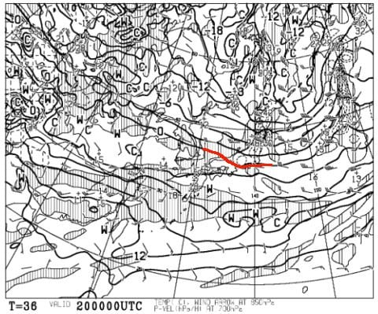

# 12月22日からの3連休までに，雪は積もるのか！？？ゲレンデ状態は回復するのか？？

📅 投稿日時: 2018-12-19 03:27:17

🏷️ カテゴリ: [スキー天気予想](c6554f5c3c106093b511a8daae23757e8.md)

えー．

月曜の夜の段階では，火曜日は雪不足のため

第2ゴンドラは営業見合わせ…

と言っていた焼額ですが．

火曜の朝までに積雪があったため．

結局，火曜も無事ゴンドラが動いたようですね～！！

…

…しかし．

この積雪も十分じゃなかったようで．

また，今晩の積雪によっては，

圧雪整備ができない状態になるようです…（涙）

（[焼額山ウェブページ](http://www2.princehotels.co.jp/ski/shiga/)より）

…そして．

「みなさまも…一緒にお祈りください」って．

焼額のスタッフも神頼みですか…！

まぁ，私なら「一緒に踊ってください」と書きますが←なんのこっちゃ

で．

今週末は3連休なわけで．

この3連休．

たっぷりの雪でスキーができるのか．

それとも悲惨な連休となるのか．

日本中の1億5千万人のスキーヤー全員が

気にしているところ←そんなにスキーヤーいないから．ってか，日本人口より多いから

ってなわけで．

今週末までに雪が積もるのか．

ちょっと見てみましょうか…

まずは19日の500hpa図を見てみると．

うむ．上空5000m-30℃の寒気…とテレビなんかで

よく言われる，そこそこの雪が降る目安の-30℃線．

志賀近くまで下がってきてますよ…！

そして，19日の地上天気図を見ると．

水色の降水域が志賀高原まで届いているので．

志賀高原，18日夜から19日まで，積雪は

ありそうですが…

…でも．

10cmあるかないか．

19日の朝までに，10cm積もるかどうか，

ギリギリのところ…

19日昼間も降り続けそうだけど．

それほど大量には積もらなさそう…

昼間は数cmってところかな．

で．20日ですが．

850hpaの0℃線は，志賀より南．

そして，地上天気図は降水域がほとんど

無いので．

うーむ．

20日はそこそこ冷えるけど，積雪は

期待できなさそう…（涙）

そして，21日の金曜日．

850hpa図を見ると…

ヤバい．

ヤバいよ，これ…

赤く印した0℃線は東北まで北上して．

志賀は水色の+3℃線よりも南．

これは，志賀高原でも，昼間は+3℃以上に

まで上がるということ…

そして，21日金曜の地上天気図は．

うむ．

降水域はまだ信州にかかっていないので．

この日は気温が上がるけど．

雨にはならずに済みそう…

そして．3連休初日の22日．

この日も850hpaの0℃線は志賀より北（涙）

ただ，この日も地上天気図の網掛け部分の

降水域が志賀にかかっていないので．

気温は上がるけど，雨にはならずに済みそう…

で．

当然，雪の積み増しは一切なし（泣）

3連休中日の23日も．

0度線は志賀よりはるか北…（涙）

そして．この日は，志賀付近に降水が予想されています．

…これは．3連休中日，一番混む時期というのに．

雨が降るという可能性が…（戦慄）

3連休最終日，24日ですが．

850hpa気温図では．

赤い0℃線が太平洋側よりさらに南下しています！

そして，日本海側にかかる雲も予想されているので…

23日から降り続けた雨が，どこかの段階で雪に変わり．

24日は雪降りになりそうかな…

ってなことで．

まとめると．

19日水：冷え冷え，終日雪降り．積雪は10cmほどか？

20日木：そこそこ冷えるけど，天然雪の積み増し無し．

21日金：気温は一気に上がるが，雨にはならなさそう．

　…この日は人工降雪が動かせない可能性が…

22日土：3連休初日は，朝イチからプラス気温になりかねない

　ほど気温が上がる．雨にはならない．

23日日：この日は…ヤバいかも．

　雨になるか…？

ってな感じで．

19，20までは冷えるけど．

そのあとは気温が上がり，雪の積み増しは

ほとんどなさそう…

うーむ．

この3連休．

ちょっとヤバいかも…

皆さん．

一緒に踊りましょう…！

## 💬 コメント一覧

### 💬 コメント by (若杉勲71)
**タイトル**: 志賀高原情報
**投稿日**: 2018-12-19 19:56:19

火曜日は二年ぶりに熊さんへ。

遅いペアリフトが上まで行けたんですが、正面の急斜面はクローズ。左の尾根は一部地肌が出ていましたが、中間駅の右の林間が新雪で、ウハウハいいながらご馳走にあずかりました。

そのあとは中間駅の左端のマシュマロ絨毯を大満喫。最高の１日でした。

本日水曜日はヤケビへ。パノラマアウトはこぶでしたが、唐松はコロコロはかなりあったものの、ずっと締まって楽しめました。

最も快適だったのはロマンス。コロコロもなくいい練習バーンでした。

明日が待ち遠しくてたまりません。感謝をこめて、世捨て人を満喫させて頂いております。

### 💬 コメント by (若杉勲71)
**タイトル**: 山ノ内が雪に
**投稿日**: 2018-12-19 20:37:49

先ほどまで雨だったのに、雪に変わりました。ワクワクです。

ただし、すごいしっせつ。

### 💬 コメント by (しんちゃん)
**タイトル**: 踊りまくり
**投稿日**: 2018-12-19 22:12:43

踊りまくっています(笑)

降れ降れ踊りを･･･

なんとしても雨だけは避けたい(^^;

### 💬 コメント by (Skier_S)
**タイトル**: 雪よ積もれ～！！
**投稿日**: 2018-12-20 02:44:04

＞若杉さま

熊の湯は結構良かったんですね…

そして，今日のヤケビも堪能しましたか．

若杉さんのような生活にあこがれます…

今晩の雪が積もって，明日も楽しめることを

願っています～！

＞しんちゃんさま

必死に踊ってください(笑)

でも…3連休，ヤバそうです．

雨が降ったら，しんちゃんの踊りが足りなかった

ということで，A級戦犯確定ですので（嘘）

