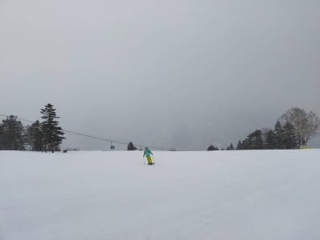
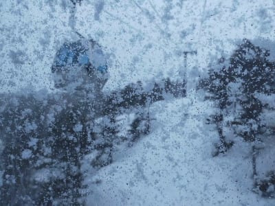
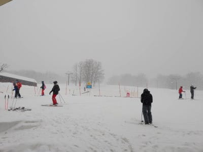

# 2021/3/26(金)の志賀高原スキー場は，雪！！…そして明日は私も志賀高原に復活！

📅 投稿日時: 2021-03-27 00:10:43

🏷️ カテゴリ: [日記](cc4b5682fb7b8b144980957a978653fb0.md)

なんと．

本日の志賀高原ですが．

雪だったようです…

それも，かなり積もったようです！！！！

うーむ．

昨日の予想では，一瞬雪がぱらつく程度と

思ったけど…

完全北風だったので，思いのほか

志賀に雪が流れてきたようで…

うん．

予想，外しましたね

…まぁ，いい方に外れたから良しとしま

しょう…！←外れた時に50%の確率で使える言い訳

ってなことで．

いつも通りの特派員情報から始まる

わけですが．

…果たして，五つ子になったのか？

というところが気になる，今朝のおこみんですが．

…五つ子にすることは諦めたようで．

仲間いっぱいの写真を送ってくれました…

さすが，五つ子は無理だったか…

で．

今朝は朝のうちはわずかに青空も見える

程度の曇り空でスタート．

あさイチの焼額山頂は…

-3℃と，意外と冷えてませんね（涙）

でも，朝はバーン全面，かなり手ごわい

ガチガチバーンだったようで．

洗濯板状態で，板のエッジが立って

ないと厳しいという報告があり．

奥志賀エキスパートも，コロコロだった

という生中継が入っていたのですが…

が．

10時前あたりから，雪が結構な勢いで

降り始めたという報告が入って

そのあと，10時半ごろには，うっすらと

ゲレンデの上を新雪が覆うほどになり．

アイスバーンが隠れて，滑りやすく

なったようです！

その後も，誰かのいい加減な予想を裏切って，

結構な勢いで雪が降り続け…

昼間の志賀高原の道路も結構積もった

ようです！

昼過ぎには，ゲレンデ全体かなりの

ガン降りになっていき…

なんだか，午後1時ごろにはパウダーっぽい

ゲレンデを滑る写真が送られてきたかと

思うと…

上部はガス＆雪で見えなくなっていった

ようです（涙）

そして．

なんと，昼間の方が朝より冷えて，-4℃

くらいに下がったみたいなので．

この時期にしては悪くない雪が

積もったようです！！

この雪は，リフトストップ近くまで

降り続けたようですが…

午後4時過ぎには止んじゃった

みたいですね（涙）

うーん．このまま一晩積もってくれれば…

残念ながら，急斜面のガチガチが

隠れるほどの積雪にはならなかった

みたいですが．

でも，結局今日一日で，緩斜面では

15cmくらい軽い雪が積もったようです！！

今日は，思わぬ時期のボーナス的な

冷え冷え雪でしたね…！

…やっぱり，私の踊りがさっそく効いてきた…（ドス）←読者に正面から真っ二つに切って捨てられる音

…

…でも．

明日はやっぱり気温が上がるのだ．

朝はいいけど，昼間は高温＆日差しで

この柔らかい雪が溶けると…

張り付く雪になりそう(涙）

…夜にガチガチに固まった氷なら，

日差しで解けてもザラメになる感じだけど．

柔らかい雪が日差しで解けると…

ネットリした，滑らない雪になっちゃうので．

…明日，晴れないでほしいんだけどなぁ…

で，

日曜ですが．

やっぱりダメっぽいです．

朝から風は強そうで．

午後はリフトの営業もヤバくなるほどの

強風．

そして夕方には…

降る．

降るのだ．液体が…（涙）

まぁ，それでも．

今週末は久しぶりに，志賀高原に復活します！！！

皆さん，志賀高原でお会いしましょう！

## 💬 コメント一覧

### 💬 コメント by (ikkun)
**タイトル**: Unknown
**投稿日**: 2021-03-28 06:24:27

おはようございます❗新潟も一昨日はリフト山頂は雪になりまして、嬉しい反面滑りにくい状況でもありましたよ小学中学年さんにはきつすぎでした❗今日いよいよラストのゲレンデとスキー学校です(泣)

