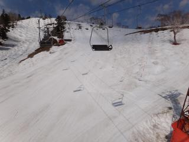

# 5月8日は熊の湯・横手山に行ってました

📅 投稿日時: 2011-05-09 00:40:11

日曜の今日は…

天気は晴れたり小雨が降ったりとめまぐるしく変化する一日でした．

朝は熊の湯に行ったんですが．

雪は多いですね～．

この時期でほぼ全面に雪がついているとは…

すべてのコースが滑れるので，この時期としては

上出来なほど楽しめます．

リフトは，クワッド，第2ペア，第1ペアが動いてます．

でも，第2ペア上部に沿ったコース，もうそろそろ雪が薄くなって

あと数日で土が出るかな…

第1リフト沿いのコースは，ちょっと土が顔を出してきてます．

…しかし，雪が滑らないよ．

かなり板に張り付いてブレーキがかかる雪ってのがちょっと

楽しさを30％ダウンさせてます…．

んで，昼からは横手山に．

横手山は，第1，2，3リフトが動いてます．

この時期に，第1リフトの山麓まで，ほぼ幅いっぱい

雪がついてます．

うーーん．すごい…

第2リフトから見えるジャンボコースは，

一応滑れることになってましたが，ちょっと

滑るのは微妙かな…

でも，それ以外は渋峠も含めて積雪十分．

ただ，ここでも雪が張り付いて滑らないのは困ったもの…

と，思いつつ滑っていたら．

午後2時ごろ．

いきなり強風が吹き始め，2時半過ぎには横手山の山頂リフト，

渋峠のリフトが営業終了してしまいました．

うーん．残念…

とりあえず．

滑らない雪に悩まされながらも．

志賀高原シーズン券の最終日をすごしたのでした．

明日以降，熊の湯が5月15日まで，横手山が雪がある限り

営業を続けますが，シーズン券が使えないので

今シーズンの志賀高原通いはこれにて終了．

来週からは，かぐらかな…
