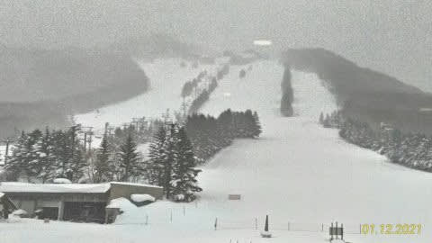
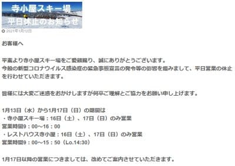
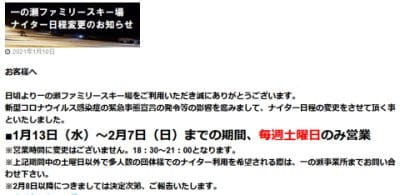
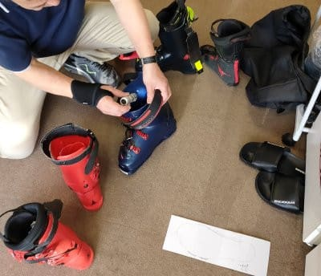
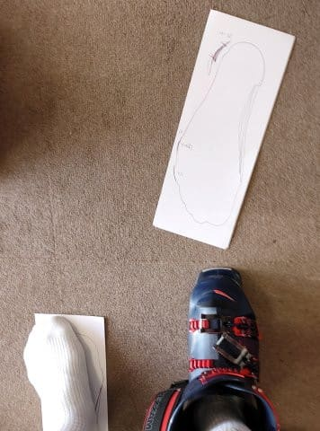
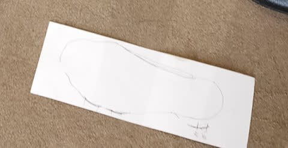

# 長岡のエキップさんで，ニューブーツ・’21モデルREXXAM R-EVO 130Mを作ってみた…その２

📅 投稿日時: 2021-01-13 03:04:47

えー．

本日の志賀高原．

特派員情報によると，曇り空で

積雪なしの圧雪バーンだったようですが…

…写真を見ると．

ゲレンデに誰もいませんね

レポートでも，ヤバいくらいガラガラだったと

報告を受けてますが．

緊急事態宣言が拡大している現在，

さすがにスキーに行くことを自粛している

人が多いということですね…

こんな状況なので．

寺子屋は今週平日の営業をやめたようです(涙)

([志賀高原中央エリアホームページ](http://shigakogen.co.jp/archives/9183)より)

そして，さらに．

正月休みが終わって以降，中央エリアで唯一

ナイター営業をやっている一の瀬ファミリースキー場．

ここも，2月7日までの平日＆日曜ナイターを

止めるようです…（泣）

([志賀高原中央エリアホームページ](http://shigakogen.co.jp/archives/9155)より)

な，なんということだ…！！！（激涙）

これ，来シーズンはつぶれるスキー場が出そう…

志賀高原も，来シーズン

「蓮池とジャイアント，寺子屋は営業やめました～！」

とかならないか心配…

パルスゴンドラができたら，丸池と西館orブナの

リフトが動いてたら，サンバレーと一の瀬の行き来が

できちゃいますから

うーん．

だれかが私に1000億円くれたら，志賀高原を

買い取って，リフトを減らさないどころか，

全て最新リフトに架け替えるんですけどねぇ…

だれか私に1000億円くれないかな？

ということで，本題へ．

[前回のブーツ購入の話](e84a3c4f3e87605ea154c49f2e9927b90.md)の続きです！

ってなわけで，ブーツはREXXAMに

することに決まったわけですが．

これまで履いていたATOMICブーツは，

フレックス130だったけど．

REXXAMのフレックス130を試し履きすると．

夏で気温が高いにも関わらず，

フレックスが硬めに感じて．

「これ，冬の冷えた時にすごく硬く

　なっちゃうんじゃないかな…？」

と，ちょっと心配．

硬めに感じたREXXAM，フレックス120に

落とした方がいいかな…？

とも思ったけど．

REXXAMのR-EVOのブーツ．

フレックス130と120では，プラの材質が違って，

130の方は反発と粘りがあるいい材質…

という話で．

悩んだあげく，新素材の130を選んでみました．

(これまで履いていたATOMICブーツとREXXAMを比較中）

そして，次の選択肢は，

インナーをフォーミングインナーにするか

標準インナーにするか？

というもの．

エキップさんは，フォーミングもいろんな

ノウハウを持っているようですが…

今回は，経済的理由からノーマルインナーに

しておきました．

で，次の選択肢は，インソールをどうするか？

…ですが．

私の足は，インソールを作った方が良さそう

ということで．

インソールのかかとの下側の部分に

ウレタンを貼って削り出し，

インソールのかかと部分をしっかり支える

ポスティング付きのインソールを作ることに．

ちなみに，一緒に行った某氏は，

前のブーツに入っていたインソールが

結構いいものであることに鈴木社長が

気づいて．

このインソール上での動きを見てみたところ，

膝もきれいに入るようちゃんと作られて

いたようだったので．

「これ，そのまま使った方がいいよ」

と言われていました…

どうやら，誰にでも新しくインソールを

作るよう進めているわけでは無いようです．

商売的にはインソールを売った方が

良い気がするところ，結構良心的ですね…

ってなことで．

ブーツを何にするかが決まって，

さらにインナー，インソールの選択が

終わりましたが…

ここまで決まったら，

足型をとって，

シェルに当たりそうなところは

徹底的に記録していきます．

そのほか，試し履きして当たったところを

インナーブーツにマークしていきます…

ってな所までで，これで一旦本日は終了．

これまで来店から約3時間．

この3時間，鈴木社長がずっとつきっきり…

次回までに，シェルの当たりだし＆削り

調整を入れてもらい，

次回は，調整が終わったシェルを履いてみて，

さらに削りやインナーの調整，

そしてインソール整形をするということで．

2回目はほぼ一日仕事のようです．

実は，次回が本番なのね…

ちなみに，一緒に行った某氏は，

割と素直な足型だったらしく（？）

FISCHERのVACUUMを選んでましたが．

この場合，シェル出しが必要ないので，

1回の来店で全て終わってました．

ってなことで．

訪問時には，ブーツを買うかどうかすら

決めていなかったのに．

ついつい話の面白さに惹かれ，ブーツを

買うことにしてしまい．

それも，全く想定外のREXXAMを買うことに

なったという，予想外の結果←想定の範囲内では？

になったわけですが．

その結果，今回だけじゃなく，次回も含め，

長岡まで2往復することになったわけで．

果たして，長岡まで2往復の価値がある

ブーツになるのかどうか…？

次回以降，こうご期待！

([続く](ebe47719105b24961acf31f1e4b0e1ae5http:.md))

## 💬 コメント一覧

### 💬 コメント by (sarada)
**タイトル**: ブーツ調整
**投稿日**: 2021-01-13 07:07:57

いつも楽しく拝見させてもらっています。

ブーツ調整の話が出ましたので、書き込みを。

当方は広島なんですが、ピステという小さいshopがあります。ここの調整は足裏が｢ベッタ｣っと底に収まる。(かかとが落ちる)

まず、インソールでそれを作って、上物の調整を行います。5年前に作って、今年買い換えました。インソール1.5万+調整2.0万と結構な金額になりますが、それだけのことはあります。※給付金じゃ全然足りなかった。夏にブーツ決め、その場で調整日程予約。再度行って3時間調整という流れです。

リピーターが多く、休日に調整予約したいので、受注会開始日に行っています。

県内スキー場で上手い人のブーツを見ると皆｢Piste｣のステッカーが貼ってあります。

今、HPを見ましたがブーツ調整の事は書いてありません。ほぼ、口コミで広がってると思います。

広島からの書き込みでした。

### 💬 コメント by (レインボー73)
**タイトル**: Unknown
**投稿日**: 2021-01-13 09:04:36

1000億円あれば、ゴンドラも新規になるんですね。

了解です。まず、私が1000円投資しましょう。

残るは『億』だけですね。

さて、水曜日の志賀高原情報ですが、相変わらず気温が上がらないので、しっかり食い込む好みの雪です。新しいフィッシャー大活躍です。

### 💬 コメント by (アリス)
**タイトル**: 営業縮小で懸念します
**投稿日**: 2021-01-13 11:37:37

Skier_S様

レインボーさんが1,000円の投資なら、私は『イ』を投資します。残るは『意』ですね。

昨シーズンは、4月中旬クローズでしたよね？

今シーズン券の規定で2月以降のクローズは返金なしだったと思いますが心配です。

スキーヤーとブーツとの相性重要ですね。昨日、箱根駅伝での勝利者チームのシューズに触れていた記事を読みましたが、競技の違いはありますがメーカーの技術者の凌ぎがすごいです。

### 💬 コメント by (レインボー73)
**タイトル**: Unknown
**投稿日**: 2021-01-13 11:58:16

水曜日の志賀高原情報

本日のテーマは、ロードトゥ銀嶺。いつもなら奥志賀からバス移動なのに、あまりの天気の良さ、コースの快適さに、滑って高天原へ。ところが鬼門の奥志賀連絡道、なぜどっちから行っても登りなの?

すっかり体力消耗した私がやっとの思いでたどり着いたのは、高天原のホテル銀嶺。ありがたいことに、go to eat 対象なので、ざる蕎麦大盛り1100が、僅か900円でOK。盛りが多くてコシもある。四人とも満足の昼食でした。

長岡のエキップさんでフィッシャーRC4 curv 黄色フレックス130を購入した剣道７段の隊員が、今日初おろし。滑りがさらにさらに格段にアップ。８段をあげたいくらい。本人によると、『フィット感が、今が100とすると、今までは50』

道具って大事なんですね。来週ニューフィッシャーRC4RCが手許に届いたら、彼はエス様の100倍幸せを手にすることでしょう。

### 💬 コメント by (レインボー73)
**タイトル**: Unknown
**投稿日**: 2021-01-13 13:29:49

水曜日の志賀高原情報

戻ってきました、ヤケビ。やっばりいい。

ＧＳも全く荒れていなくて、飛ばし放題。インソール新調して少し設定してもらったら、ホールド感アッブが半端ない。私は今日も上手くなりました。

### 💬 コメント by (レインボー73)
**タイトル**: Unknown
**投稿日**: 2021-01-13 15:14:03

アリス様、では残る『立』『日』『心』に投資して下さる太っ腹のかたを募りましょう。

今日は団体さんが少しいましたが、やっぱり空いてました。心配です。スキー場では誰もがマスクをしていますし、かなり安全かと思います。皆様、できる限りのご来志賀をお願い申し上げます。

### 💬 コメント by (はなげ親分)
**タイトル**: Unknown
**投稿日**: 2021-01-13 17:49:54

ファミリーナイター、土曜日のみとなりましたか～

ひそかに一の瀬宿泊者割引でのナイターを楽しみにしていたんですが（泣）

8日以降も心配ですね。

休日の運休リフトが増えないことを祈ります！

### 💬 コメント by (Noname)
**タイトル**: Unknown
**投稿日**: 2021-01-13 22:53:06

外野からですが、「心」ばかりの投資ならば参加します

### 💬 コメント by (Skier_S)
**タイトル**: あと立と日が揃うと私は志賀高原を買わなくてはいけないのか？？
**投稿日**: 2021-01-14 03:12:10

＞saradaさま

広島にもそんなショップがあるんですね…！

ブーツはやっぱり大切ですよね．

いいブーツにはお金がかかりますが，痛かったり不満があると，スキーが全然楽しくないので…

＞レインボー73さま

今日は晴天で良かったみたいですね…

ピカピカシマシマバーンだと，RC4RCの切れ味が堪能できますね！

そして．

1000円とイと心が揃ってしまったので，あとは立と日が揃えば，

私は志賀高原を買うことになるようです…（汗）

PS.私も奥志賀と焼額の山頂連絡ルートはどっちから行っても登りに感じます(笑)

＞アリスさま

昨シーズンは4月中旬に強制終了でしたね…

今シーズンは最後まで営業してほしいのですが．

今回ブーツを作って，ブーツにはお金をかけないといけないと思いました…

私のように足型がおかしいとなおさらです．

＞はなげ親分さま

うーむ．

7日以降も，なんだかんだ言って土曜日しかやらないような予感が…

土曜なら，一の瀬ペアよりヤケビナイターに行きますよねぇ．

＞Nonameさま

…上手い．

誰が上手いこと言えと言った，とツッコみたくなります(笑)．

### 💬 コメント by (西舘)
**タイトル**: Unknown
**投稿日**: 2021-01-15 02:49:50

では私が『日』銭程度を投資しましょう。

### 💬 コメント by (Skier_S)
**タイトル**: ＞西舘さま
**投稿日**: 2021-01-15 04:02:53

ヤバい…

これで残るはひとつのみ！？？

### 💬 コメント by (yumi)
**タイトル**: Unknown
**投稿日**: 2021-01-15 07:16:00

Ｓさぁ～ん😁😁😁

あっ❗️

やっぱり❗️

最後は❗️

ワ・タ・シ・の 👉😁 出番かなぁ～🤔

### 💬 コメント by (Skier_S)
**タイトル**: ＞yumiさま
**投稿日**: 2021-01-16 02:24:13

いや…出番が無くても大丈夫ですから…

### 💬 コメント by (孫　悟空)
**タイトル**: Unknown
**投稿日**: 2021-01-16 10:17:22

おっす!

おら、悟空!

元気玉を投資するっす！

はじめまして。いつも楽しく拝見しております。

私のスズメの涙ほどの元気玉を投資···なんてな。

### 💬 コメント by (Skier_S)
**タイトル**: ＞孫　悟空さま
**投稿日**: 2021-01-17 03:56:07

元気玉，届いた気がします…(笑)

