# 12月7日の志賀高原，焼額のゲレンデ状況＆混雑は？？

📅 投稿日時: 2013-12-07 17:33:45

ってことで．

ついに．

ついに今シーズンも，やってきましたよ～．

志賀高原は焼額．

えー．

本日の志賀高原ののぼり．

中野の街中はまったく雪がなかったのですが．

山を登り始めてしばらく．

志賀高原らしい完全な雪道になりました…

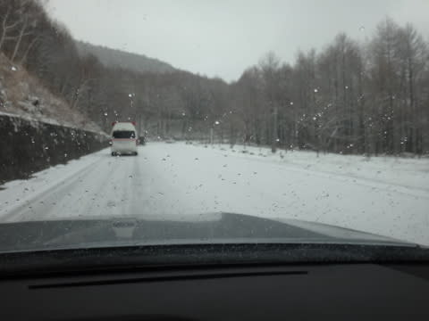

途中，路肩に突き刺さっている車も1-2台…

私としては，レガシィでの初めての本格雪道を

楽しみつつ，焼額に向かったわけですが…

途中に通った高天ヶ原は．

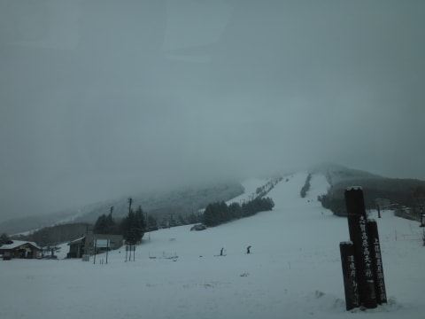

うーん．クワッドは動かず，下の緩斜面だけ

しか滑れないようですね…

で．

焼額に到着して，ゲレンデに出ると．

うーむ．

新雪が乗っていますが．

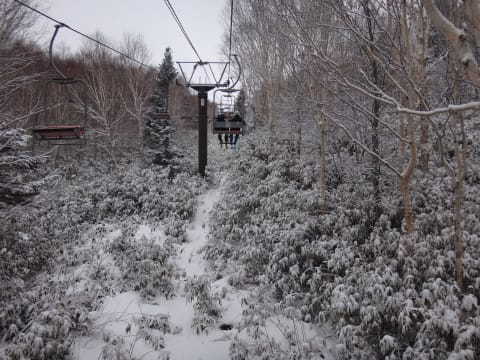

それほど積雪量は多くないですね…

5cm程度でしょうか．

今日動いたリフトは第2高速，第4ロマンスの2本．

第2高速沿いは…

コース幅は結構あり，ほぼ幅いっぱい滑れるいいコンディション！

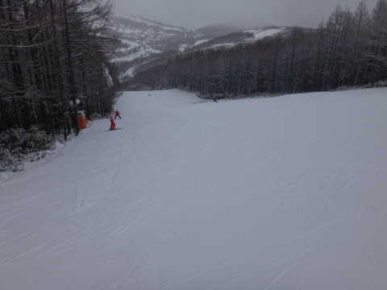

これはいいぞ！

…と，思ったところ．

ゲレンデは人工雪の固めの荒れた雪で，

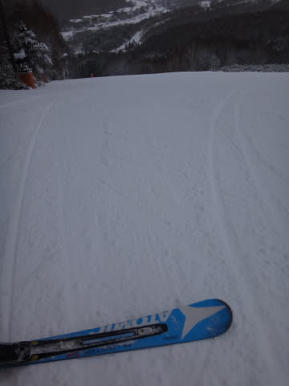

ちょっとカリカリした雪の上に氷のころころが出て，ちょい

滑りにくいかな～

ちょっとコースコンディションが良くなかったので，

コースもリフトも空いてたけど…

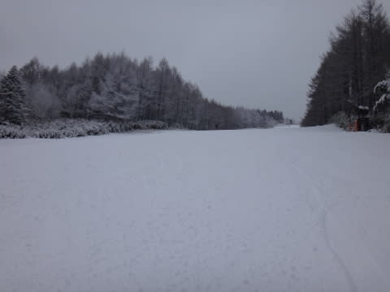

まぁ，ちと滑るのに難しい感じ．

で，

第4ロマンス沿いに出てみると．

こっちもコース幅いっぱいに滑れます！

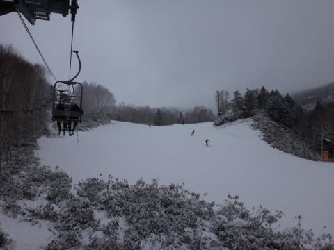

こっちは第2高速側と違い，人工雪の上に天然雪が乗っていて，

やわらかくてフラットで，結構滑りやすいいい雪！

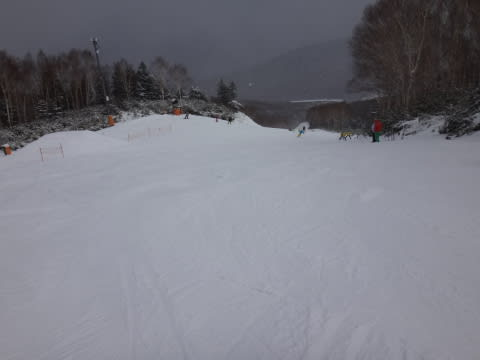

でも，このコースは第2高速側に比べ，ちょっと人が

多かったかな～．

全体的にこんな感じ．

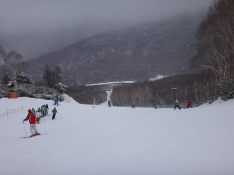

…っつっても，先週のアサマに比べればずっとましですけどね～（笑)

このリフトのほうが待ち時間が長く…

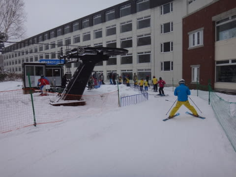

とはいっても，せいぜいこんな感じ．

だいたい平均10人ちょいってくらい．

そして．

天気は終日小雪．

ちらちら舞う程度で．

…残念ながら，積もるような感じではなかったです(残念)

ゴンドラが動くには，もうひと降りほしいところ…

人も少なかったので．

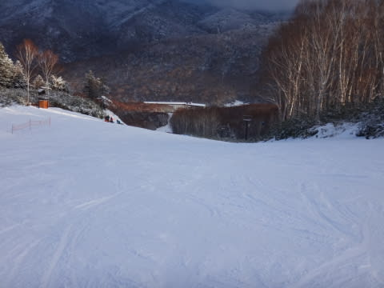

ゲレンデは夕方まで，終日幅いっぱいの大回り可能な，

快適バーンでした！！

…ちなみに．

夜，今は雪が降ってます．

新雪が2-3cm積もってますかね～．

明日までに，ちょっと1mほど積もってくれないかなぁ～(無理）

(志賀高原スキー場開き祭りに来ていたおこみん）

## 💬 コメント一覧

### 💬 コメント by (ゆうこ)
**タイトル**: 寒かったですね。
**投稿日**: 2013-12-08 17:43:17

昨日は旦那の会社の保養所が発哺にあるので、そっちに泊まってました。

三連休は、いつもの宿に泊まる予定ですよ。

今日は、お会いしませんでしたね。

リフトからSさんが滑ってる姿は見ましたが。

私は昼過ぎに切り上げて、小布施で栗おこわ食べたり温泉入ったりしました。

### 💬 コメント by (Skier_S)
**タイトル**: ゆうこさま
**投稿日**: 2013-12-08 19:44:34

今日はおみかけしなかったので、

日帰りだったのかな～…

って思っていたんですが。

私は発見されてたんですね(^^;)

こっちはいつも通りリフトストップ

まで滑ってました(笑)

また志賀でお会いしましょうー

