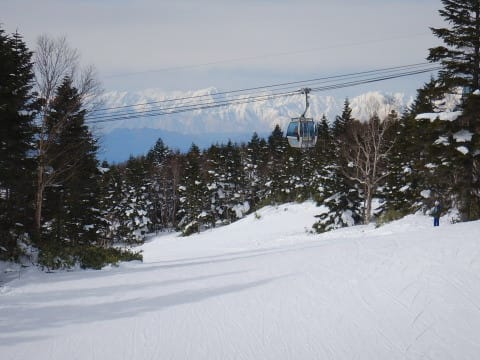
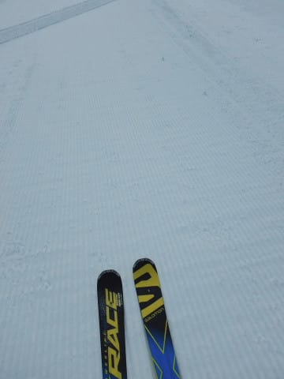
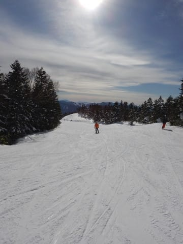
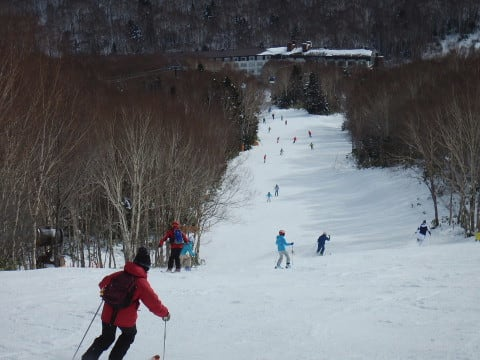
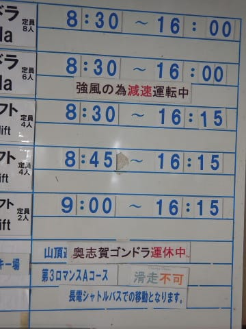
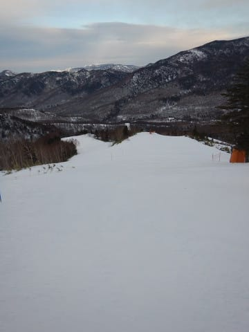
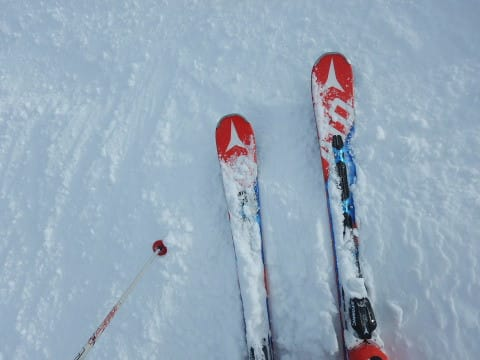

# 12月24日，日曜の志賀高原は…うす曇りの一日，午後は風が出てきて奥志賀ゴンドラ運休したものの，結構楽しめたかな

📅 投稿日時: 2017-12-25 01:44:19

えー．

25，26日は爆弾低気圧でどっさり雪が

降ってくれるとお思いでしょうが．

志賀高原はそれほど降らなさそうな

天気図を見て，ちょっとがっくり来ている

Skier_Sです．

…うーん．

でも，27日はちょっと積もってくれそうかな～．

ってなわけで．

世間一般ではクリスマスイブらしいのですが．

関係なくスキーをしていた私は，

本日もいつも通り，帰宅は夜遅く．

さらに，板の手入れだなんだやっているとこんな時間…（涙）

だもんで．

日曜夜の定番，速報モードで…

えー．

まず．

ちょっと薄い雲がかかっていたものの．

北アルプスもすっきり見える天気で始まった

本日．

朝イチのゲレンデは…

そうです！

お約束の，シマシマバーン！

昨晩からの積雪がなかったので．

結構いい感じでキュッと締まった，

スピードが乗るシマシマ圧雪！

で．

昼間の気温はプラスにまで上がったものの，

ピカピカ晴天というよりは，うっすらと

雲がかかった天気だったので…

思ったほど雪もひどくならず．

午後もいい雪をキープ！

…でも．

12月も後半に入り，そろそろゲレンデの人が

増えてきたかな～

焼額第1ゴンドラは搬器数台待ち程度

だったけど，第2ゴンドラは混んでたんじゃ

無いかな～，

と，思ったら．

昼過ぎから南風が強まり…

なぬ？第2ゴンドラ減速運転…？？

そして，奥志賀ゴンドラ運休！？

このあと，第1ゴンドラも減速運転に

なりました（涙）

ゴンドラは減速運転になったものの．

午後はゲレンデの人も少なく．

終日雪も良かったので．

この週末も，結構楽しめたな～！！

いやーーー．

今日も楽しかった…

ってことで．

詳細はまた明日！

## 💬 コメント一覧

### 💬 コメント by (たろ)
**タイトル**: Unknown
**投稿日**: 2017-12-25 18:04:12

孫悟空ばりの瞬間移動だけでなく、謎の細胞分裂を起こして板を増殖させるという特殊SPECまで身につけ、神セブンとしての神通力を更にアップさせたというSさん、こんばんは。搬器でご一緒出来たので、年内にご挨拶が出来て良かったです。今シーズンもよろしくお願い致します。

### 💬 コメント by (しんちゃん)
**タイトル**: 20000mGoldの皆様にお礼
**投稿日**: 2017-12-25 20:54:41

今週末は20000mGoldの皆さんと濃い～時間を過ごさせていただきありがとうございました。

日曜朝一のシマシマといったら、極上でした。

>Goldの皆様

夕食での様々なお話はとても楽しく、食事もおいしく、極上の時間でした。

>yama様

柚子胡椒＆柚子、ありがとうございました!!極上の味わいでした!!!!

>Ｓ様

ナイターを悩んだ末に断念してのチューンナップ風景は、大変参考になりました。ありがとうございました。

### 💬 コメント by (KENKEN)
**タイトル**: もう戻れない。
**投稿日**: 2017-12-25 23:51:22

今回も濃密な時間をありがとうございました。

レジャースキーヤーのはずなのに、あまりにも濃いスキーヤーに囲まれ、普通?に滑れなくなりました。

パンドラの箱を開けてしまったようです。

この場を借りて週末一緒に滑って頂いた皆さんお土産含めありがとうございました。

年末は北海道で修行してきますので、また新年から宜しくお願いします。

### 💬 コメント by (Skier_S)
**タイトル**: 昨晩は撃沈
**投稿日**: 2017-12-26 08:05:28

＞たろさま

8か月ぶりの再会でしたね~！

でも，ゴンドラ1回だけでしたね…

あのあとも焼額だったのですか？

我々はあの後も集団爆走モードでした（笑）

また焼額でお会いしましょう~！

ってか，今度は一緒に滑りましょう！

＞しんちゃんさま

いや．

濃い時間でしたね（笑）

今シーズン，これからも泊りでいらっしゃれば

濃密時間が過ごせますよ…

特に，朝イチシマシマは外せませんから！

＞KENKENさま

今週もお世話になりました~！

もう，他のメンバーと滑れない体に

なっていますよ．

「え？お茶休憩？なにそれ？」

「なんでコース上でそんなに何度も止まるの？」

…みたいな（笑）

北海道楽しんできてください~！

