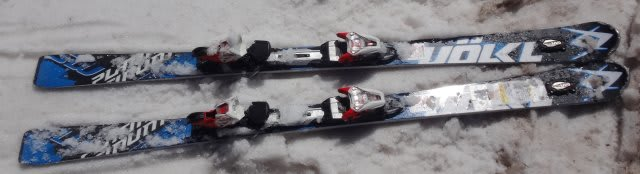

# 2017シーズンモデル，スキー試乗レポート第6回…VOLKL編

📅 投稿日時: 2016-05-25 03:14:07

本日もご無体時間に帰宅している今日この頃（涙）．

でも．

2017シーズンのスキー試乗レポートを，続けるのだ…

なんて涙ぐましい努力っ！！←自分で言うか

本日は，フォルクル編，2機種．

では，どうぞ～！

○VOLKL PLATINUM SW 166cm

基礎オールラウンド．

荷重ポイントは後ろ．

意外とATOMICに近いほど，明確にかかと部分．

…しかし．チューンナップのせいかな？

昨年度までは，もう少し動かしやすい板という

印象がありましたが…

今回は，結構エッジグリップが強い板と

感じました．

板自体はすごく軽い板なんだけど，

履いた感じのどっしり感が今年モデルより増した感じ．

トップとテールのエッジがガッツリ食いつき，

しっかりエッジに乗って回っていくカービング性が

強まった感じです…

しっかりエッジグリップして，板がクッと回ってきます．

SDよりはフレックス・返りは弱いですが，

メタルっぽい張りが結構強くなり，

動かしやすさという点では今年までのSWの方が

動かしやすい気がします．

…繰り返しますが，板のチューンナップの

違いのせいかも？？

ずらしで軽快にコントロールするというより，

エッジにどっしりと乗って滑っていくのが気持ちいい

板なので，166cmでも小回り専用というより，

ミドルターンまで気持ちよくいける感じでした．

○VOLKL PLATINUM GD 175cm

基礎大回り用．

楽です．持った感じもすごい軽い板だけど，

履いてもすごい軽く感じます…

これも，SWと同様に荷重はテール寄りでコントロールする板．

テール荷重気味にして板と一緒に落ちて行けば，

板が自動的に大回りを描いてくれます．

ガッツリ強烈な足場ができて，乗り手が積極的に仕掛けて

横Gを高めていく…という板ではありません．

張りが強い，手ごわい板ではないのに．

どこまでスピードを上げて行っても，

安定性・高速耐性がありそう…という不思議な

感じがする板．

板を押さえなくても良く，

仕掛けなくてもいい．

傾けば傾くだけ，ちょうどよい回転弧で板が回っていき．

体力がない人でもハイスピード大回りができる，

いい大回り板．

軽快なので，その気になればずらしも行けます．

…板なりに落ちていくのが気持ちいいので，あまり

ずらそうとは思いませんが．

仕掛けていくとちょっと弱い感じがありますが，

板も軽く，傾くだけで体力を使わず大回りが

できるので．

整地をロングクルージングしたい人には良いのかも…
