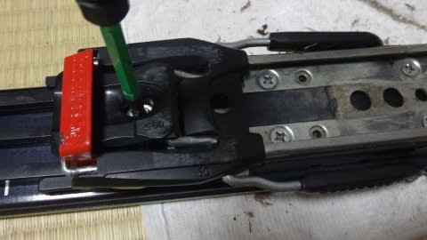
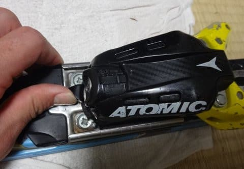
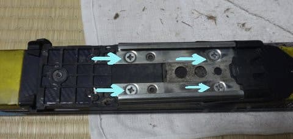

# ATOMICのVARビンディングとSALOMONのXビンディングって同じだよね…SALOMON　X-RACEにATOMICのVARビンディングがつくのか？その1

📅 投稿日時: 2017-02-22 02:10:24

🏷️ カテゴリ: [スキー雑談](c1f9d2cb7478308da16419928ea3945e9.md)

えー．

本日は．

やはり．

かなりドサドサ積もったようですね…

（[焼額山FB](https://www.facebook.com/yakebitaiyama/posts/1230570537038290)より）

朝圧雪した上にさらに40cmほど積もったのか…

それはすごい…

おかげで．

第2高速，第3高速リフトの営業開始が

かなり遅れるほどだったようで…

＃2ゴンは強風で営業できず

＃シャトルバスも視界不良で運行しなかったみたいなので．

＃すごい天気だったんだな…

これで，月曜の雨の影響はリセットされたかな？？

…と，思いきや．

…やはり．

23日の木曜日は，ダメダメですね…（涙）．

志賀高原には，水色の+6℃線がかかる予報は変わらず（泣）．

やはりこの日は，強烈高温になり…

そして，地上天気図はこんな感じなので．

…ダメです（泣）

降ります．

23日は，朝から．

強烈な勢いで液体が降ってきます（激烈涙）．

…ただし．

やっぱり，翌24日はこんな感じで．

水色の-9℃線が志賀高原に近づいてます…

これは．

前日の+6℃から15℃も冷えてます…！！！

…なんだか，極端すぎるんですけど…

ということなので．

24日の金曜の朝は，-12，3℃くらいの冷え冷えになり．

そして，地上天気図はこんな感じなので．

水色の降水域が志賀高原にもかかっており．

…これは．

23日夜から24日終日，雪が積もってくれそうです．

…うーん．

この積雪で，何とか土曜までに．

雪は改善してくれそうかな…

＃夕方は固い下地が出そうだけど

ということで．

本題へ．

えー．

今シーズン初めまで．

石ころを踏みそうなデンジャラスバーン向けに

利用していた，ヘタリまくった'14 ATOMIC Bluester DEMO SX．

そして．

ビンディングを新しい'16 X-RACEに移植手術したため．

ビンディングが無くて使えない，'15 SALOMON X-RACE．

（この右側）

…'14 ATOMICはヘタリまくったうえに，エッジや滑走面も

ボロボロだけど．

'15 X-RACEは，多少へたったとはいえまだ使おうと思えば

使えるレベル．

…だもんで．

ATOMICからSALOMONに，ビンディングを付け替えられれば，

X-RACEを復活させられるなぁ…

と，思っていたけど．

SALOMONのX-RACE．

SALOMONのZビンディングかXビンディングしか

着けらんないことになってます．

…でも．

どう見ても．

ATOMIC Bluesterに着いている，

ATOMICのX12 VARビンディング

これって…

SALOMONのX12ビンディングと．

どう見ても，同じものだよね…

ATOMICのVARビンディング，SALOMONのX-RACEにつけられるよね？？？

…と．

誰もが考えるわけですね．

とりあえず，

ATOMICのX12 VARビンディングとSALOMONのX12ビンディング．

取り付け台座まで含めて，全く同じなのかどうか．

…SALOMONの板にATOMICのVARビンディングがつくかどうか．

実際に確かめてみました～！

まず，ビンディングの取り付け・取り外し作業をする前に．

「ポジドライバー」

を準備しましょう．

通販で800円くらいで購入できます…

ポジドライバのサイズはPZ3（No.3)を選んでください．

この左側が普通のプラスドライバーで，右側がポジドライバー．

…形が結構違います．

ビンディングの取り付け・調整ネジは．

普通のプラスネジとは違います．

ポジドライバーを使いましょう！

…一見，普通のプラスドライバでも

行けそうに見えますが．

普通のプラスドライバだと，こんな感じで，

ネジの頭にぴったりはまらず，ヘタするとネジの頭を

舐めちゃって，ネジを回せなくなります．

それに対し，ポジドライバは．

ビンディング取り付けネジにピッタリはまります．

ってことで．

ポジドライバーが準備できたところで．

ATOMICの板のVARビンディングの

取り外し作業からスタートしましょうか…

まず，最初にこの白いプラスチックプレートを

外しましょう．

見えているねじ一本外せば，

簡単に外れます．

で．この白いパーツを外すと，

こんな風になりますが…

ヒールピースは，この白いパーツのネジで固定されているので．

この白いパーツを外せば，ヒールピースは自由に動きます．

だもんで，矢印方向に引っ張って外しましょう．

ちょっと引っかかりますが，コンコンと叩けば

比較的すんなりと外れます．

次に，ブレーキを外します．

赤いブレーキストッパーをかましたあと，

この部分のネジ1本外せば．

…ブレーキは簡単に外せます．

ブレーキを外したら，

今度はトゥピースを外します．

このように，トゥピース前のレバーを横に押しながら…

矢印側にスライドすると，外れます．

トゥピースを外したら，

今度はトゥピース側のビンディング固定台座を，

この4本のネジを緩めて外します．

ネジが外れると，台座が簡単に外れます．

そして，次はヒールピース側のビンディング固定部を

外しますが．

この，矢印で示すネジ4本を外すと，

これも簡単に外れます．

…これで，ビンディング取り外しは完了！

…あとは．

このビンディングが，SALOMONのX-RACEに着くかどうか．

試してみるわけですね…

（続く）

## 💬 コメント一覧

### 💬 コメント by (はなげ親分)
**タイトル**: プチ冬休み
**投稿日**: 2017-02-22 14:16:07

土日は快適だったのに月曜はウェアグッショリ、火曜は朝から大量の湿雪と強風&ホワイトアウトで断念。あ～あ!折角有休取ったのに…(泣)

### 💬 コメント by (Skier_S)
**タイトル**: はなげ親分さま
**投稿日**: 2017-02-23 04:22:37

…ご愁傷さまです．

この月，火はちとひどい天気でしたね…

月曜はひどいと思ってたけど．

火曜も全面パウダーにならず，

周りも見えず重い雪とは…

何かの嫌がらせかと思いたくなる天気でしたね（笑）

