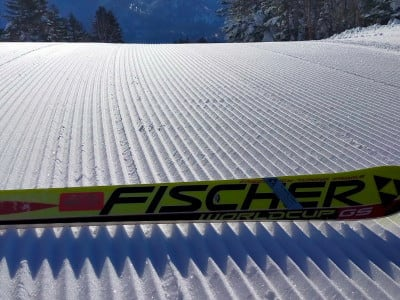
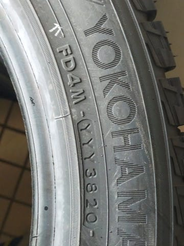
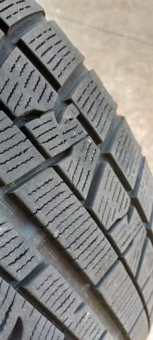

# LEVORGのスタッドレスタイヤを新品に交換！…今度もYOKOHAMA iG5+にしたよ

📅 投稿日時: 2022-01-26 01:53:15

🏷️ カテゴリ: [車](cba0e8330b3f2ded7c1addfacc75d4547.md)

ということで．

本日も，志賀高原特派員から

写真が送られてきましたが…

うぎゃーーー！晴天！！

そして…シマシマっ！！

朝の冷え込みは激冷えという感じでは

なかったみたいだけど…

それでもそこそこの冷え込みの，

締まったいい感じのシマシマバーンの

一日だったみたいで…

あぁ…晴天の平日に滑ってみたい…

しかし．

[こちらの情報](https://shigakogen.co.jp/archives/13462)によれば．

コロナ感染拡大の影響で，

1月31日より，

平日は寺小屋，タンネ，蓮池が運休

（タンネは金曜は運行）

になるようです…（涙）

リフトを全部動かすわけにいかないほど，

お客さんが減ってるってことですね（泣）

あぁ…コロナが憎い．

ちなみに，

明日26日（水）：

朝のうちは晴れるかもしれないけど

昼前後から曇り空，夕方くらいから雪が

ぱらつきそう…

そして，

明後日27日（木）：曇り時々雪…

って感じの天気でしょうか．

ってなところで，本日の本題へ．

えー．

我がVMG LEVORG君．

[11月に，タイヤをスタッドレスに交換](cba0e8330b3f2ded7c1addfacc75d4547.md)しましたが．

すでに3シーズンで4.5万kmも走っていた

タイヤでさすがに4シーズン目に突入となると，

今シーズンをこのタイヤで走りきる

つもりはなく．

本格シーズンに入ったら新品タイヤと

入れ替えよう…と思っていたわけで．

だもんで．

年末に，通販でスタッドレスタイヤを購入

しておきました～！

今回も，これまで履いているのと同じ

YOKOHAMAのiG 5 Plusです！

もう，iG7が出たので，2世代前の

古いモデルになっちゃいましたが…

だって，このタイヤでこれまで走って

不満なかったんだもん…

で．

製造は…2020年38週．9月～10月ごろ製造なので，

1年ちょっと経った，昨シーズンの製造ですね．

まぁ，私の場合，スタッドレスは早ければ

2シーズン，長く履いても3シーズンなので，

1年古くても問題なし！

安かったので，これでOK！

…さすがにタイヤの打ち換えは自分で

できないので，持ち込みタイヤを安く

交換してくれる某ガソリンスタンドで

交換してもらいました…

で．

リフトで車を持ち上げてたので．

滅多に見れない下周りをじっくり

眺めてみますが…

志賀高原から帰ってきた翌日だったので，

足回りに凍結防止剤が残ってるけど，

錆は出てませんね…

さすが，いつもメンテナンスして

防錆剤塗ってるだけはある！←自画自賛

タイヤ交換していたスタッフも，

「え？毎週スキー場に行ってる車で

　85000kmも走っててこれ？

　きれいですね…」

と言っていたので．

走行距離にしてはかなりきれいな下回り

なのかと…

ってなことで．

古いスタッドレスをホイールから外し，

新しいタイヤに打ち換えますが…

古いスタッドレス．

まだギリギリプラットフォームまで

削れてないですね…

このタイヤで49000km走りましたが，

もう少し走れた感じ．

でも，古いタイヤと新しいタイヤを比べて

みると，やはり新しいタイヤの方が，

ゴムが柔らかかったので…

製造5年目，ちょっと硬くなってきてるので，

まぁ替え時だったかな．

という感じで，新しいタイヤを組みつけた

ホイールを履かせて…

作業完了！！

タイヤ4輪ホイール打ち直し，

ホイールバランス，

バルブ交換，

廃タイヤ処理まで合わせて

トータル8000円くらいで済んだので，

まぁ安かったかな～…

ってなことで，早速新しいタイヤで

志賀高原を走ってみたけど…

うーむ．

新品のスタッドレスタイヤだと，かなり

グリップ力が変わるんじゃないかと

期待してたけど…

ふわふわ新雪だと，新しいタイヤも

古いタイヤも，あんまり変わらんな…

おそらく，ツルツルアイスバーンとかだと

違いが出てくるんだろうけど，

柔らかい雪や，普通の圧雪路面だと，

5万km走ったタイヤとそんなに差が

無かったので．

YOKOHAMA iG 5+って，もしかすると

かなり走って減ってきても，性能劣化が

少ないタイヤなのかも…

でも，とりあえず．

前のタイヤで不満が無かったのでリピート

したくらいなので．

新しいタイヤも，

「これだけグリップすれば，志賀の登り

　下りに不満も不安もない」

って感じで，安心して走れます…！

私の車に乗ったことがある人なら，

LEVORG+iG5Plusで志賀の登り坂を十分速く走れることを

体験しているはず…

## 💬 コメント一覧

### 💬 コメント by (Hide)
**タイトル**: Unknown
**投稿日**: 2022-01-26 07:36:42

おっ、新品タイヤだ☆彡

私も志賀高原までの片道約330Km、ほぼ高速なので20年振りにMICHELIN履いてみました。

X-ICE SNOWですが、噂通り高速ドライでも下手なサマータイヤより良いんじゃね？って感じです。

それでいて、志賀高原の下り凍結路も以前のVRXと遜色がなく、なんだか不思議なタイヤです（笑）

スタッドレスの進歩を感じました。

### 💬 コメント by (おおすぎ)
**タイトル**: Unknown
**投稿日**: 2022-01-26 14:23:35

Sさんの、タイヤインブレッションも大変役立ちます。

わたしも、Sさんのスタッドレスタイヤの評価を読んで、VRXから、アイスガードに乗り換えました。

浮いたお金で、一回くらいスキーに行けますし、何履いても運転操作に気を付けないと、雪道は特に危険ですからね！

(出来れば、IG60に交換して、違いを伺いたかったです！)

### 💬 コメント by (レインボー74)
**タイトル**: Unknown
**投稿日**: 2022-01-26 14:50:02

水曜日の志賀高原情報

朝の上林-1℃　蓮池-5℃。今日も爽やかな晴天です。平日族の心掛けがいいからかなあ。

今日はやけび券の人と一緒なので、やけびをぐるぐるしました。一ノ瀬から移動してきた人によると、ファミリーは圧雪してないそうな。

やけびは今日もまた穴一つない完全フラット。本当に頭が下がります。

### 💬 コメント by (Skier_S)
**タイトル**: コロナ早く収まってほしい…
**投稿日**: 2022-01-27 01:09:03

＞Hideさま

ミシュラン，そんなにいいんですか！

昔は高かったイメージもありますが，今はそれほど高くもないみたいですし，

スタッドレス，進歩してますね…

＞おおすぎさま

私も今回はiG6にしようかと思いましたが…

10月ごろまで安かったですが，11月から値上がりしてiG5との価格差が

かなり大きくなっちゃったので，またiG5+にしちゃいました…

＞レインボー74さま

今日もヤケビは良かったみたいですね！

これから週末まで，いいコンディションが続きますよ～！！

