# 4月11日の志賀高原は…朝は10cm積雪，一日曇りなれど気温は高め…

📅 投稿日時: 2015-04-11 20:07:49

えー．

いつもどおり志賀高原に来ているわけですが．

例年この週末に開催されている，

一の瀬ナイター無料開放が，今年は実施されない

…という事実に，ショックを受けているSkier_Sです．

…無料ナイターがあると期待していたのに…（涙）．

ショーック．ショック，ショック！！！（激泣）

夕食後，寂しくこの記事を書いています（；_；

ってことで．

本日の志賀高原のレポートですが．

…今日は，天気が悪いだろう早朝営業はスキップし，通常営業開始の

8：30を狙ってやってきたわけで．

志賀高原の上り坂までは結構降っていた雨が，

スキー場近辺まで来ると雪に変わり，

ゲレンデ到着時は，雪がちらちら舞っている感じに．

で．

通常営業開始の8:30にゲレンデに出ると…

うううぅーむ．

今日も，営業開始時に，すでに気温プラス3度ですか…

ちょっと高いな（涙）．

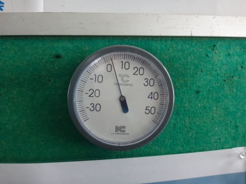

でも．

先週よりは低いので，よしとしておきますか…←何だその上から目線の言いっぷりは

山頂の天気は…

ふむ．

曇り，ですね～

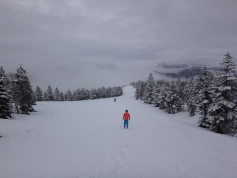

で．

到着時には小雪が待っていたけど．

ゴンドラを降りてで滑り始めるころには，ちょうど雪が止んで．

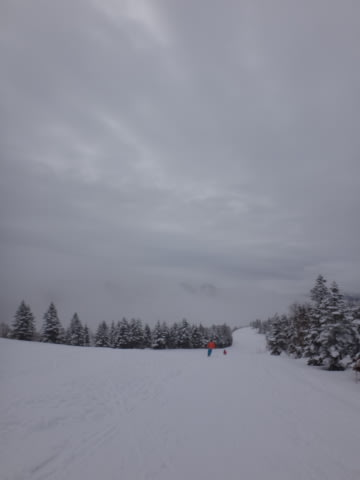

ふははは．

昨日予想した，

午前中の早い段階，9時ごろには雪orみぞれは止みそうな雰囲気．

ってのが，どんぴしゃあたりじゃないですか．

そして，ゲレンデの雪は…

10～15cmほどの新雪が積もってるよっ！！！

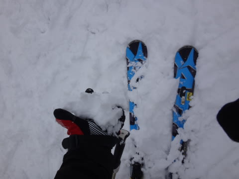

わはははは．

これも，

朝のうちはうっすら湿った新雪が被った下地に，ざらざらした固めのバーン．

ってのが，ほぼ当たりじゃないですかっ！

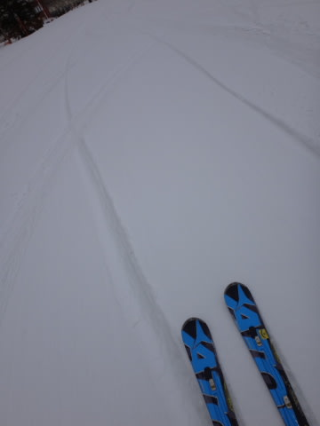

見よ！

私の予想の正しさを！！←…もしもし，当たったときだけ激しく主張してないかい？？

上に積もっている新雪は，かなり重い，しっとりした雪で．

気温が高めだったので，下地もそれほど固くなく，

どちらかというと下地もしっとりとした感じってのが，

多少予想と違いますが…

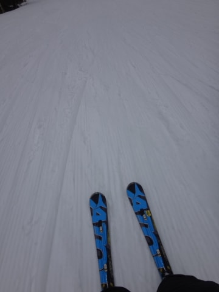

まぁ．

でも．

朝からザブザブ溶け溶けザラメよりはマシですね．

…と，まぁまぁ快適なゲレンデを滑ること，しばし．

天気は，時折ガスがでて，前が見えなくなることもあったけど…

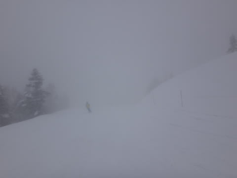

さすが4月の春休みが終わった後なので，

ゲレンデもがらがらですな～．

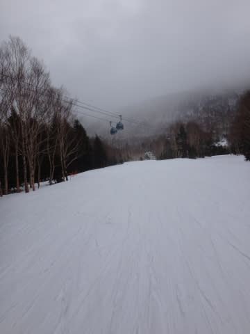

ゴンドラ待ちも，終日完全に0でしたよ～！！

人が少ないおかげで，午前中は雪も

それほど荒れませんねぇ…

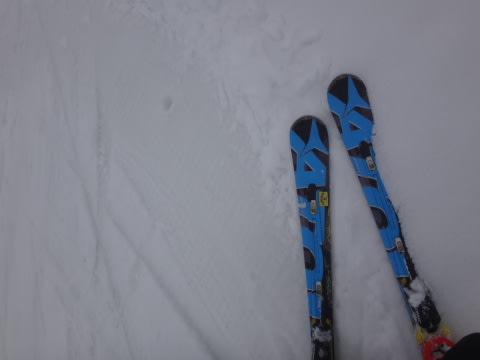

うっすら積もった新雪が，どぼどぼザラメになるのを

防いでくれている感じで，板が埋もれるような雪にならず．

まーまーすべりいい感じかな～

＃ゴンドラ乗り場付近では，新雪がちょいと板に張り付く感じも

＃あったけど…

そして．

昼間の気温もプラス4度と，朝とほとんど変わらず，

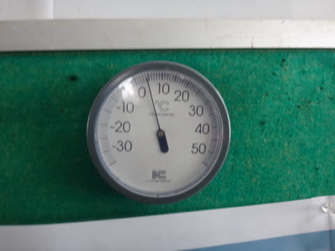

また，日も射さなかったので…

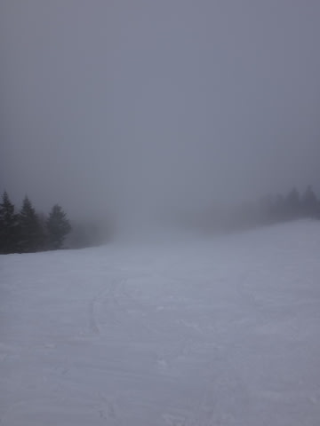

さすがに午後はちょいと雪は凸凹してきたとはいうものの．

板が埋もれるザブザブザラメ雪ではなかったので，

それほどひどい荒れ荒れバーンにならず．

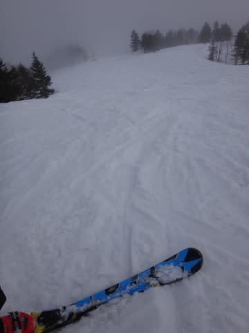

夕方までこんな感じで，

まぁ，この時期の夕方としては，かなりマシな感じかな～．

とはいえ．

今日は結構ガスも出たし．

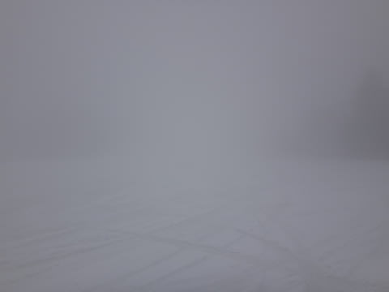

（ま，前が見えない…）

気温も朝から高く，朝イチに硬くしまったバーンも滑ることができず．

…そして．

今週からは，焼額の営業終了が，ゴンドラ15:45と

異常に早くなってるし…（悲）

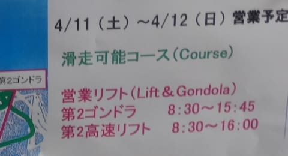

（な，なんだ，この異常に早い終了時間は…（落涙））

そしてそして．

楽しみにしていたナイターも営業ない…

という感じで．

水曜の予想の「終日雨」ってよりは，ずっといいコンディション

で恵まれていたとは言え．

ちょっとばかり，「なんだかな～（涙）」って気持ちが残る，

ちょっとだけ残念な感じの一日だったのでした…

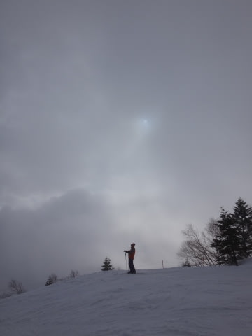

うーむ．

明日も朝はそんなに冷えなさそうなので．

早朝はそんなに硬くならなさそう…

でも．

明日は朝から晴れそうだから，早朝は放射冷却で

そこそこしまり気味のバーンを楽しめるかな～…

今日，ナイター滑れなかった分．

明日の早朝は．

すべりまくるのだっ！！
