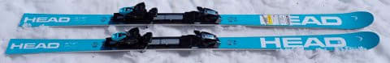
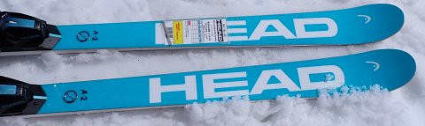
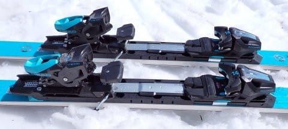
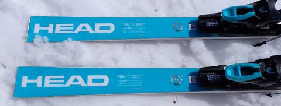
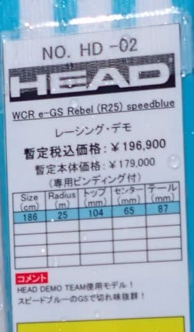

# 2025シーズンモデルのスキー板，試乗レポートその27…HEAD WC GS-REBEL RP-WCR14 SPEEDBLUE

📅 投稿日時: 2024-07-11 01:36:15

🏷️ カテゴリ: [スキー板試乗](c0bd8048615710cee890e403a36cc9a2b.md)

先日．

数年前に同じ職場で一緒に働いていた

人が，私の職場に異動してきたの

ですが…

私「ようこそ我が部署へ！」

かつての同僚「お久しぶり～！

　いやーー．以前○○で一緒に働いて

　以来ですね！…あの頃はひどい

　ご無体職場で苦労しましたね～！」

私「…

　…

　…

　今の職場の方がご無体ですよ…」

同僚　「…え？

　…

　この部署が…

　あれ以上に…？？」

私　「…あれ以上に…」

同僚　「…あれ以上に…」

通りがかった偉い人　「あれ？

　××さん(かつての同僚)，S君と知り

　合いだったのかね？」

同僚　「…ええ．

　Sさんとは以前同じ職場でかなりの

　ご無体をくぐり抜けてきた仲間ですけど，

　ここがもっとご無体だって脅され

　ましたよ！（笑）」

偉い人　「…

　…

　…そうだね…」

同僚　「え…！？？」

私　（否定しないんかい！！）

偉い人　（私を見ながら）「でも，

　チミはこんな状況でもいつも

　楽しそうに仕事してるよね～！！

　ワハハハハ！」

私　（…いつも笑うしかない状況になる

　から笑ってるだけで，決して楽しいと

　思ってないんだけど…（涙））

同僚　「そうなんですよ！Sさんは

　実は前のご無体職場でも，かなり

　楽しそうに見えたんですよ～」

私　（そうなの！？）

同僚　「だから，ご無体職場を次から次へ

　渡り歩かされるわけですね～！」

以上はフィクションです．

あくまでフィクションですが…

ということで．

どうやら私はご無体職場を渡り歩く

宿命にあるようなので．

とっとと早期退職して，早くスキー

三昧の生活に移行したい，と強く願った

本日なのでした．

ってなことで本題へ．

本日も2025シーズンモデルのスキー板

試乗レポート．

今回はヘッド編です！！

〇HEAD WC GS-REBEL RP-WCR14 SPEEDBLUE 186cm

FIS非準拠GS競技用，基礎大回り用

板自体は，[前回試乗レポートを書いた
HEAD WORLDCUP REBELS e-GS RD](e28691e91c19dff0fcfef0e7d67310d30.md)

と全く同じで．

プレートも同じ，WCR14 Shortプレート

なので．

白いGSモデルとスペック上は変わらないの

ですが…

どうやら，水色の板は名前が変わって，

e-GS RDとは呼ばないようです．

ってなことで．以前履いた白い板と同じ，

R=25mのFIS準拠じゃないGS板ですが．

SLモデルの場合，[同じ板でも白と水色で
トップシートが違うらしく，履いた感じ
全然違っていた](e177a669ff33025faf72b49091ac5cc36.md)ので．

もしかすると大回り板でも同じかな…？

と思って，今度は水色の板を履いてみました…

ただ，白い方は3月の柔らか新雪，

今回は4月のザブザブ雪なので…

同じ条件の比較じゃないので，

差がわかるかな…？？

とりあえず滑ってみると…

やっぱり結構良くできている板！

しっかりしたフレックスで安定感があり，

スピードにも強いにもかかわらず

結構軽快に動かせて，自由に取りまわせる

感じの板です．

スピードを出していくと，強いグリップの

足元に適度なたわみが出てくれて，

気持ちよくカービング大回りができます．

ハイスピードでの快感度の高い大回りが

できる板です．

しっかり踏んで角付けを強めていけば，

中回りくらいまではもっていけます．

あさイチの人がいないきれいなバーンで

トップスピード大回りをすると気もちいい

感じの板ですね～！

FIS規定の板ではないとはいえ，さすがGS板．

私のトップスピード程度ではまだまだ全然

板に余裕がある感じで，スピードが上がっても

全く怖さを感じない安定感．

そんな板なのに，春雪のザブザブに

突っ込んでも手ごわさはなく，

荒れた雪の上でも気持ちよくカービングで

切れていくし．

さらに板を動かそうと思うと，荒れた

雪のうえでも簡単にズラしを入れて

コントロールすることができます．

急斜面でも，カービングとズラしを上手く

使い分けてセーフティーに降りてくることも

できる感じ．

スピードが乗らないとたわまないので，

低速で滑ってもあまり楽しくないですが，

低速でも板は動かしやすく．

意外にも，ずらしを使ってゆっくりと楽に

滑ってくることもできます．

私が普段大回り用として履いている

FischerのRCのR=21のように，トップが

食いついて回ってくる感じは無いので，

RCと比べるとずっとまっすぐ走りますが，

スピードに乗せて踵荷重気味でしっかり板を

たわませていけば，普通のGS板よりは

ぐっと回る感じで，カービングで滑れる

半径も自由度が高く．

それでいて，グリップが強いにもかかわらず

板をずらしていく自由度もかなり高いという

不思議な扱いやすさがある板なので…

GS競技用というより，普段のゲレンデ用

大回りとしてはかなりイケるな…

と思いました…

で．

肝心な白い板との比較ですが．

なにぶん前の試乗から1か月近く経っていて，

さらに雪質が全く違ったので．

白い板と水色の板で，特性が違ったかどうかは

分からずじまいでした…

でも．

どっちにしろ，体力があってかなりスピードを

出す人には，ゲレンデ大回りとしていい板だと

思います！
