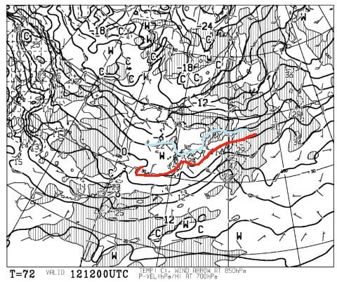

# 3連休中日，1月12日の雨の危険は回避！！…でも，この1月の一か月予想を見ると，1月も気温は高そう（涙）

📅 投稿日時: 2020-01-10 06:37:51

えー．

昨日の記事で，

　9日（木）：朝はそこそこの冷え込み．夜中から降り始めた雪が

　20～30cm積もる．

と予想した，9日（木）の志賀高原．

…9日の朝，実際は

5cm程度しか積もらなかった

ようです（激烈涙）

焼額は朝3時過ぎの段階で3cm（涙）

ただ，ゲレンデオープンまでにこれから

2-3cm積もったようですが…

（[焼額山Facebook](https://www.facebook.com/yakebitaiyama/posts/2634623339966329)より）

奥志賀も朝10時の段階で積雪5cm…

（[奥志賀高原スキー場Facebook](https://www.facebook.com/okushiga.kogen/posts/1480607355422901?__xts__[0]=68.ARDve3hUUBTb6MZp37OMKFZ07IzvS38d3N9GXU-esM6dhjeAZxDWZByFUscYROAD1AZtG45XevQ-2blXET2yAJj9oHbSAKQHuhndwrUs_9hv0hBP-3qLLbHH0vLyM6Pdu1aIQNJTL1UbaYBLRJQWlZNnRbDSBO0UmP4GeZc7wM9HD-DOKH6c-ZD0A_FFqaoGq5OxDrR_d6XLtPyHy1-50VQytD3-E-PUMR9_89g4wdxDrfcpHU_I2EStSpywlb4N8yhpsKDJAHs4y5fPKkM1yZF8R6Ba0DBCIRCvTCwmKxfUft1VLcjSeAvwzwJtQ-S21816w4AYbrp8lPvan6xYrXjqkw&__tn__=-R)より）

…まさか，ここまで積もらないとは…（泣）

残念ながら，見事に予想を外したようです…（涙）

そして．

本日10日も，朝4時の段階で積雪は5cm

ほどのようですね…

あぁ…積雪が足りない…

とはいえ．

昨日は積雪5cmながら，

焼額現地特派員からは，

コンディションが良くて楽しかったとの

レポートが入ってました…

とりあえず，積雪5cmでも，冷え冷え雪だし，

下地の硬いのが隠れて良かったみたいですね…

うーむ．

しかし．もう少し降ってくれないと，

人が多い3連休は，雨で固まった下地が

すぐ出てきそう…

だけど．

最新の3連休の天気図を見直してみても，

やはりドサドサ積もる感じにはなってません…（泣）

でも．

ちょっとだけいいニュース！

3連休中日，12日．

昨日段階の予想より，気温が下がりそうです！！

850hpaの0℃線は予想より南に下がり，

志賀高原は水色の-3℃線が近づいてます！

…以前から危惧していた

12日雨の可能性は，回避

されたようです…

とりあえず．

3連休に雨にならないように，

必死に祈っていた私のおかげなので．

皆さん，感謝してください！←そこはみんなが必死に冷え冷え踊りを踊ったおかげだと言うところでしょ

で．

この12日は，南岸低気圧が近づいてきて

降水量がありそうなので．

志賀高原でも，12日の昼間には

重い雪ながらわずかに積雪があるかも…

せいぜい数cmレベルですが，

雨が降って解けるのに比べれば，

まぁ積もってくれるだけありがたい…

そして．

本日発表の，これからの1か月予想図．

果たして，この1月は，これから冷えるのか？？

これまでの天気と違って，ドサドサ降るように

なってくるのか…？？

というところを，ほとんど結果が

分かっていながら見てみましたが．

う――――む．

やはり，あまり期待してはいませんでしたが．

これからの1か月も，平年より2~3℃気温が

高い日が，ずっと続くようです…（激涙）

あぁ…

ダメか…

これだと，この1月も，ドサドサ積雪は

期待できなさそう…

このままだと，今シーズンは一度も

太い板の出動機会が無いまま終わりそう

なんですけど！？？？

あぁ…

腰パフが滑りたい…

冷え冷え踊りも効かない．

寒いギャグも効かないという，

緊急事態の現在．

あらゆるイベントに雨を降らせてしまう

雨男…という，伝説をお持ちの方が

時々いますが．

そんな感じで

「私は雪女」「我こそ雪男」

という自負のある方．

ぜひ，10000人ほど集まって，

こぞって志賀高原へお越しください…！！（懇願）

## 💬 コメント一覧

### 💬 コメント by (若杉勲72)
**タイトル**: Unknown
**投稿日**: 2020-01-10 12:20:07

志賀高原情報

金曜日ダイヤモンドで休憩中。昨日に増してベストコンディション。ウハウハが止まりません、たまりません。

本日のやけびは、地肌もなく最高。

昨日は、白樺で地肌。寺子屋はひとい。ファミリーは良好。パーフェクたは閉鎖。パノラマはカリカリ地肌最悪。

### 💬 コメント by (Northfox)
**タイトル**: 明日より志賀高原！
**投稿日**: 2020-01-10 19:39:38

この3連休、雨は降らないということで良しと考えます。ゲレンデの状況も回復傾向ということでしょうか。

今シーズン初の志賀高原を楽しもうと思います。

S様の滑りの拝見も楽しみにしています。遭遇の際は挨拶させてください。

では焼額で！！

### 💬 コメント by (m&t)
**タイトル**: Unknown
**投稿日**: 2020-01-10 23:08:20

アサマ2000がホームのm&tです。

アサマは斜面も雪質も良いのですが、残念ながら距離が短いのです。

信州スノーリゾートキャンペーンで長野県共通リフト券が当ったので、日曜日に急遽志賀高原に遠征します。

ヤケビも大好きですが、朝イチ奥志賀ゴンドラにする予定です。

その後ヤケビに行きますので、皆さんをお見かけしたらお声をかけますのでよろしくお願いします。

### 💬 コメント by (Skier_S)
**タイトル**: 今週末は3連休！
**投稿日**: 2020-01-11 00:40:23

＞若杉さま

今日もいいコンディションだったんですか…

ヤケビは8日の雨にもやられず，それほどブッシュが

出てないんですね，

でも，寺子屋，一の瀬パノラマはダメなんですね…

もう少し雪が必要そうですね…

＞Northfoxさま

いや，12日は雨が降っても不思議じゃなかったのに，

よく降らずにもってくれたものですね…

今週末志賀高原ですか！

では，焼額第1ゴンドラでお会いしましょう！

＞m&tさま

長野県共通リフト券ですか！！

だったら，ぜひ志賀高原へ…

日曜奥志賀スタートですね．

私は基本的にイチゴングルグルしてると思います～！

（何かあったら浮気するかもしれませんが）

では，今週末お会いしましょう！

