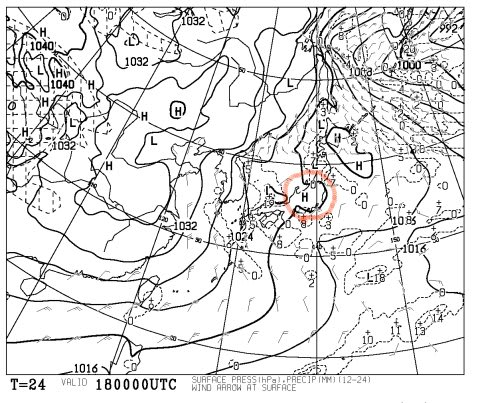

# 明日は，もしかしたら晴れ間も？？

📅 投稿日時: 2014-01-17 23:17:13

ということで．

いつもどおり，この週末は焼額第1ゴンドラをぐるぐる

していると思う，Skier_Sです．

えー．

明日，土曜日ですが．

先日の天気予想で，

土曜…朝から終日雪が降る．朝の新雪はそれほどでもないけど，

　　　夕方から雪が強くなり始め，夜はどさどさ降る．

って書きましたが．

…うーむ．

土曜，時折晴れ間ものぞきそうですね～．

なんだか，赤く囲ったような感じで．

プチ高気圧が発生する予想図になったので．

…意外と朝のうちはすっきり晴れてるかもっ！！

まぁ，晴れ，曇り，雪が入り混じる日になる感じです．

あー．夕方から雪が強くなり始め，夜はどさどさ降って．

日曜パウダー，一日中降り続け…って予想は変わらずですよ～っ！！

ということで，

あと4時間後に，

志賀高原へ出発です…

＃今日も夜あんまり寝てられない…(涙)←ブログ書いてないで早く寝ろよ
