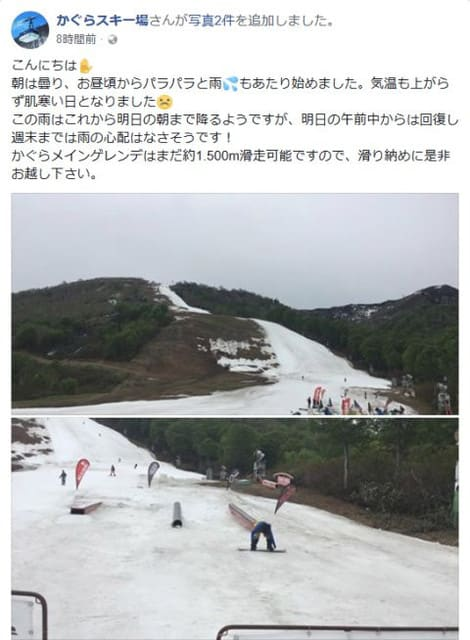
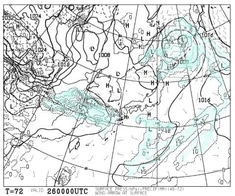
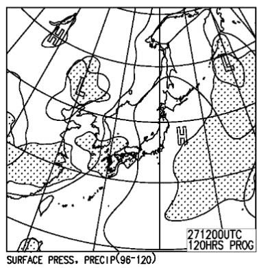

# 5月26，27日の週末のかぐらスキー場の天気は？…基本的に晴れそう．気温は暑いくらいだよ！

📅 投稿日時: 2018-05-24 00:11:57

🏷️ カテゴリ: [スキー天気予想](c6554f5c3c106093b511a8daae23757e8.md)

えー．

意外なことに．

本日の雨を乗り越えて，

まだまだかぐらはメインバーンが

クワッドで営業を続けているようですね…！

（[かぐらスキー場FaceBook](https://www.facebook.com/snowkagura/posts/1547538822040099)より引用）

これは．

うーむ．

…先週の状態から考えると，信じられない

ことですが…

まさか，この週末までクワッドが営業できるのか？？

とりあえず．

まだシーズンが続いている皆さんにとって，

大変気になるであろう，今週末のかぐらスキー場の

天気予想です！←だから，もうスキー場の天気を気にする人はなんてほとんどいないから…！

まずは，26日土曜の地上天気図ですが…

うむ．

朝9時の段階の天気図では，水色の降水域は

本州にかかっておらず．

基本的に晴れそうですね…

あと．

この時期は，雪か雨か悩むようなこともないので．

いつもの850hpa気温図は載せませんが．

まぁ，気温はかなり上がりますね．

山頂で20度を超えて，日が射すと暑く感じる気温です．

そして，27日の日曜ですが．

地上天気図を見てみると…

うむ．

降水域の網掛けが本州にかかっていないので．

日曜は終日晴れですね．

まぁ，この日も昼間の気温は，

かぐら山頂でも20度近くまで上がりそうで．

暑くなりそうです…

ってな感じで．

まとめるまでもないですが．

まとめると．

26日土曜：朝は晴れ．気温はかなり上がる．

　日差しがかなり暑く感じる一日．

　晴れてる間はTシャツで十分．

　ただ，夕方になると，ちょっと雲が

　増えるかも…

　

27日日曜：終日晴れ．すっきり晴れ．

　この日も暑くなる．

ってな感じですか…

しかし．

ついに今週末で，かぐら営業も終了．

…私が月山に行く週末は，臨時天気予想

やるかもしれませんが，毎週定例の週末天気予想は，

これが今シーズンのラストかな？

あぁ…シーズンが終わっていく…（涙）
