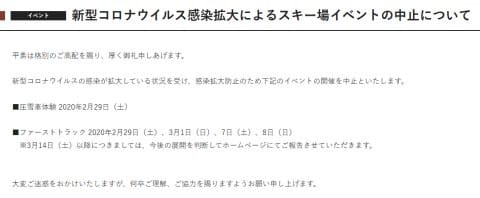
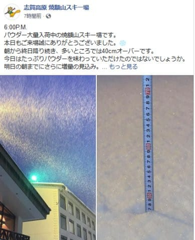
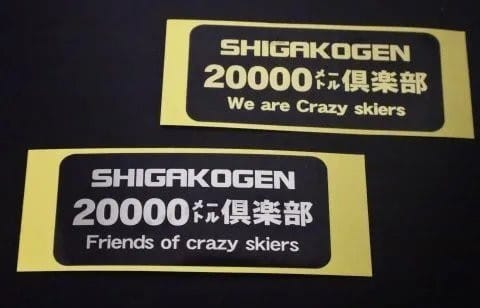
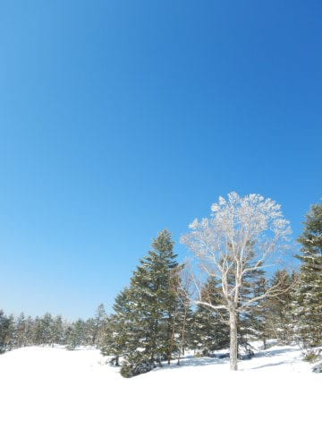
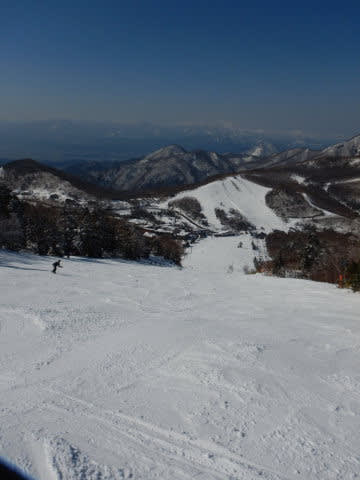
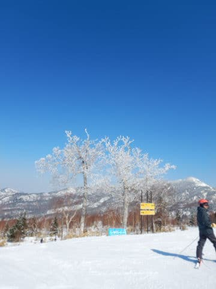
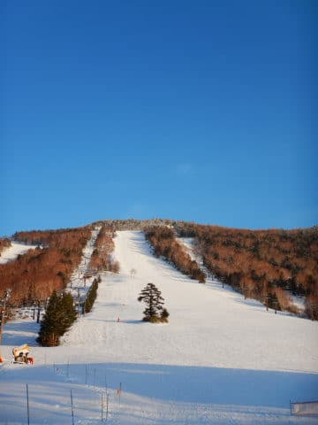
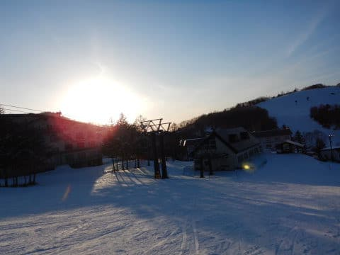

# まだ続く20000mチャレンジ…そして新たな記録が誕生したよ

📅 投稿日時: 2020-02-28 01:25:54

🏷️ カテゴリ: [スキー雑談](c1f9d2cb7478308da16419928ea3945e9.md)

どうやら，コロナウイルスの影響で，

いろんなスキー場での大会やらイベントが

中止になり．

ついに今年の[全日本技術選までが中止](https://www.happo-one.jp/news/16031/)

になったようですが（涙）

昨日はいいニュースがあった焼額も，やむを得ず

いくつかのイベントを中止するようですね…（泣）

（[焼額山スキー場公式ホームページ](https://www.princehotels.co.jp/ski/shiga/informations/discontinued/)より）

…って，なんで圧雪車体験とファーストトラック？？

どっちもそんなに大勢が密集するイベントじゃない気が…

とりあえず，「イベント中止」の要請が

各方面に悲劇を起こしているようです（涙）

せめてもの心の支えは．

　の日は昼間も気温が-7℃程度までしか

　上がらない激冷えデーで，終日雪が

　降り積もりそう．

　営業時間中に10～20cmは積もりそう．

との予想を上回る積雪があったようで．

（[焼額山Facebook](https://ja-jp.facebook.com/yakebitaiyama/posts/2734040433357952?__xts__[0]=68.ARDv6rMeRktpcNtNMvmecpxjMqcZKU0XMJ-6aNsscSM5ePLth_iA595u9WEg5QqQDs3CBx9_kf973tI6QAyEHeYmjfMXpUZoD4FQh5XcaNvJVoMrfxzY2SRxtAR-lh_jDiFR9eQcgfBK3Ld5E0gXwVQHz4zs-PDLpVXJ5cSIrqW0S0iYTKr1fC0-4UE-p4q_VFSl2QMip7gvOuRgu9YRC434FoziTUBXLNYYowt26W5Sj-X-pNNLmuJV0bfiqxOuXoc3BSjd8SfHHcaj3X65UQSXOuc51GGqHfai_L7_-ciYeri_4nReIvsaFjrlCVbCyofW2lZRCp9xJjr9stL8ZodtQg&__tn__=-R)より）

さらに，28日の朝まで降り続けるという

予想通り，

今もかなりの勢いで雪が降り続けている

ようなので．

この週末に向けて，いい感じの冷え冷え雪が

たっぷり積もりそう…

というあたりが，このいろいろ厳しい状況の中の，

明るいニュースでしょうか…

ってなことで．

本日の本題へ．

20000mクラブ…

それは，一日の滑走標高差20000mを超えたことがある，

ちょっとおかしい人たち突き抜けた記録を持つ人たちが集う，

いろんな意味で危ない素晴らしい団体．

20000mを超えていなくても，準会員として

シルバーステッカーをもつ人は多いけど．

ゴールドステッカーは，

普通の人ならやろうとは思わない普通の人間では達成できない，

一日滑走標高差20000mを超えた人のみが

受け取ることのできる，

自分は終わった人ですということを示す素晴らしい記録を

達成した人であることを示す証．

もともと，

[滑走標高差を正確に測れ，他人もそれを確認できるSkiline](eb7000864a88040c158aab82451750b83.md)があったころ．

そのSkilineの記録を見て．

「なんだ！？？一日20000m超えてる人が何人かいるっ！！」

という驚きから，[勝手に私が「20000mクラブな方々」
と呼び始めたのがきっかけ](ea8a953c4b60b5eec845669ca5ba7bf0f.md)で始まり，

知らぬ間に広がった，この20000mクラブですが．

Skilineがなくなった今でも，20000mチャレンジをする方が

まだぼちぼちいるようで…

なんでそんなことにチャレンジするのか謎未だにチャレンジ精神にあふれる人が

多数いるようです…（驚き）

で．

この3連休最終日．

焼額常連メンバーで，20000mチャレンジをしようという

奇特な方チャレンジ意欲旺盛な方がいたわけで．

まぁ，[この方の技術レベル](https://www.youtube.com/watch?v=f1ZlSXdC8Uc&t=69s)なら，問題なく

20000mは突破しちゃうだろうな…

と，思っていたところ．

その日は，すっきり晴天，雪質最高，

午後になっても比較的締まった雪で，

3連休最終日ということもあり，

午後はガラガラ，

雪の荒れもかなり少な目…

という，シーズンでもそうそうない，

絶好の20000mチャレンジ日和！！←そんなものがあるのか！？？

そのせいもあって，安定した危なげのない

ハイスピード大回りで正面バーンを落下し続け．

応援に行った私が，余裕でぶっちぎられて，

ひたすら引き離されていくという…

これは，速い．

正直，かなり速い．

私のトップスピードで追いかけても，

全く追いつけず，じりじり離されていく…（涙）

そして，安定感があり，危なさはない．

だもんで．

昼頃には…

「このペースなら，営業終了の午後4:40よりかなり前…

4時前くらいには20000m突破しちゃうんじゃない？？」

という，余裕のよっちゃん（死語の世界）で

ゴールド達成しそうな感じになってきました…

…

…で．

普通の人なら，ここでペースを落とし，

体力温存を図りつつ，セーフティーに20000m

キープに走るところ．

しかし．

この方は違う．

この方の精神構造は，我々の想像の上を行っている．

午後になって，バーンが荒れてきても．

ペースを落とす気配，全くなし

…そうか．

この方は，今日滑り終わったあと，5時間近く

運転して帰らなきゃいけないから，

いつもは最終日は昼頃に切り上げて帰る人だし．

今日は早めに20000m達成して，営業終了前に

切り上げようということだな…

と，思っていたら．

なんと．15時20分過ぎに．

「64本達成～！20000m突破！」

という連絡が！

…そうです．

一の瀬ファミリーのクワッドリフト．

64本滑れば，20000m突破です．

ゴールド達成，おめでとう！

しかし，早い…

普通なら営業終了ぎりぎり達成が

いいところなのに，営業時間がまだ

1時間半近く残ってる午後3時半前に達成とは…！

20000m達成の最早記録に近いのでは？？

…んじゃ，これから帰りの運転頑張って…！

と，思ったところ．

「まだ行く．70本目指します！」

…え？？

やるの？？

まだ？？

もうゴールドステッカーの権利は得てるし，

これ以上やっても得るものはバカの称号くらいだよ

何もないよ…

…

そして．午後4時ごろ

「70本行きました～！」

…すごい．すごいバカだ根性だ…

とりあえず，70本行ったし．

もうさすがに帰るよね…？？

「行けるところまで行きます！！」

…

……

…馬鹿だ…完全に馬鹿だ素晴らしい…大変素晴らしい…

…これはもう，とち狂ってしまった見上げた根性としか言いようがない…

もう，停めません．

ぜひ，行けることろまで行ってみてください…！

ってなことで．16:40の終了時まで，

ひたすら止まらず休まず，トイレも1度しか行かず，

私の追いつけないトップスピードで

滑り続けるという，

一体何が楽しいのかという一日すごいチャレンジングな一日を

やり遂げたのでした…！！！

で．

その記録は…

なんと，一の瀬ファミリーの

クワッドリフト乗車本数，76本！！

標高差，約23,900m！！

（スマホアプリの標高差は不正確なので，

　滑走本数をカウント，標高差を計算してます）

Skilineが始まる前は，非公式ながらKonSukeさんが

80本の記録を持っていますが．

Skilineが始まって以降，Skilineやスマホアプリなどで，

ちゃんと本数を記録して滑るようになってからの，

昼間一日滑走標高差の，最高記録樹立です！！

いやーーー．

これはもう，バカとしか言いようがない素晴らしい記録としか

言いようがないですね！

とりあえず．

普通の人は，この記録にチャレンジしようとしないほうが

いいです．

人に危険を与えずにこの記録を樹立するには，

かなりの技術レベルが必要になりますので…

良い子はマネしようと思わないでくださいね！！

（誰もマネしようと思わないだろうけど…

皆さん，無理せず安全にっ！！）

ということで．

しんちゃん，新記録達成＆ゴールド取得

おめでとうございました！

（めでたいのかどうか，微妙な気がするけど）

## 💬 コメント一覧

### 💬 コメント by (yumi)
**タイトル**: Unknown
**投稿日**: 2020-02-28 06:30:14

Ｓさぁ～ん😁🎵😱

久々に 笑わして もらいましたぁ～⤴️🤣🤣

しんちゃんさん✌️おめでとうございます🎉🎉🎉

売り切れ伝説 やら なにやらで、色々 ネタの宝庫 ですね☺️

昨日は 久々の 超〰️〰️〰️ぱぅぱぅ でしたよ☺️

少し、底は有りましたが 問題ない程度🎵

今日もさらに ぱぅの予感🎵

明日は最高😃⤴️⤴️ですよ🎵

○○様、浮気はもったいないですよ✨

是非、志賀高原に。。。😁☃️✌️

### 💬 コメント by (ノーザンレインボー)
**タイトル**: Unknown
**投稿日**: 2020-02-28 16:40:22

sさん

どうも私はこのブログの魔術にかかりやすいタイプのようです。

水曜日の天気予報の゛28日はシーズン最高級の一日゛を読んだ途端、体が意思に反して有給届を書き始め、今朝はホームの白馬方面に向かう長野ICをうっかり通り過ぎ、なぜか1ゴン駐車場に8時に居ました。そして山頂で-13℃と神のお告げが正しいことを確認し、そこからは楽しすぎてあっという間に16時です。

今の段階で雪は固まらず、溶けずの粉状態をキープしているので、明日の朝一の圧雪はプレミアムなものになると思われます。

残念ながら私は白馬へと後ろ髪を引かれる思いで向かいますが、明日からの2日間楽しんで下さい。

的確な天気予報に感謝!!

### 💬 コメント by (レインボー)
**タイトル**: Unknown
**投稿日**: 2020-02-28 18:48:19

志賀高原情報

今日金曜日はまさにベスト。

朝一のオリンピックはさらさら新雪30cmで、抵抗感ゼロ。まさに夢の軽さ。

次は1ゴン下の非圧雪。滑り跡が二本のみ。快適幸せ以外に言葉が見つからない。

ついでスーパージャイアント。40cmパフパフ。幸せ。

次はミドル。

どこもずっと続けたいけど、他も滑りたいので嬉しい悲鳴。

期待したダイヤモンドは圧雪され過ぎで、がっかり。

パーフェクタ、ファミリーも、老人でも気持ちよく滑れる快適バーン。

タンネもいいけど、他が良すぎてこの日はランク低。

寺子屋、東館、ブナ、西館、高天、天狗、

などなど楽しんで、地元のヤケビで遊び、2時に2ゴンに帰着したレインボーでした。

底付きなんかは気にならない深さでしたよ。

これが圧雪された明日は、快適シマシマ。明日も、いただきまーす。

### 💬 コメント by (Northfox)
**タイトル**: Unknown
**投稿日**: 2020-02-28 21:09:12

志賀高原のゲレンデコンディションは最高のようですね。

私は来週に志賀高原の予定なので、それまでこのコンディションが続くことを願うばかりです。

しかしコロナウィルスの影響も気になります。まさかスキー場の営業自粛なんてことにならないよね？？と心配になってきました。

### 💬 コメント by (しんちゃん)
**タイトル**: 仲間入り
**投稿日**: 2020-02-28 23:19:50

いやぁ～、終わった人たちの仲間入りをしてしまいました。

あの日はほんとに天気・雪質・来客数等すべて恵まれた環境だったと思います。

また、先週達成した方、先々週達成した方の他、様々な方より、傾かない・ターンしない・ペースを守るなどなどアドバイスをもらったり、ペースメーカーになってもらったりしたおかげで記録達成できたと思います。応援してくださった皆様、ありがとうございました。

チャレンジ中に、（こんなことにチャレンジして）君もバッカだね～(笑)と冷やかされました。家路への帰路の途中その言葉がよみがえり、ばかな（普通の人が真似すると危険な）チャレンジだったなぁと一人苦笑いしていました。よいこの皆さんはマネしないでくださいね(笑)

今シーズンはマゼンダのウエアに変わっていますが、20000ｍのシルバーステッカーを張ってみたいなと思った方はお声がけくださいね～!(^^)!

ネタの宝庫（？）、普段はちゃんとターンして滑っている一般ゲレンデスキーヤーの　しんちゃんより

### 💬 コメント by (Skier_S)
**タイトル**: 今週末も志賀高原！
**投稿日**: 2020-02-28 23:52:56

＞yumiさま

…やっぱり，今日の志賀高原は予想通り良かったのですね…

うらやましい…

明日朝イチ，楽しんできます～！！

＞ノーザンレインボーさま

…そうですか．

金曜，滑ってきたのですか…

この予想をした本人は滑りに行けなかったのに，

滑りに行ったのですか…

大当たりの一日だったようで，うらやましいです．

明日は私が楽しんできます！！

＞レインボーさま

う，う，う，うらやましい…っ！！！

明日まで新雪を取っておいてほしかった．

とりあえず，明日朝は最高圧雪のはず．

曇りでバーンはすっきり見えなさそうなのが残念だけど，

最高雪質を楽しめるはず！！！

＞Northfoxさま

志賀高原の現在は，最高のようですね…（伝聞系）

今の天気図だと，まだ土日そのものの天気は分かりませんが，

週末前に冷えて雪が降りそうなので，来週もコンディションは悪くなさそうですよ！

＞ネタの宝庫，しんちゃんさま

20000mチャレンジ，お疲れ様でした．

そして新記録おめでとうございます．

朝礼メンバーのチャレンジは，いっぱい応援に

来てくれるのでやりがいがありそうですね（笑）．

しかし，こんなチャレンジをする人には，やはり

「バカだね～」と言わずにはいられません…

