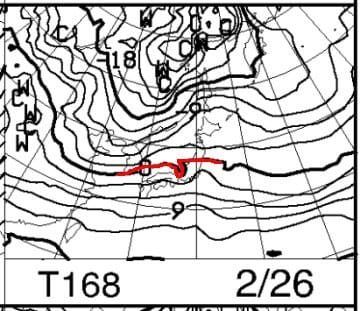
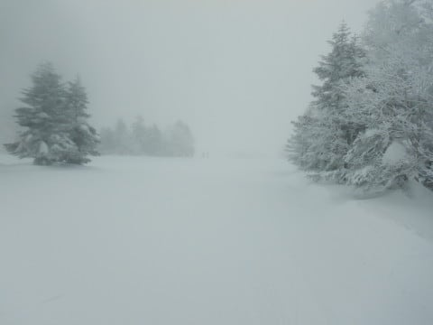
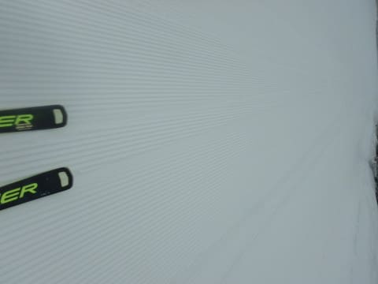
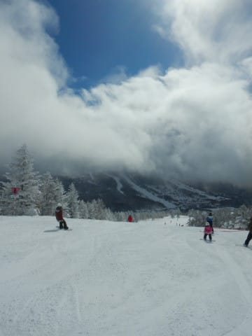
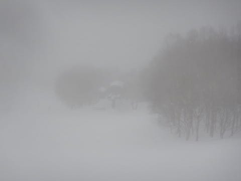
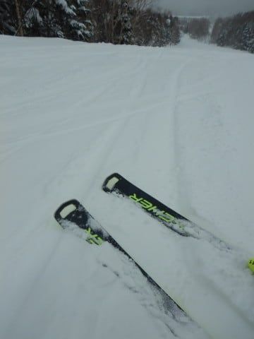
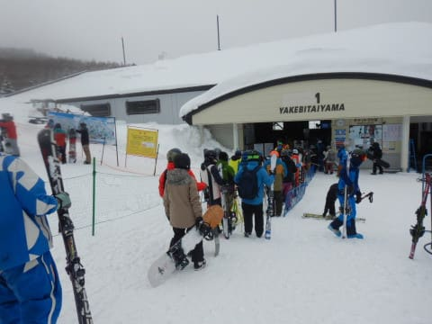
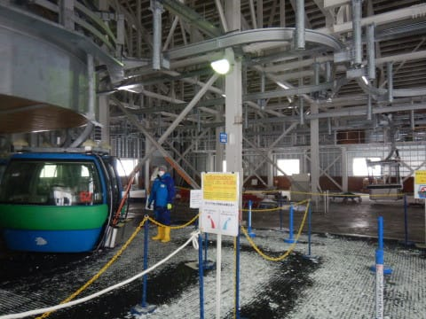
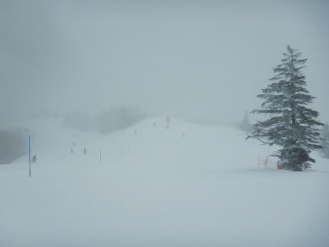

# 2022/2/20(日)の志賀高原スキー場，速報レポート！…朝の積雪10cm，午前はあまり降らず．午後は雪がかなり強く降る天気

📅 投稿日時: 2022-02-21 01:52:58

🏷️ カテゴリ: [2022スキー滑走日記](cc9cb73e4320f6a97af6fccc37587a61a.md)

えー．

本日も志賀高原で滑ってきたわけですが．

今日の夕方からかなり強い雪が

降り始め，今もそこそこ降っている

ようなので…

明日の朝は結構積もってると思います！

明日21日の志賀は，終日雪降りで

朝はパウダー！

明後日22日(火)も朝は10cmほど

積雪があり，曇ったり雪が降ったり，

時折晴れたり…という天気．

日本海側の海沿いはかなり降りそう．

23日(水)も，日本海側はすごい積もり

そうだけど…志賀は10~20cmくらいかな？

昼間も雪が降る天気になりそう…

って感じかな．

その後は，しばらく積雪は無さそうなんだけど…

うむむむ？？

なんだ！？？この26日の850hpa気温図は！？

…赤い0℃線，志賀高原より北に上がって

ますよ！？？

この26日は降れば液体の危険が…（恐怖）

…まぁ，今のところ晴れそうだけど．

昼間はちょっと雪が緩むかも（涙）

3月は高温になりそうという予想が

リアリティを帯びてきた感じ…（ガクブル）

とりあえず．

3月のスキー場が冷えてくれるよう，

今から必死に祈り，踊りましょう…

ってなことで，本題へ．

今日も帰宅したのが日付変更線突破後

なので，今日も速報モードにて，

本日の志賀高原レポートです！

えー．

まず．

予想通りの雪降りで始まった本日朝ですが．

　朝は重めの積雪が10cmほど．

という予想はおおむね当たりで，

ちょっと重めの新雪が10cm弱積もった，

雪降りの朝．

ちょっと視界が悪くて，スピードを出すと

怖かったのが残念…（涙）

でも，朝はそんなに強い雪降りじゃ

なかったので，朝の圧雪バーンの上には

ほとんど新雪が乗っておらず．

重い雪が踏みしめられた，エッジが

食い込むいい感じの圧雪バーン！

モサモサバーンじゃなくて良かった！！

…けど．

ということは．

　あさイチバーンはモサモサで

　ちょっと快感度が低いかも．

というところは外れたようだな…（涙）

まぁ，いい方に外れたから良し！

許す！！←外れたのになぜ偉そうにしてるんだ？

そして，午前中はそれほど雪の降りが

強くない…というより，時折一瞬

晴れ間が除くほどの穏やかな天気！！

ずっと晴れていたわけじゃないし，

時折ガスが出ることもあったけど．

雪もほとんど降らない曇り空で．

風もそんなになく．

奥志賀ゴンドラも，焼額第1，第2ゴンドラも，

全て通常営業．

…ということは．

　この日は風も強く，奥志賀

　ゴンドラは止まる危険性も．

　終日雪が降ったりやんだり．

　時折強く吹き付ける．

というところも外したか…（涙）

と，思っていたら．

昼ごろから天気が悪化し始め．

午後になると，時折強く吹き付ける

かなり気合が入った本降りの雪に

なってきました！！

そして，リフト営業終了の頃に

なると…

圧雪コースの上にも新雪がうっすら

積もるほどの積雪になりました～！

ふははは！

午前は予想外したかと思ったけど．

午後は大体予想が当たったのだ！！

予想外してないよ！！←いや，ちゃんと午前は雪が弱くて

午後から雪が強くなる…と書いてないと，当たりと言えないでしょ

ゴンドラ待ちは，午前10時~11時の間に

5分待ち程度が1-2回あったけど，

それ以外はそれほど混むこともなく．

特に午後になると，ガラガラ！

夕方は時折視界が悪くなるほど

降ったけど．

バーンはガラガラだったので，

なんとかくじけることなく滑り

続けられたのでした…

ってなことで．

明日もかなり寒いパウダーデーに

なりそうですが．

これが今シーズンラストのパウダーって

わけじゃ無いよね…

今シーズンでまだあと1-2回…

いや．2-3回…

いや，5-6回は激冷えパウダー

滑れるよね！？？

…と，願わずにはいられない，

Skier_Sだったのでした…

## 💬 コメント一覧

### 💬 コメント by (新米パパ)
**タイトル**: Unknown
**投稿日**: 2022-02-21 10:06:11

あー、志賀高原行きたい。

今週は子供の予定で日帰りでしたので、湯の丸でした。

スピード系のボーダーが朝は多く斜面にエグい切れ込みが多数、、怖かったなー。

話かわりますが、湯の丸ふもとの丸山って蕎麦屋にお邪魔しましたが絶品ですね。

長野県食べログ蕎麦ランキング上位5位より全然美味かった。

### 💬 コメント by (ikkun)
**タイトル**: Unknown
**投稿日**: 2022-02-21 13:33:29

降りすぎ困りますけどね……手が回らない除雪 お願いしたら大枚八枚(泣)ショックでまた降り積もる雪に無気力ですちなみにアルバイト先も「お客様居ないから休んで」になりましたコロナに２ヶ月続く雪(泣)もはや楽しめる範疇逸脱です

### 💬 コメント by (レインボー74)
**タイトル**: Unknown
**投稿日**: 2022-02-21 18:34:38

月曜日の志賀高原情報

凄い暴風雪。ホワイトアウトして運転がめっちゃ怖い。だめかと思ったけど、イチゴン、ニゴンがしっかり動いてくれました。感謝です。

朝圧雪なのに、パノラマは凄い雪。白樺はストップがヤバイのでカラマツヘ。

好きなGSサイドは深くて経験上止まるはずなので、GSへ。これも深い。

オリンピックは夕方圧雪かと思うけど、なんとふかふか雪が70cm。最後の緩斜面で停まったら、そのあとの漕ぐのが大変。うまい人が何人もホイホイ網にかかっていました。ほほえましい。

湯田中の家は庭が広いので、雪掻きのために二時間でスキーは終了。

雪掻きに二時間半を要して、もうヘロヘロです。

朝の上林-7℃　蓮池-12℃　山頂-15℃。サム～い吹雪の一日でした。あしたも？

### 💬 コメント by (副院長)
**タイトル**: Unknown
**投稿日**: 2022-02-21 21:59:44

今日一日パワフルな雪。奥志賀は、運転見合わせ。オリンピックは、レインボーさんの報告どおり、70センチ、太腿、腰の深さで、勘弁してください状態でした。今も降り続いています。膝ぐらいで結構なので、来週に、残してほしいのですが　来週からは温度上がりそうですね。

### 💬 コメント by (Skier_S)
**タイトル**: 水曜までかなり雪が降り続けるよ！
**投稿日**: 2022-02-22 00:50:16

＞新米パパさま

あら．日帰り湯の丸，楽しめましたか？

丸山って蕎麦屋さん，知らなかったです．

今個チャレンジしてみます！

＞ikkunさま

スキー場に降るのはいいんですが，それ以外に降りすぎるのは

困ったものですよね…

除雪大変ですよね．

＞レインボー74さま

70cmはすごいですね！！

でも，雪が重かったようで残念…

雪搔きお疲れ様でした！！

＞副院長さま

すごい新雪だったみたいですね…！

それも終日エンドレスパウダー状態だったみたいで，

かなり多くの人がふるい落とされたのじゃないでしょうか…

明日も降ります．明後日も…

確かに来週まで取っておいてほしいですよね（笑）．

