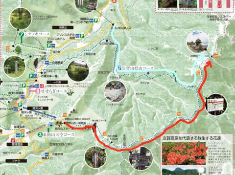
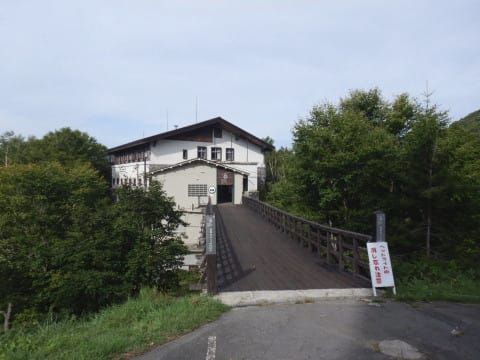
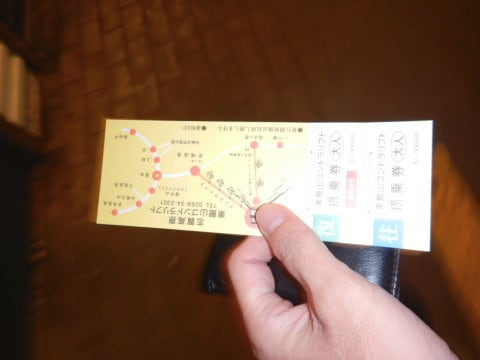
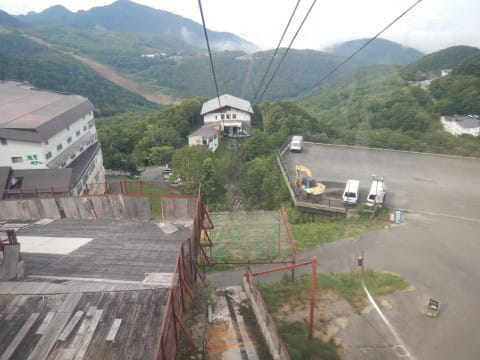
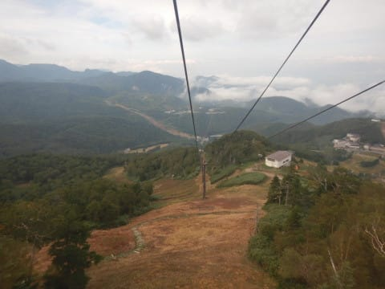
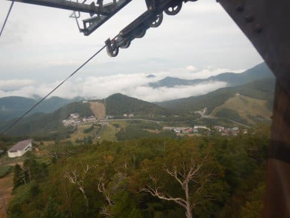
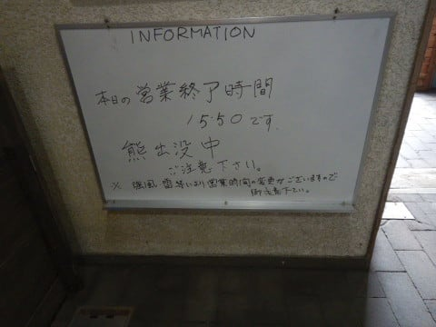
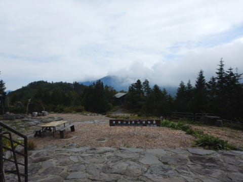

# 志賀高原の岩菅山に登ってみた…今度は寺子屋経由コース．妙義山の翌日によく行ったなぁ…

📅 投稿日時: 2020-10-13 01:38:08

🏷️ カテゴリ: [登山・旅行](c1d637a11a25b457ac978d197adbdafc5.md)

ってなわけで．

[この週末も志賀高原に行ってきた](e84ef4188618c33973535735e286d9006.md)…という

レポートを昨日書いたばかりというのに．

9月の4連休にも志賀高原に行ってたんですね～…

スキーシーズンじゃないのに，中2週間半で

志賀高原へ通っているって．

どれだけ志賀高原が好きなんだろう…

とりあえず．

前回行ったときに，

[東館ゴンドラがらいちょうバレーの中古搬器を
Getしていた](e51732c85e0d7d0c91bb3485dc382c50e.md)

というレポートを書いたので，覚えている方も

多いかと．

で．

その9月の4連休．

何しに志賀高原に行っていたかというと．

2度目の岩菅山登山に行ってました～！

…

…[前日，妙義山に登って](eeb40cfc3ed33eb058078ae37812468de.md)，全身筋肉痛だったのに．

まぁ，よくも翌日また登山に行ったものだ…←自分であきれててどうする

でも，[前回の岩菅登山](ef86722c684780ea254ff9ce1e2bbd11b.md)．

下の地図の水色の線で示すルートで，

岩菅山登山口からまっすぐ往復する

「岩菅山登山コース」を歩きましたが．

今度選んだのは，赤色の線の東館ゴンドラから，

寺子屋山～岩菅の，尾根沿いを歩くルート．

寺子屋山頂も見てみたかったし．

一度，このルートを歩いてみたかったん

ですよね～…

（[志賀高原観光協会ホームページ　トレッキングマップ](https://www.shigakogen.gr.jp/themes/shiga/green/document/trekking_map.pdf)より）

水色の登山ルートは，標高1600mくらいから

沢沿いを登っていくので．最初のうちは景色も

良くなく，さらに標高差700m程度のルートで

体力的にもきついのですが．

赤色のルートなら，東館ゴンドラで登れば，

標高2000mからスタートで，山頂の2300mまで

そんなに標高差を登らなくて済む，

体力的に優しそうなコースだし．

…さらに尾根沿いだから，景色もいいはずだし．

妙義山を登った翌日の，リハビリお気楽

山歩きにはもってこいに違いない…

と，思ってこのルートを選んだのでした…

（後でこの予想は一部裏切られますが（涙））

ってなことで．

やってきました東館ゴンドラ乗り場．

…スキーシーズン以外で，東館ゴンドラに

乗るのは初めてですね…

Webの営業案内を見ると，9時から営業と

書いてあったのですが．

どうやら4連休は8時半から営業だったらしく．

ほぼ営業開始と同時にゴンドラ搭乗！

見慣れた志賀高原のゲレンデですが．

雪のない時期に見るのは新鮮ですね…

高天ヶ原と西舘のトリプル側，

そしてダイヤモンドが見えてます．

山頂に到着すると…

え？

クマ出没中？？

この時期になって，まだ熊が山頂に近い

ところにいるの…？

と，ちょっとビビりながら．

ゴンドラ山頂駅の外に出ますが…

紅葉時期には早く，花の盛りが終わった

この時期．

ガラガラで誰もいませんね…

では，岩菅へ向かって，Go!

（続く）

## 💬 コメント一覧

### 💬 コメント by (アリス)
**タイトル**: 志賀高原天空コース
**投稿日**: 2020-10-13 08:45:14

Skier_S様

妙義山制覇して岩菅山への移動体力がありますね。

さすが2万ｍ制覇者だと驚きです。

以前は、天空コースで蓮池からロープウェーでスタートするプランがありましたよね。

春から夏は、東館山山頂の高山植物が綺麗だった記憶があります。

### 💬 コメント by (Skier_S)
**タイトル**: ＞アリスさま
**投稿日**: 2020-10-14 01:10:59

妙義山→岩菅山は，体力的にきつかったです…

でも，20000mな方々はたぶん夏もこんな感じでみんな

ついつい体をいじめてしまってるんじゃないでしょうか（笑）．

以前は蓮池ロープウェーが天空コースだったんですか…

今は東館ゴンドラで登って，高天リフトを降りて回るコースが

天空コースって言ってますね…

東館山頂，高山植物園がきれいですが．

私が行ったときは，花はもうほとんど終わってました（涙）

