# 5月28日，かぐらファイナル速報モード…朝から雨（涙）．夕方にちょっと晴れたけど，終日ガスのファイナルデー

📅 投稿日時: 2017-05-29 01:50:06

ということで．

本日．

かぐらへ行ってきたわけですが…

確か．

誰かの天気予想で．

　「日曜は朝から晴れ！」

などという，面白い予想をしていたようなんですが…

…これが，晴れか？？

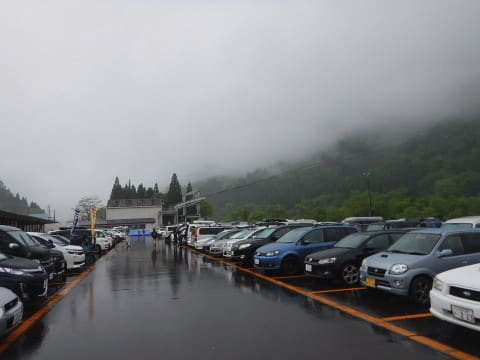

これのどこが，朝から晴れなんだ？？？

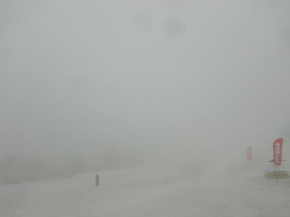

という感じで．

朝から雨降りのスタート（涙）．

誰だ～！適当な予想した奴はっ！！

…いや．

私じゃないですよ．私じゃ．

気象庁です！！

気象庁の数値予想天気図が違ってたのが

悪いんですっ！！←これを人は責任転嫁という

…いや．

一応言い訳をしておけば．

天気図がどんどん変わっていったので．

金曜夜の記事で

「日曜のかぐらも，朝のリフト営業開始前，わずかに雨が

ぱらつくかもしれないけど」

そして，当日朝の記事で

「雲が多そう」

と修正したんですが…

ええ．

修正したんです…←一生懸命言い訳

…ええ．そうですよ．

もう言い訳はしません．

しませんよ．

どうせ，天気予想外しましたよ～！！！←今度は開き直りか

ということで．

予想外の雨で始まった，

本日のかぐらファイナルデーですが．

朝8時のロープウェーに乗って，

かぐらの山頂に出ると…

もう，ガスで何にも見えません（涙）．

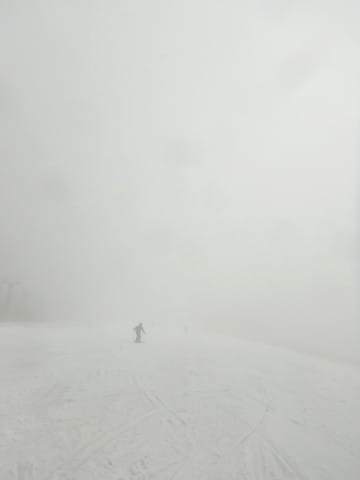

かぐらゲレンデ全面，全て真っ白．

何も見えません…（泣）

雨自体は，昼前ごろにほぼやんだのですが．

ゲレンデは相変わらずガスの中…

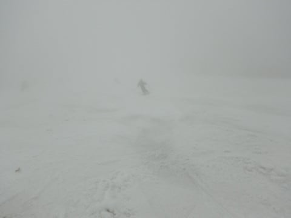

でも．

天気が悪かったおかげで．

リフトの待ち時間は最大この程度で．

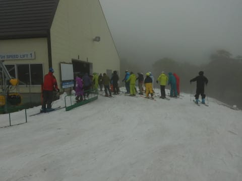

いつもの狂乱混雑にならなかったので．

雨が降って良かったのだ！

うん．良かったのだっ！！！←自分を何とかだまそうとしている

しかし．

まだメインバーンがコース幅ほぼいっぱい

滑れるほど雪があるとはいえ．

昼を過ぎると…

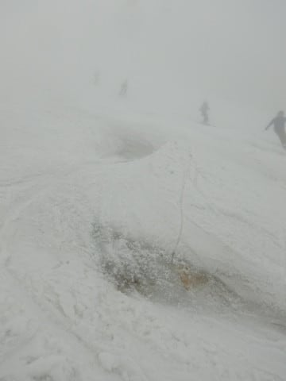

うううーーん．

ちょいと残念なことに．

コブ溝に土が出始めてきました…

そして．

午後1時を過ぎると…

をを！

時々，一瞬ガスが上がる瞬間が！

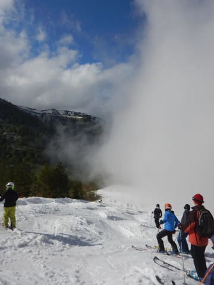

…残念ながらごく一瞬で，すぐまた

ガスが出てきちゃいますが…

でも，今日初めてゲレンデがすっきり見えたよ！

…って，まだコース途中から下はガスに覆われてるけど…

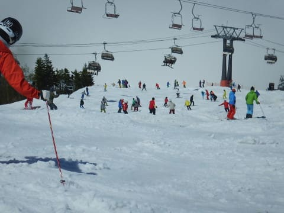

しかし．

ガスが上がって初めて気づいたけど．

すごい数の人がいたんだなぁ…

そして．

コース幅いっぱいに雪は着いてるけど，

結構土が出始めてきてますね…（残念）

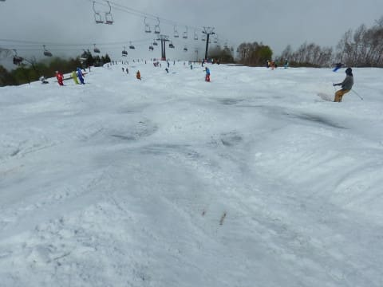

…って感じで．

ガスが出たり，わずかに切れたりする

天気が続きましたが．

リフト営業終了間近の午後3時過ぎから．

ようやくコース全面が見えるようになって

きました…（遅いよ…（涙））

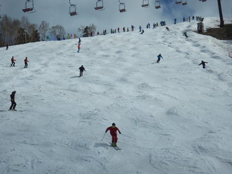

しかし．

一部に土が出始めてきたものの．

ファイナルデーの営業終了時に．

こんなに雪があるとは…っ！

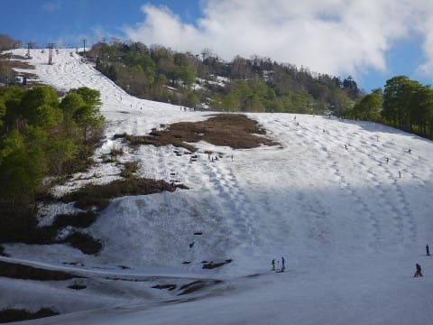

というわけで．

今日の天気は悪かったけど．

雪の量には恵まれていた今シーズン．

みつまたエリアも滑って降りれたし．

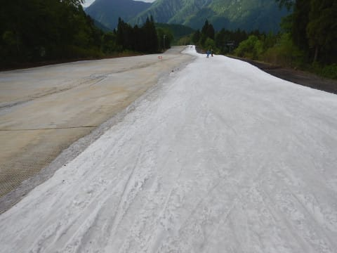

まぁ，充実したファイナルデーだったかな～．

ということで．

詳細レポートは，また明日！←いつもながら，本日の速報モードで，もう十分詳しいのでは…？？？
