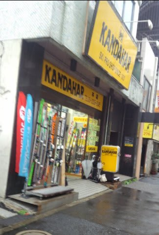

# 第5回物欲選手権！その１

📅 投稿日時: 2015-11-11 02:57:23

🏷️ カテゴリ: [スキー雑談](c1f9d2cb7478308da16419928ea3945e9.md)

ってことで．

知っている人は知っている．

物欲選手権が，今シーズンも開催されたようです…

ってことで，

[第1回](ebea1e9e359cc665d9cc2929e08045177.md)，[第2回](e4eb8b62d644e240a6080cac72ad69416.md)，[第3回](efb7a35a863f49c11192814a01ff642c2.md)に続き．

今シーズンも，例年恒例の物欲選手権，スタート！

---

アナウンサー　「えー．本日は．

　第5回 スキーヤーの物欲を刺激する街神田に来て，

　物欲にまみれたスキーヤーが買い物をせずに

　我慢できるか選手権

　をお送りします．

　本日も，解説は板尾買蔵さんにお越しいただきました」

解説　「…」

アナウンサー　「えー．板尾さん？？」

解説　「…まさか，本当にまだ続くとは…このシリーズ…」

アナウンサー　「意外な人気のため，今回をもって第5回目の

　開催となりました，この選手権．

　今回も，参加選手はSkier_S選手です」

解説　「意外な人気って…」

アナウンサー　「スキーヤーの間で，新しいアイテムを衝動買い

　してしまったことを，『物欲選手権に負けた』とか，

　『板尾買蔵さんが出てきた』とか言う人がいるとか，いないとか…」

解説　「なんですか？人の名前を勝手に物欲の代名詞みたいに…

　…で，この大会，たしか前回が第3回だったから，今回は

　第4回なのでは？」

アナウンサー「[第4回は，実は別会場にて実施された](http://blog.goo.ne.jp/suma_shikao/e/e83fb1ff4463953372b06b410938850c)ようで，

　今回が第5回となります」

解説　「前回はともかく，今回の参加選手は，またSkier_S選手な

　わけですね…」

アナウンサー　「さて．スキーヤーの物欲を刺激してやまない

　この街にやってきて，果たしてSkier_S選手は，無事

　物欲を抑えることができるのでしょうか！？」

解説　「…これまで何度も言ってますが，この街に来てる時点で，

　すでに何かの勝負に負けてるんですけど．Skier_S選手の場合…」

アナウンサー　「今シーズンは，Skier_S選手，新しい板を買うことを

　すでに決めているようです．」

解説　「まぁ，彼のショート用のATOMIC Bluester SXは，もう2シーズン

　使っていて寿命が来てますからね～．

　とはいえ，もう買うことが決まってたら『買い物をせずに

　我慢できるか選手権』にならないんじゃないですか？」

アナウンサー　「ただ，板を買うのは安くなる12月以降と決めている

　ようで，今回は板が売り切れになったりしなさそうか，

　様子を見に来ただけだ，ということのようですが…」

解説　「…また，無理なことを…

　無理です．Skier_S選手に，我慢なんて無理です．

　『様子を見に来ただけ』なんて言い訳をして，

　この街に来た時点で負けです．すでに負けてますから」

アナウンサー　「さて．誰もがそう思っているでしょう

　この選手権．Skier_S選手は，まず，フソウスポーツに

　寄ったようです」

解説　「あぁ．どうやら，買う板をはっきり決めてるようですね…．

　[ATOMIC Bluester SXのVARビンディング](e3a3e19a9d6086e63ed1782a28bd00e48.md)モデルの

　価格を，お店に入るなり店員さんに聞きましたね～」

アナウンサー　「おっと．値段が出たようです．

　あー．やっぱり，まだ値段が高いようで．

　値段を聞いた途端，あっさりお店を後にしました」

解説　「いや，これは彼のいつものパターンですから．

　まず，複数のお店の在庫と価格を確認するのが，

　彼のパターンです」

アナウンサー　「そのようですね…そのあと，5件ほどの店で

　同じことを繰り返していますね～．

　板の価格を聞いては，次々といろんなお店に

　移動していっています」

解説「この時期，まぁどこに行ってもまだお値段は

　ほぼ同じはずです．12月，せめて11月後半にならないと，

　値段は落ちないはずですから…」

アナウンサー　「どうやら，まだ価格が落ちていないことを

　確認して，そして，まだ在庫がどのお店にも複数あることが

　わかって，Skier_S選手，満足しているようです．

　これは，まさか本当に，在庫調査だけで今回は終わってしまうのか？

　ついに，歴史始まって以来のSkier_S選手の勝利と

　なってしまうのでしょうかっ！？」

解説　「…Skier_S選手に限って，絶対にそれは

　ありえませんから」

アナウンサー　「そして…いつものお店にやってきましたね」

解説　「…いつものパターンですね」

（これから意外な展開（？）に続く）

## 💬 コメント一覧

### 💬 コメント by (れお)
**タイトル**: これは楽しみ
**投稿日**: 2015-11-11 09:31:08

この選手権好きなんで、続きを楽しみにしてます～!!

もしかして、今回はＳさん勝利!?

### 💬 コメント by (マルハバ)
**タイトル**: 待ってました～！！
**投稿日**: 2015-11-11 12:08:35

Ｓさんの勝利はありえないと思います（爆）

＞意外な展開

とのことで・・・

ちょっとイレギュラーな負け方？（笑）

をするのでは？

「一点モノ」とか・・・

### 💬 コメント by (はなげ親分)
**タイトル**: 意外な展開・・・？
**投稿日**: 2015-11-12 00:26:46

う～む！

これは何を買ったか当てるクイズですね。

A：太板

### 💬 コメント by (Skier_S)
**タイトル**: やっぱり人気なんですね…物欲選手権．
**投稿日**: 2015-11-12 01:19:28

＞れおさま

はいはい～

この先の展開を楽しみにしていてください！

勝利かどうかは…今日これからアップする

記事を見ればお分かりかと．

＞マルハバさま

さて．Skier_S選手は勝利できるのか？？

これからの展開をお楽しみに…

＃ホントに予想外の展開ですから

＞はなげ親分さま

いや…

クイズじゃないですからっ！！

