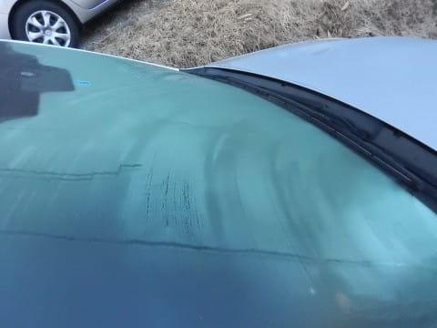
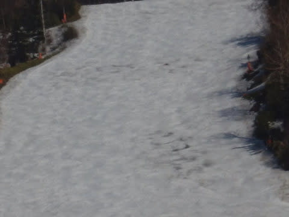

# 4月22日（日）の志賀高原，詳細レポート…雪がどのくらい減ったのか？写真たっぷりでレポート

📅 投稿日時: 2018-04-24 06:47:28

🏷️ カテゴリ: [2018スキー滑走日記](c11b88dc181f34079ab41db74a3587646.md)

うむ．

やはり．

これからGWまでの一週間も，

平年より高めの気温の日が続き．

…そして．

志賀高原は，24日の朝から25日の夜まで．

2日間雨が降り続けそうです（涙）．

…これは，ヤバい．

かなりいろいろきわどい感じの天気…

うーむ．

GWまで何とか頑張れ～っ！！

お願い～っ！！！

ってな感じで．

今週も雪がかなり解けそうですが．

とりあえず，昨日の22日日曜の焼額の積雪，

いったいどんな感じか…

ってのを，写真たっぷりでレポートします～！

まず．

この日も，朝6時半の早朝からスタート！

ってか．

昨日はあまりにも昼間の雪が悪すぎたので．

この時期は早朝にかけるしかないでしょ！

ってな感じで．

早朝の山頂の気温は…

…

…

朝6時半で，すでに+7℃か…（涙）．

うむ．

志賀高原の早朝としては，ありえない

高温ですね（泣）．

でも．

朝イチは車の窓が凍り付いていたくらいなので．

（朝の車のガラス）

早朝のゲレンデは，ちゃんと硬く締まってます！

結構固めのカリカリ！

昨日は一日，ザブザブの張り付く雪ばっかり

滑っていたので．

こんなしっかり固まったシマシマバーンを

滑れるだけシアワセ…

この日から，奥志賀の早朝も始まったからか．

人も少なめで．

こういう気持ちよいバーンを飛ばせます！

GSコース，まだほぼ幅いっぱい滑れますけど，

ゴンドラくぐったこのあたりは

ちょっと土が出始めてます…

そこを突きあたって右に折れる部分は，

日当たりが良く雪がかなり融けてしまうので．

幅半分に雪寄せして，コースを維持してます．

でも，GSコース．

それら以外はコース幅いっぱい大丈夫！

人も少ないし．

雪は締まってるし．

早朝はいいなぁ～！！

…8時くらいまで，結構締まり気味の

気持ちいい感じでしたが．

8:30からの通常営業開始のころになると…

あう．

早くも気温は10℃を超えてきて…

そのせいで，雪もかなり緩んできました…（涙）

やっぱり，この時期は早朝が勝負だなぁ…

早朝はGSコースのみでしたが．

通常営業開始時にオープンする第2ゴンドラ側コース，

パノラマ～サウスに回ってみると．

うむ．

まだちょっとシマシマが残ってますね…！

こちら側のコースは，朝は全く土が

出てくる様子もなく．

コース幅いっぱい雪があり，

まだ1週間は余裕で雪がもちそうに見えます…

…でも，1-2本滑ると．

すぐに表面に汚れが浮いてきて，

板の滑りが悪くなってきたのが残念…（涙）．

そして．

昼になると．

…本日も気温は20℃近くまで上昇…（激涙）

うがーーーー！

志賀高原の4月，雪が降っても不思議じゃないのに．

こんな気温にまで上がるって，異常です．

ありえない…（泣）．

これって，何の嫌がらせだろう…（落胆）．

高温＆強烈な日差しのコンボで．

激烈な勢いで雪が消えていき…

第1ゴンドラの降り場も，雪が減って．

かなり土が出てきました…

奥志賀へ行く通路自体はまだ大丈夫ですが，

1ゴン降りたすぐの部分，1mほどだけ

切れかかってきました（涙）

そして，GSコースも．

朝は全く大丈夫だった部分が…

次々穴が開き始めてきます．

ヤバい…

穴が開き始めた部分は，コース上の100m程度の

長さに渡るところで，ごく一部ではありますけど．

でも…

この感じだと，来週は厳しいか？？

かなりの雪出しをしないと，GW前半まで

もたないでしょう…

全然大丈夫に見えた，パノラマ-サウス側．

ここも1カ所だけ，大きく土が出始めました…（涙）

朝は全然大丈夫だったのに，あっという間に

これだけ穴が開くとは！

でも．

それ以外は大体まだ雪が残っているので．

うーむ．

パノラマ-サウスは，GW前半はもってくれそう…

しかし．

ただでさえ人が少なかったこの日．

午後になると，ホントに人がいないん

ですけど？？

もう，完全貸し切りですね…

ちょっと贅沢気分．

でも．

人が滑らないので，

雪の表面に汚れが浮いて，

かなり滑りが悪い…（泣）

とはいえ．

人が滑らなかったので，

夕方になっても雪はそれほど

荒れなかったのが良かったかな！

しかし…

夕方になると，GSコースの長さ100mちょいの

デンジャラスエリア．

ヤバさがさらにひどくなってるんですが…（涙）

うーむ．

せめてGW前半はもってくれますように…

ってな感じで．

結局この日もしっかり，ラストまで滑ったの

でした…

…このゴンドラ乗り場も，ちょいとヤバい感じ（涙）

で．

帰りに，一の瀬ファミリーを見てみると．

一見無事に見える正面バーン上部ですが．

拡大すると…

穴が開き始めてる…！！！

滑った人曰く．

「上から下まで1本のラインが取れない．

　雪があるところを選んで，あみだくじ状態で

　下りないといけない」

ということで．

かなりヤバい状態のようです（残念）．

うーむ．

この週末までは，何とかほぼ全面滑れたけど．

GW前半まで，なんとか雪がもってくれるように

例の踊りを踊るしかない感じ…

そうです．

踊ります！

必死に踊るっ！

全身全霊を込めて踊る！

だから，GW前半は何とかもつはず…

皆さんも，火，水の雨がひどくならないことを

祈って，休まず止まらず，冷え冷え踊りを

踊りましょうっ！！←もう何頼みなんだか良く分からないところまで追い込まれている

…そして．

全く関係ないけど．

わが娘．

さりげなく，早朝スタートから営業終了まで，

昼休み以外休憩なしで滑り続けていたことに気づいた，

Skier_Sなのでした…

## 💬 コメント一覧

### 💬 コメント by (しんちゃん)
**タイトル**: 蛙の子は蛙
**投稿日**: 2018-04-24 22:11:47

早朝から営業終了まで滑るなんて、やはり蛙の子は蛙、お娘さん、凄過ぎます。

来シーズン、ゴールド保持者になれたりして(笑)

### 💬 コメント by (Skier_S)
**タイトル**: しんちゃんさま
**投稿日**: 2018-04-25 01:07:18

わが娘．

前日は夜10時半過ぎまで騒いでいたのに．

なぜか朝6時に元気に起き出し，

早朝からハイテンションですべってました…

でも．この日は雪が滑らなかったし．

昼休みも1時間以上取ったので，

早朝から営業狩猟までで1万mしか

行きませんでした…

20000mまではまだ遠いです（笑）

### 💬 コメント by (KENKEN)
**タイトル**: Sさん&20000m倶楽部の皆様へ
**投稿日**: 2018-04-25 19:40:20

先週末で今シーズン終了しました(多分)。

20000m倶楽部員の宿命でメンバーの殆どの方に挨拶も出来ませんでしたので、この場を借りてSさん始め一緒に滑って頂いた皆さんと過ごした楽しい時間と多くの御支援に心から感謝致します。

何も返せず心苦しいばかりですが、もし国産新車(メーカー不問)購入予定の方(家族や知人でも可)はディーラーに行く前(ここ重要)に当方に御一報下さい。

成約の際に志賀高原リフト券１日分相当の薄謝がメーカーより出ます。

では来シーズンもSさん皆さんと朝一爆走を楽しみにしています。

(シーズンオフに物欲選手権も参加予定です。)

### 💬 コメント by (Skier_S)
**タイトル**: KENKENさま
**投稿日**: 2018-04-26 01:59:23

今シーズンもお世話になりました～！

最後にご挨拶できませんでしたが…

でも，まだ6月にあのイベントが待ってます！

また6月にお会いしましょう！

