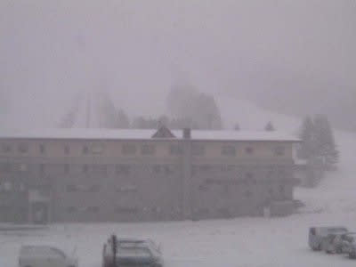

# 28日土曜日朝，志賀高原は雪が積もってるよ！

📅 投稿日時: 2020-11-28 07:59:00

🏷️ カテゴリ: [日記](cc4b5682fb7b8b144980957a978653fb0.md)

えー．

今日はちょっと滑りに行ける余裕がなく．

またちょっととんでもない時間に更新

してますが…

どうも，残念ながら昨日は

27日（金）：基本的に曇り．時々晴れるか？…気温は朝にちょっと

　人工降雪機が動かせ，夜になったらまた人工降雪機が

　稼働できそうな気温に

　熊の湯のこの日のゲレンデ状況はかなり厳しいかも．

という水曜の天気予想の通り，朝に

人工降雪機がギリギリ動かせた程度（涙）．

26日は横手山も山頂付近は人工降雪が

動かせたものの，ゲレンデ下部は降雪できず，

27日午後のオープンは諦めざるを

得なかったようです…(涙）

([横手山スキー場ホームページ](https://yokoteyama2307.com/news/11334/)より）

しかし．

…ふははははは！

やっと．

やっと，志賀高原．

雪が積もってます！

([北信建設事務所道路気象状況カメラ](http://hokushin.pref-nagano-roadcamera.jp/)より）

これも，水曜段階での予想，

28日（土）：朝から雪！終日気温は上がらず，一の瀬エリアも

　フルパワーで人工降雪が行ける！

　この日だけで10~20cmの天然雪の積雪もあり

というのが当たりましたね！

ふはははは！

わが予想の精度を見よ！←自画自賛モード

ただ，昨晩深夜2時ごろの降り始めは

雨っぽかったようですが…

でも，次期に雪に変わり．

午前7:30現在，10cmほど積もってるようです！

([志賀高原ライブカメラページ](https://www.shigakogen.gr.jp/live/index.html)より）

この雪は，今日一日降り続けます！

…とはいえ，午後は降ったりやんだりくらいで，

それほど強く積もる勢いの雪じゃないのが

残念…

明日も午前中はパラパラと雪が舞ったり

止んだりという程度で，それほど積もる

感じではないものの．

でも，今日から12月1日にかけては

ガッツリ冷えて，ひたすら人工降雪機が

動かせます！

明日の日曜には，横手・熊の湯はゲレンデ

コンディションがさらに改善してるでしょう…

30日もまたちょっとだけ積雪がありそう…！

今日も志賀高原の登りは，木曜に

　土曜朝はドサドサ積もるほどではないものの，

　終日降り続けそうだし．

　日曜も午前中は雪で，土曜夜から10cmほどの雪の積み増しが

　ありそうな感じなので．

　志賀高原の道路は，積雪・凍結路だと思って

　覚悟して行ってください…

と書いた通り，積雪路でスタックしてる

車もあるみたいですし．

明日日曜も朝は積雪＆凍結路面だと

思います．

気を付けて運転を…

ということで，

今日は滑りに行けないSkier_Sですが．

明日は今シーズン初の志賀高原へ行く

予定です～！
